# Project 5 - Vehicle Detection and Tracking

## Vehicle Detection Project

### The goals / steps of this project are the following:

1. Perform a Histogram of Oriented Gradients (HOG) feature extraction on a labeled training set of images and train a classifier Linear SVM classifier
2. Optionally, you can also apply a color transform and append binned color features, as well as histograms of color, to your HOG feature vector.
Note: for those first two steps don't forget to normalize your features and randomize a selection for training and testing.
3. Implement a sliding-window technique and use your trained classifier to search for vehicles in images.
4. Run your pipeline on a video stream (start with the test_video.mp4 and later implement on full project_video.mp4) and create a heat map of recurring detections frame by frame to reject outliers and follow detected vehicles.
Estimate a bounding box for vehicles detected.

## Initial Imports


```python
#Initial Imports
import glob
import numpy as np
import cv2
import matplotlib.pyplot as plt
import matplotlib.image as mpimg
import time
from mpl_toolkits.mplot3d import Axes3D
from skimage.feature import hog
from sklearn.preprocessing import StandardScaler
from sklearn.model_selection import train_test_split
from sklearn.svm import LinearSVC
from sklearn import tree
from sklearn.ensemble import RandomForestClassifier
from sklearn.neighbors import KNeighborsClassifier
from sklearn.naive_bayes import GaussianNB
from sklearn.neural_network import MLPClassifier
from scipy.ndimage.measurements import label
%matplotlib inline

# Import everything needed to edit/save/watch video clips
from moviepy.editor import VideoFileClip
from IPython.display import HTML

```

## Functions / All the things

### A list of all functions used throughout


```python
# Define a function that takes an image, a list of bounding boxes, 
# and optional color tuple and line thickness as inputs
# then draws boxes in that color on the output

def draw_boxes(img, bboxes, color=(0, 0, 255), thick=6):
    # Make a copy of the image
    draw_img = np.copy(img)
    # Iterate through the bounding boxes
    for bbox in bboxes:
        # Draw a rectangle given bbox coordinates
        cv2.rectangle(draw_img, bbox[0], bbox[1], color, thick)
    # Return the image copy with boxes drawn
    return draw_img

# For Use:
# Add bounding boxes in this format, these are just example coordinates.
# bboxes = [((275, 572), (380, 510)), ((488, 563), (549, 518)), ((554, 543), (582, 522)), 
#           ((601, 555), (646, 522)), ((657, 545), (685, 517)), ((849, 678), (1135, 512))]

# result = draw_boxes(image, bboxes)
# plt.imshow(result)

##################

# Define a function that takes an image and a list of templates as inputs
# then searches the image and returns the a list of bounding boxes 
# for matched templates
def find_matches(img, template_list):
    # Define an empty list to take bbox coords
    bbox_list = []
    # Define matching method
    # Other options include: cv2.TM_CCORR_NORMED', 'cv2.TM_CCOEFF', 'cv2.TM_CCORR',
    #         'cv2.TM_SQDIFF', 'cv2.TM_SQDIFF_NORMED'
    method = cv2.TM_CCOEFF_NORMED
    # Iterate through template list
    for temp in template_list:
        # Read in templates one by one
        tmp = mpimg.imread(temp)
        # Use cv2.matchTemplate() to search the image
        result = cv2.matchTemplate(img, tmp, method)
        # Use cv2.minMaxLoc() to extract the location of the best match
        min_val, max_val, min_loc, max_loc = cv2.minMaxLoc(result)
        # Determine a bounding box for the match
        w, h = (tmp.shape[1], tmp.shape[0])
        if method in [cv2.TM_SQDIFF, cv2.TM_SQDIFF_NORMED]:
            top_left = min_loc
        else:
            top_left = max_loc
        bottom_right = (top_left[0] + w, top_left[1] + h)
        # Append bbox position to list
        bbox_list.append((top_left, bottom_right))
        # Return the list of bounding boxes
        
    return bbox_list
#for use
# bboxes = find_matches(image, templist)
# result = draw_boxes(image, bboxes)
# plt.imshow(result)
##############################################

# Define a function to compute color histogram features  
def color_hist(img, nbins=64, bins_range=(0, 256)):
    # Compute the histogram of the RGB channels separately
    rhist = np.histogram(img[:,:,0], bins=nbins, range=bins_range)
    ghist = np.histogram(img[:,:,1], bins=nbins, range=bins_range)
    bhist = np.histogram(img[:,:,2], bins=nbins, range=bins_range)
    # Generating bin centers
    bin_edges = rhist[1]
    bin_centers = (bin_edges[1:]  + bin_edges[0:len(bin_edges)-1])/2
    # Concatenate the histograms into a single feature vector
    hist_features = np.concatenate((rhist[0], ghist[0], bhist[0]))
    # Return the individual histograms, bin_centers and feature vector
    return rhist, ghist, bhist, bin_centers, hist_features

# Define a function to compute hsv histogram features  
def hsv_hist(img, nbins=64, bins_range=(0, 256)):
    # Compute the histogram of the hsv channels separately
    hhist = np.histogram(img[:,:,0], bins=nbins, range=bins_range)
    shist = np.histogram(img[:,:,1], bins=nbins, range=bins_range)
    vhist = np.histogram(img[:,:,2], bins=nbins, range=bins_range)
    # Generating bin centers
    bin_edges = hhist[1]
    bin_centers = (bin_edges[1:]  + bin_edges[0:len(bin_edges)-1])/2
    # Concatenate the histograms into a single feature vector
    hist_features = np.concatenate((hhist[0], shist[0], vhist[0]))
    # Return the individual histograms, bin_centers and feature vector
    return hhist, shist, vhist, bin_centers, hist_features

# Define a function to compute yuv histogram features  
def yuv_hist(img, nbins=64, bins_range=(0, 256)):
    # Compute the histogram of the hsv channels separately
    yhist = np.histogram(img[:,:,0], bins=nbins, range=bins_range)
    uhist = np.histogram(img[:,:,1], bins=nbins, range=bins_range)
    vhist = np.histogram(img[:,:,2], bins=nbins, range=bins_range)
    # Generating bin centers
    bin_edges = yhist[1]
    bin_centers = (bin_edges[1:]  + bin_edges[0:len(bin_edges)-1])/2
    # Concatenate the histograms into a single feature vector
    hist_features = np.concatenate((yhist[0], uhist[0], vhist[0]))
    # Return the individual histograms, bin_centers and feature vector
    return yhist, uhist, vhist, bin_centers, hist_features

# rh, gh, bh, bincen, feature_vec = color_hist(image, nbins=32, bins_range=(0, 256))

# # Plot a figure with all three bar charts
# if rh is not None:
#     fig = plt.figure(figsize=(12,3))
#     plt.subplot(131)
#     plt.bar(bincen, rh[0])
#     plt.xlim(0, 256)
#     plt.title('R Histogram')
#     plt.subplot(132)
#     plt.bar(bincen, gh[0])
#     plt.xlim(0, 256)
#     plt.title('G Histogram')
#     plt.subplot(133)
#     plt.bar(bincen, bh[0])
#     plt.xlim(0, 256)
#     plt.title('B Histogram')
#     fig.tight_layout()
# else:
#     print('Your function is returning None for at least one variable...')
    
#############################

def plot3d(pixels, colors_rgb,
        axis_labels=list("RGB"), axis_limits=[(0, 255), (0, 255), (0, 255)]):
    """Plot pixels in 3D."""

    # Create figure and 3D axes
    fig = plt.figure(figsize=(8, 8))
    ax = Axes3D(fig)

    # Set axis limits
    ax.set_xlim(*axis_limits[0])
    ax.set_ylim(*axis_limits[1])
    ax.set_zlim(*axis_limits[2])

    # Set axis labels and sizes
    ax.tick_params(axis='both', which='major', labelsize=14, pad=8)
    ax.set_xlabel(axis_labels[0], fontsize=16, labelpad=16)
    ax.set_ylabel(axis_labels[1], fontsize=16, labelpad=16)
    ax.set_zlabel(axis_labels[2], fontsize=16, labelpad=16)

    # Plot pixel values with colors given in colors_rgb
    ax.scatter(
        pixels[:, :, 0].ravel(),
        pixels[:, :, 1].ravel(),
        pixels[:, :, 2].ravel(),
        c=colors_rgb.reshape((-1, 3)), edgecolors='none')

    return ax  # return Axes3D object for further manipulation

#For Use:
# # Read a color image
# img = cv2.imread("000275.png")

# # Select a small fraction of pixels to plot by subsampling it
# scale = max(img.shape[0], img.shape[1], 64) / 64  # at most 64 rows and columns
# img_small = cv2.resize(img, (np.int(img.shape[1] / scale), np.int(img.shape[0] / scale)), interpolation=cv2.INTER_NEAREST)

# # Convert subsampled image to desired color space(s)
# img_small_RGB = cv2.cvtColor(img_small, cv2.COLOR_BGR2RGB)  # OpenCV uses BGR, matplotlib likes RGB
# img_small_HSV = cv2.cvtColor(img_small, cv2.COLOR_BGR2HSV)
# img_small_rgb = img_small_RGB / 255.  # scaled to [0, 1], only for plotting

# # Plot and show
# plot3d(img_small_RGB, img_small_rgb)
# plt.show()

# plot3d(img_small_HSV, img_small_rgb, axis_labels=list("HSV"))
# plt.show()

#############################################

# Define a function to compute color histogram features  
# Pass the color_space flag as 3-letter all caps string
# like 'HSV' or 'LUV' etc.
# KEEP IN MIND IF YOU DECIDE TO USE THIS FUNCTION LATER
# IN YOUR PROJECT THAT IF YOU READ THE IMAGE WITH 
# cv2.imread() INSTEAD YOU START WITH BGR COLOR!
def bin_spatial(img, color_space='RGB', size=(64, 64)):
    # Convert image to new color space (if specified)
    if color_space != 'RGB':
        if color_space == 'HSV':
            feature_image = cv2.cvtColor(img, cv2.COLOR_RGB2HSV)
        elif color_space == 'LUV':
            feature_image = cv2.cvtColor(img, cv2.COLOR_RGB2LUV)
        elif color_space == 'HLS':
            feature_image = cv2.cvtColor(img, cv2.COLOR_RGB2HLS)
        elif color_space == 'YUV':
            feature_image = cv2.cvtColor(img, cv2.COLOR_RGB2YUV)
        elif color_space == 'YCrCb':
            feature_image = cv2.cvtColor(img, cv2.COLOR_RGB2YCrCb)
    else: feature_image = np.copy(img)             
    # Use cv2.resize().ravel() to create the feature vector
    features = cv2.resize(feature_image, size).ravel() 
    # Return the feature vector
    return features

#For Use:
#feature_vec = bin_spatial(image, color_space='RGB', size=(32, 32))
# Plot features
# plt.plot(feature_vec)
# plt.title('Spatially Binned Features')

###############################################

# Define a function to return some characteristics of the dataset 
def data_look(car_list, notcar_list):
    data_dict = {}
    # Define a key in data_dict "n_cars" and store the number of car images
    data_dict["n_cars"] = len(car_list)
    # Define a key "n_notcars" and store the number of notcar images
    data_dict["n_notcars"] = len(notcar_list)
    # Read in a test image, either car or notcar
    example_img = mpimg.imread(car_list[0])
    # Define a key "image_shape" and store the test image shape 3-tuple
    data_dict["image_shape"] = example_img.shape
    # Define a key "data_type" and store the data type of the test image.
    data_dict["data_type"] = example_img.dtype
    # Return data_dict
    return data_dict

#For Use:
# print('Your function returned a count of', 
#       data_info["n_cars"], ' cars and', 
#       data_info["n_notcars"], ' non-cars')
# print('of size: ',data_info["image_shape"], ' and data type:', 
#       data_info["data_type"])
# # Just for fun choose random car / not-car indices and plot example images   
# car_ind = np.random.randint(0, len(cars))
# notcar_ind = np.random.randint(0, len(notcars))
# Read in car / not-car images
# car_image = mpimg.imread(cars[car_ind])
# notcar_image = mpimg.imread(notcars[notcar_ind])


# # Plot the examples
# fig = plt.figure()
# plt.subplot(121)
# plt.imshow(car_image)
# plt.title('Example Car Image')
# plt.subplot(122)
# plt.imshow(notcar_image)
# plt.title('Example Not-car Image')
#########################

# Define a function to return HOG features and visualization
def get_hog_features(img, orient, pix_per_cell, cell_per_block, vis=False, feature_vec=True):
    if vis == True:
        features, hog_image = hog(img, orientations=orient, pixels_per_cell=(pix_per_cell, pix_per_cell),
                                  cells_per_block=(cell_per_block, cell_per_block), transform_sqrt=False, 
                                  visualise=True, feature_vector=False)
        return features, hog_image
    else:      
        features = hog(img, orientations=orient, pixels_per_cell=(pix_per_cell, pix_per_cell),
                       cells_per_block=(cell_per_block, cell_per_block), transform_sqrt=False, 
                       visualise=False, feature_vector=feature_vec)
        return features

# #For Use:
# # Generate a random index to look at a car image
# ind = np.random.randint(0, len(cars))
# # Read in the image
# image = mpimg.imread(cars[ind])
# gray = cv2.cvtColor(image, cv2.COLOR_RGB2GRAY)
# # Define HOG parameters
# orient = 9
# pix_per_cell = 8
# cell_per_block = 2
# # Call our function with vis=True to see an image output
# features, hog_image = get_hog_features(gray, orient, 
#                         pix_per_cell, cell_per_block, 
#                         vis=True, feature_vec=False)


# # Plot the examples
# fig = plt.figure()
# plt.subplot(121)
# plt.imshow(image, cmap='gray')
# plt.title('Example Car Image')
# plt.subplot(122)
# plt.imshow(hog_image, cmap='gray')
# plt.title('HOG Visualization')
#################################################

# Define a function to extract features from a list of images
# Have this function call bin_spatial() and color_hist()
# Define a function to extract features from a list of images
# Have this function call bin_spatial() and color_hist()
def extract_features(imgs, color_space='RGB', spatial_size=(64, 64),
                        hist_bins=64, orient=9, 
                        pix_per_cell=8, cell_per_block=2, hog_channel=0,
                        spatial_feat=True, hist_feat=True, hog_feat=True):
    # Create a list to append feature vectors to
    features = []
    # Iterate through the list of images
    for file in imgs:
        file_features = []
        # Read in each one by one
        image = cv2.imread(file) #mpimg.imread(file)
        image = cv2.cvtColor(image, cv2.COLOR_BGR2RGB)
        # apply color conversion if other than 'RGB'
        if color_space != 'RGB':
            if color_space == 'HSV':
                feature_image = cv2.cvtColor(image, cv2.COLOR_RGB2HSV)
            elif color_space == 'LUV':
                feature_image = cv2.cvtColor(image, cv2.COLOR_RGB2LUV)
            elif color_space == 'HLS':
                feature_image = cv2.cvtColor(image, cv2.COLOR_RGB2HLS)
            elif color_space == 'YUV':
                feature_image = cv2.cvtColor(image, cv2.COLOR_RGB2YUV)
            elif color_space == 'YCrCb':
                feature_image = cv2.cvtColor(image, cv2.COLOR_RGB2YCrCb)
        else: feature_image = np.copy(image)      

        if spatial_feat == True:
            spatial_features = bin_spatial(feature_image, size=spatial_size)
            file_features.append(spatial_features)
        if hist_feat == True:
            # Apply color_hist()
            rhist, ghist, bhist, bin_centers, hist_features = color_hist(feature_image, nbins=hist_bins)
            file_features.append(hist_features)
        if hog_feat == True:
        # Call get_hog_features() with vis=False, feature_vec=True
            if hog_channel == 'ALL':
                hog_features = []
                for channel in range(feature_image.shape[2]):
                    hog_features.append(get_hog_features(feature_image[:,:,channel], 
                                        orient, pix_per_cell, cell_per_block, 
                                        vis=False, feature_vec=True))
                hog_features = np.ravel(hog_features)        
            else:
                hog_features = get_hog_features(feature_image[:,:,hog_channel], orient, 
                            pix_per_cell, cell_per_block, vis=False, feature_vec=True)
            # Append the new feature vector to the features list
            file_features.append(hog_features)
        features.append(np.concatenate(file_features))
    # Return list of feature vectors
    return features

#For Use:
# images = glob.glob('*.jpeg')
# cars = []
# notcars = []
# for image in images:
#     if 'image' in image or 'extra' in image:
#         notcars.append(image)
#     else:
#         cars.append(image)
        
# car_features = extract_features(cars, cspace='RGB', spatial_size=(32, 32),
#                         hist_bins=32, hist_range=(0, 256))
# notcar_features = extract_features(notcars, cspace='RGB', spatial_size=(32, 32),
#                         hist_bins=32, hist_range=(0, 256))

# if len(car_features) > 0:
#     # Create an array stack of feature vectors
#     X = np.vstack((car_features, notcar_features)).astype(np.float64)                        
#     # Fit a per-column scaler
#     X_scaler = StandardScaler().fit(X)
#     # Apply the scaler to X
#     scaled_X = X_scaler.transform(X)
#     car_ind = np.random.randint(0, len(cars))
#     # Plot an example of raw and scaled features
#     fig = plt.figure(figsize=(12,4))
#     plt.subplot(131)
#     plt.imshow(mpimg.imread(cars[car_ind]))
#     plt.title('Original Image')
#     plt.subplot(132)
#     plt.plot(X[car_ind])
#     plt.title('Raw Features')
#     plt.subplot(133)
#     plt.plot(scaled_X[car_ind])
#     plt.title('Normalized Features')
#     fig.tight_layout()
# else: 
#     print('Your function only returns empty feature vectors...')
##########################################################

# Define a function that takes an image,
# start and stop positions in both x and y, 
# window size (x and y dimensions),  
# and overlap fraction (for both x and y)
def slide_window(img, x_start_stop=[None, None], y_start_stop=[None, None], 
                    xy_window=(64, 64), xy_overlap=(0.5, 0.5)):
    # If x and/or y start/stop positions not defined, set to image size
    if x_start_stop[0] == None:
        x_start_stop[0] = 0
    if x_start_stop[1] == None:
        x_start_stop[1] = img.shape[1]
    if y_start_stop[0] == None:
        y_start_stop[0] = 0
    if y_start_stop[1] == None:
        y_start_stop[1] = img.shape[0]
    # Compute the span of the region to be searched    
    xspan = x_start_stop[1] - x_start_stop[0]
    yspan = y_start_stop[1] - y_start_stop[0]
    # Compute the number of pixels per step in x/y
    nx_pix_per_step = np.int(xy_window[0]*(1 - xy_overlap[0]))
    ny_pix_per_step = np.int(xy_window[1]*(1 - xy_overlap[1]))
    # Compute the number of windows in x/y
    nx_windows = np.int(xspan/nx_pix_per_step) - 1
    ny_windows = np.int(yspan/ny_pix_per_step) - 1
    # Initialize a list to append window positions to
    window_list = []
    # Loop through finding x and y window positions
    # Note: you could vectorize this step, but in practice
    # you'll be considering windows one by one with your
    # classifier, so looping makes sense
    for ys in range(ny_windows):
        for xs in range(nx_windows):
            # Calculate window position
            startx = xs*nx_pix_per_step + x_start_stop[0]
            endx = startx + xy_window[0]
            starty = ys*ny_pix_per_step + y_start_stop[0]
            endy = starty + xy_window[1]
            # Append window position to list
            window_list.append(((startx, starty), (endx, endy)))
    # Return the list of windows
    return window_list

# a function to calculate slide windows similarly to slide_window but proportionally adjusting the window size
# to the y values of the image. An xy window closer to the beginning of the y(midpoint of the image) will be smaller
# than the windows near the bottom. This will capture cars in windows far away and close to the camera much better than
# searching in a constant window size
def my_slide_window(img, x_start_stop=[None, None], y_start_stop=[None, None], 
                    xy_window=(64, 64), xy_overlap=(0.25, 0.25)):
    # If x and/or y start/stop positions not defined, set to image size
    if x_start_stop[0] == None:
        x_start_stop[0] = 0
    if x_start_stop[1] == None:
        x_start_stop[1] = img.shape[1]
    if y_start_stop[0] == None:
        y_start_stop[0] = 0
    if y_start_stop[1] == None:
        y_start_stop[1] = img.shape[0]
    # Compute the span of the region to be searched    
    xspan = x_start_stop[1] - x_start_stop[0]
    yspan = y_start_stop[1] - y_start_stop[0]
#     # Compute the number of pixels per step in x/y
#     nx_pix_per_step = np.int(xy_window[0]*(1 - xy_overlap[0]))
#     ny_pix_per_step = np.int(xy_window[1]*(1 - xy_overlap[1]))
#     # Compute the number of windows in x/y
#     nx_windows = np.int(xspan/nx_pix_per_step) - 1
#     ny_windows = np.int(yspan/ny_pix_per_step) - 1
    # Initialize a list to append window positions to
    window_list = []
    # Loop through finding x and y window positions
    # Note: you could vectorize this step, but in practice
    # you'll be considering windows one by one with your
    # classifier, so looping makes sense
    for ys in range(int(y_start_stop[0]),int(y_start_stop[1])):
        for xs in range(x_start_stop[0],int(x_start_stop[1])):
            ratio = 1/(20-10*int(ys/int(y_start_stop[1])))
            window_size = int(ratio * ys)
            xy_window = (window_size, window_size)
            # Compute the number of pixels per step in x/y
            nx_pix_per_step = np.int(xy_window[0]*(1 - xy_overlap[0]))
            ny_pix_per_step = np.int(xy_window[1]*(1 - xy_overlap[1]))
            # Compute the number of windows in x/y
            nx_windows = np.int(xspan/nx_pix_per_step) - 1
            ny_windows = np.int(yspan/ny_pix_per_step) - 1
            for y_windows in range(ny_windows):
                for x_windows in range(nx_windows):
                    # Calculate window position
                    startx = x_windows*nx_pix_per_step + x_start_stop[0]
                    endx = startx + xy_window[0]
                    starty = y_windows*ny_pix_per_step + y_start_stop[0]
                    endy = starty + xy_window[1]
                    # Append window position to list
                    window_list.append(((startx, starty), (endx, endy)))
    # Return the list of windows
    print(len(window_list))
    print(window_list[0])
    return window_list

#####################################################

# Define a function to extract features from a single image window
# This function is very similar to extract_features()
# just for a single image rather than list of images
def single_img_features(img, color_space='RGB', spatial_size=(64,64),
                        hist_bins=64, orient=9, 
                        pix_per_cell=8, cell_per_block=2, hog_channel=0,
                        spatial_feat=True, hist_feat=True, hog_feat=True):    
    #1) Define an empty list to receive features
    img_features = []
    #2) Apply color conversion if other than 'RGB'
    if color_space != 'RGB':
        if color_space == 'HSV':
            feature_image = cv2.cvtColor(img, cv2.COLOR_RGB2HSV)
        elif color_space == 'LUV':
            feature_image = cv2.cvtColor(img, cv2.COLOR_RGB2LUV)
        elif color_space == 'HLS':
            feature_image = cv2.cvtColor(img, cv2.COLOR_RGB2HLS)
        elif color_space == 'YUV':
            feature_image = cv2.cvtColor(img, cv2.COLOR_RGB2YUV)
        elif color_space == 'YCrCb':
            feature_image = cv2.cvtColor(img, cv2.COLOR_RGB2YCrCb)
    else: feature_image = np.copy(img)      
    #3) Compute spatial features if flag is set
    if spatial_feat == True:
        spatial_features = bin_spatial(feature_image, size=spatial_size)
        #4) Append features to list
        img_features.append(spatial_features)
    #5) Compute histogram features if flag is set
    if hist_feat == True:
        rhist, ghist, bhist, bin_centers, hist_features = color_hist(feature_image, nbins=hist_bins)
        #6) Append features to list
        img_features.append(hist_features)
    #7) Compute HOG features if flag is set
    if hog_feat == True:
        if hog_channel == 'ALL':
            hog_features = []
            for channel in range(feature_image.shape[2]):
                hog_features.extend(get_hog_features(feature_image[:,:,channel], 
                                    orient, pix_per_cell, cell_per_block, 
                                    vis=False, feature_vec=True))      
        else:
            hog_features = get_hog_features(feature_image[:,:,hog_channel], orient, 
                        pix_per_cell, cell_per_block, vis=False, feature_vec=True)
        #8) Append features to list
        img_features.append(hog_features)

    #9) Return concatenated array of features
    return np.concatenate(img_features)

#####################################

# Define a function you will pass an image 
# and the list of windows to be searched (output of slide_windows())
def search_windows(img, windows, clfs, scaler, color_space='RGB', 
                    spatial_size=(64, 64), hist_bins=64, 
                    hist_range=(0, 256), orient=9, 
                    pix_per_cell=8, cell_per_block=2, 
                    hog_channel=0, spatial_feat=True, 
                    hist_feat=True, hog_feat=True):

    #1) Create an empty list to receive positive detection windows
    on_windows = []
    #2) Iterate over all windows in the list
    for window in windows:
        #3) Extract the test window from original image
        test_img = cv2.resize(img[window[0][1]:window[1][1], window[0][0]:window[1][0]], (64, 64))      
        #4) Extract features for that window using single_img_features()
        features = single_img_features(test_img, color_space=color_space, 
                            spatial_size=spatial_size, hist_bins=hist_bins, 
                            orient=orient, pix_per_cell=pix_per_cell, 
                            cell_per_block=cell_per_block, 
                            hog_channel=hog_channel, spatial_feat=spatial_feat, 
                            hist_feat=hist_feat, hog_feat=hog_feat)
        #5) Scale extracted features to be fed to classifier
        test_features = scaler.transform(np.array(features).reshape(1, -1))
        #6) Predict using your classifier (now uses multiple classifiers)
        predictions = 0 #We want all classifiers to be positive in agreement
        for clf in clfs:
            prediction = clf.predict(test_features)/len(clfs)
            predictions+= prediction
        #7) If positive (prediction == 1) then save the window (if all predictions greater than a threshold)
        if predictions >= .5: #half of classifiers think car...
            on_windows.append(window)
    #8) Return windows for positive detections
    return on_windows

#######################################

def add_heat(heatmap, box_list):
    # Iterate through list of bboxes
    for box in box_list:
        # Add += 3 for all pixels inside each bbox
        heatmap[box[0][1]:box[1][1], box[0][0]:box[1][0]] += 1
    
    # Return updated heatmap
    return heatmap
    
def apply_threshold(heatmap, threshold):
    # Zero out pixels below the threshold
    heatmap[heatmap <= threshold] = 0
    # Return thresholded map
    return heatmap

def draw_labeled_bboxes(img, labels):
    #make a copy of the image
    draw_img = np.copy(img)
    # Iterate through all detected cars
    for car_number in range(1, labels[1]+1):
        # Find pixels with each car_number label value
        nonzero = (labels[0] == car_number).nonzero()
        # Identify x and y values of those pixels
        nonzeroy = np.array(nonzero[0])
        nonzerox = np.array(nonzero[1])
        # Define a bounding box based on min/max x and y
        bbox = ((int(np.min(nonzerox)), int(np.min(nonzeroy))), (int(np.max(nonzerox)), int(np.max(nonzeroy))))
        # Draw the box on the image
        cv2.rectangle(draw_img, bbox[0], bbox[1], (0,0,255), 3)
    # Return the image
    return draw_img

######################


```

## Implementation

First, I'll get the iamges of the cars and explore the data


```python
#read the images for cars/not cars
car_images = glob.glob('vehicles/*/*.png')
noncar_images = glob.glob('non-vehicles/*/*.png')
cars = []
notcars = []
for image in noncar_images:
    notcars.append(image)
for image in car_images:
    cars.append(image)

data_info = data_look(car_images,noncar_images)
print('Your function returned a count of', 
      data_info["n_cars"], ' cars and', 
      data_info["n_notcars"], ' non-cars')
print('of size: ',data_info["image_shape"], ' and data type:', 
      data_info["data_type"])
# Just for fun choose random car / not-car indices and plot example images   
car_ind = np.random.randint(0, len(cars))
notcar_ind = np.random.randint(0, len(notcars))
#Read in car / not-car images
car_image = mpimg.imread(cars[car_ind])
notcar_image = mpimg.imread(notcars[notcar_ind])


# Plot the examples
fig = plt.figure()
plt.subplot(121)
plt.imshow(car_image)
plt.title('Example Car Image')
plt.subplot(122)
plt.imshow(notcar_image)
plt.title('Example Not-car Image')
```

    Your function returned a count of 8792  cars and 8968  non-cars
    of size:  (64, 64, 3)  and data type: float32


    <matplotlib.text.Text at 0x11c5045f8>


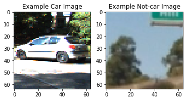


## Explore Color Spaces of the Images

Now, I'll look at the various color spaces of the image to gain insight as to what might be a good spectral signature for the car.


```python
car_image = cv2.imread(cars[0]) #Be sure to use cv2.imread and scale to 0 -255 NOT mpimg.imread(cars[0])
#scale by changing color spaces
car_image = cv2.cvtColor(car_image, cv2.COLOR_BGR2RGB)
rh, gh, bh, bincen, feature_vec = color_hist(car_image, nbins=64, bins_range=(0, 256))

# Plot a figure with all three bar charts
if rh is not None:
    fig = plt.figure(figsize=(12,3))
    plt.subplot(141)
    plt.imshow(car_image)
    plt.title('Original Image')
    plt.subplot(142)
    plt.bar(bincen, rh[0])
    plt.xlim(0, 256)
    plt.title('R Histogram')
    plt.subplot(143)
    plt.bar(bincen, gh[0])
    plt.xlim(0, 256)
    plt.title('G Histogram')
    plt.subplot(144)
    plt.bar(bincen, bh[0])
    plt.xlim(0, 256)
    plt.title('B Histogram')
    fig.tight_layout()
else:
    print('Your function is returning None for at least one variable...')
```


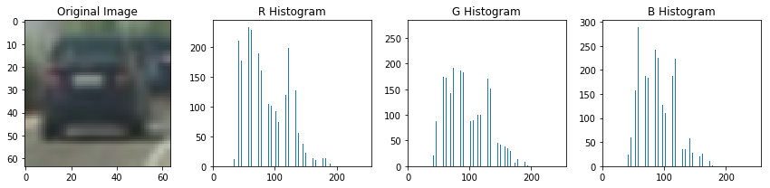


```python
noncar_image = cv2.imread(notcars[0]) #Be sure to use cv2.imread and scale to 0 -255 NOT mpimg.imread(cars[0])
#scale by changing color spaces
noncar_image = cv2.cvtColor(noncar_image, cv2.COLOR_BGR2RGB)
rh, gh, bh, bincen, feature_vec = color_hist(noncar_image, nbins=64, bins_range=(0, 256))

# Plot a figure with all three bar charts
if rh is not None:
    fig = plt.figure(figsize=(12,3))
    plt.subplot(141)
    plt.imshow(noncar_image)
    plt.title('Original Image')
    plt.subplot(142)
    plt.bar(bincen, rh[0])
    plt.xlim(0, 256)
    plt.title('R Histogram')
    plt.subplot(143)
    plt.bar(bincen, gh[0])
    plt.xlim(0, 256)
    plt.title('G Histogram')
    plt.subplot(144)
    plt.bar(bincen, bh[0])
    plt.xlim(0, 256)
    plt.title('B Histogram')
    fig.tight_layout()
else:
    print('Your function is returning None for at least one variable...')
```


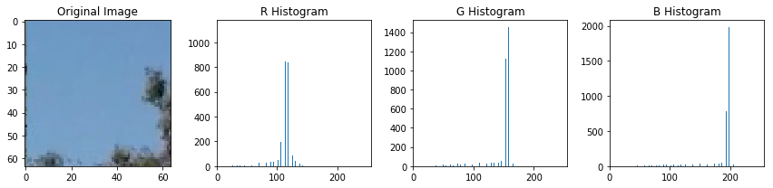


```python
img_copy = np.copy(car_image)
car_image_hsv = cv2.cvtColor(img_copy, cv2.COLOR_RGB2HSV)
rh, gh, bh, bincen, feature_vec = color_hist(car_image, nbins=64, bins_range=(0, 256))

# Plot a figure with all three bar charts
if rh is not None:
    fig = plt.figure(figsize=(12,3))
    plt.subplot(141)
    plt.imshow(car_image_hsv)
    plt.title('HSV Image')
    plt.subplot(142)
    plt.bar(bincen, rh[0])
    plt.xlim(0, 256)
    plt.title('H Histogram')
    plt.subplot(143)
    plt.bar(bincen, gh[0])
    plt.xlim(0, 256)
    plt.title('S Histogram')
    plt.subplot(144)
    plt.bar(bincen, bh[0])
    plt.xlim(0, 256)
    plt.title('V Histogram')
    fig.tight_layout()
else:
    print('Your function is returning None for at least one variable...')
```


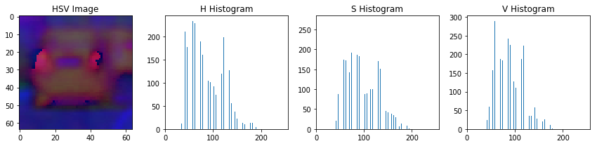


```python
img_copy2 = np.copy(noncar_image)
noncar_image_hsv = cv2.cvtColor(img_copy2, cv2.COLOR_RGB2HSV)
rh, gh, bh, bincen, feature_vec = color_hist(noncar_image_hsv, nbins=64, bins_range=(0, 256))

# Plot a figure with all three bar charts
if rh is not None:
    fig = plt.figure(figsize=(12,3))
    plt.subplot(141)
    plt.imshow(noncar_image_hsv)
    plt.title('HSV Image')
    plt.subplot(142)
    plt.bar(bincen, rh[0])
    plt.xlim(0, 256)
    plt.title('H Histogram')
    plt.subplot(143)
    plt.bar(bincen, gh[0])
    plt.xlim(0, 256)
    plt.title('S Histogram')
    plt.subplot(144)
    plt.bar(bincen, bh[0])
    plt.xlim(0, 256)
    plt.title('V Histogram')
    fig.tight_layout()
else:
    print('Your function is returning None for at least one variable...')
```


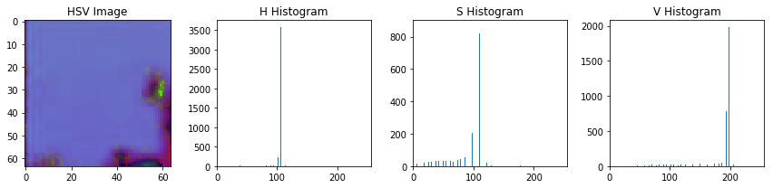


```python
img_copy3 = np.copy(car_image)
car_image_YUV = cv2.cvtColor(img_copy3, cv2.COLOR_RGB2YUV)
rh, gh, bh, bincen, feature_vec = color_hist(car_image, nbins=64, bins_range=(0, 256))

# Plot a figure with all three bar charts
if rh is not None:
    fig = plt.figure(figsize=(12,3))
    plt.subplot(141)
    plt.imshow(car_image_YUV)
    plt.title('YUV Image')
    plt.subplot(142)
    plt.bar(bincen, rh[0])
    plt.xlim(0, 256)
    plt.title('Y Histogram')
    plt.subplot(143)
    plt.bar(bincen, gh[0])
    plt.xlim(0, 256)
    plt.title('U Histogram')
    plt.subplot(144)
    plt.bar(bincen, bh[0])
    plt.xlim(0, 256)
    plt.title('V Histogram')
    fig.tight_layout()
else:
    print('Your function is returning None for at least one variable...')
```


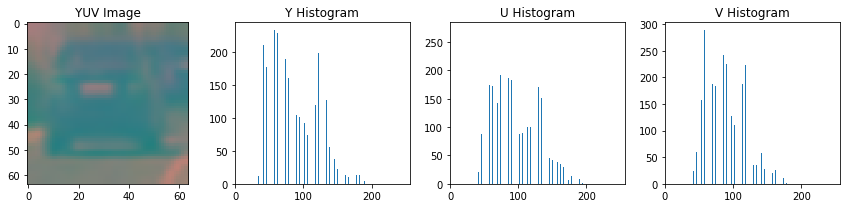


```python
img_copy4 = np.copy(noncar_image)
noncar_image_yuv = cv2.cvtColor(img_copy2, cv2.COLOR_RGB2YUV)
rh, gh, bh, bincen, feature_vec = color_hist(noncar_image_yuv, nbins=64, bins_range=(0, 256))

# Plot a figure with all three bar charts
if rh is not None:
    fig = plt.figure(figsize=(12,3))
    plt.subplot(141)
    plt.imshow(noncar_image_yuv)
    plt.title('YUV Image')
    plt.subplot(142)
    plt.bar(bincen, rh[0])
    plt.xlim(0, 256)
    plt.title('Y Histogram')
    plt.subplot(143)
    plt.bar(bincen, gh[0])
    plt.xlim(0, 256)
    plt.title('U Histogram')
    plt.subplot(144)
    plt.bar(bincen, bh[0])
    plt.xlim(0, 256)
    plt.title('V Histogram')
    fig.tight_layout()
else:
    print('Your function is returning None for at least one variable...')
```


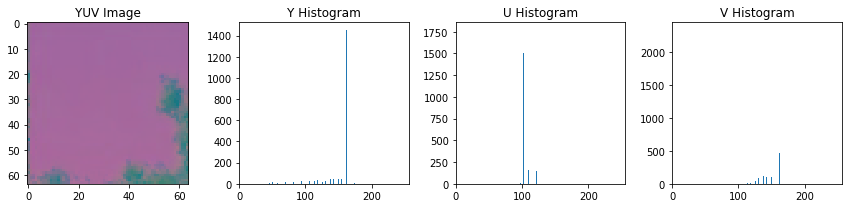


Clearly, there are very distinct differences in cars' color spaces versus non-cars that can uniquely identify a car.

### Ultimately, the color space as I was getting best results with was the YUV color space. Selecting this color space for the classifier gave me >99% accuracy on three classifiers!

## Look at Spatial Bins

Now I'll explore the spatial distribution of color in the car image versus the noncar image to include in the spectral signature.


```python
feature_vec = bin_spatial(car_image, color_space='RGB', size=(64, 64))
#Plot features
plt.plot(feature_vec)
plt.title('Spatially Binned Features')
```


    <matplotlib.text.Text at 0x11c2bcc50>


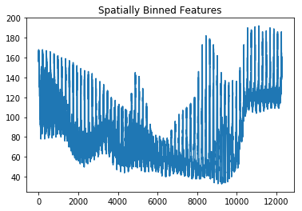


```python
feature_vec = bin_spatial(noncar_image, color_space='RGB', size=(64, 64))
#Plot features
plt.plot(feature_vec)
plt.title('Spatially Binned NonCar Features')
```


    <matplotlib.text.Text at 0x11cfe8b00>


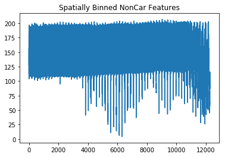


Once again, the spatial distribution of color gives a very distinct signature for cars as well.

## Look at HOG Features


```python
# # Generate a random index to look at a car image
ind = np.random.randint(0, len(car_images))
# Read in the image
example_car = cv2.imread(car_images[ind])
example_car = cv2.cvtColor(example_car, cv2.COLOR_BGR2RGB)
gray = cv2.cvtColor(example_car, cv2.COLOR_RGB2GRAY)
# Define HOG parameters
orient = 9
pix_per_cell = 8
cell_per_block = 2
# Call our function with vis=True to see an image output
features, hog_image = get_hog_features(gray, orient, 
                        pix_per_cell, cell_per_block, 
                        vis=True, feature_vec=False)


# Plot the examples
fig = plt.figure()
plt.subplot(121)
plt.imshow(example_car, cmap='gray')
plt.title('Example Car Image')
plt.subplot(122)
plt.imshow(hog_image, cmap='gray')
plt.title('HOG Visualization')
```


    <matplotlib.text.Text at 0x11ca4b940>


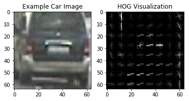


Here we can see the HOG gives a very unique structure for the car versus noncar and is easily identifiable.

I settled on the final HOG parameters empirically. I played with each one until to see which got better results in the classifiers and ended up with the orientation of 9, 8 pixels per cell, and 2 cells per block.

## Train Classifiers and Test on an Image

Now that we have a good combination of factors to create a good spectral signature for a car let's train some classifiers and test on image.

I use several classifiers including some that were not detailed in the Udacity lecture to see different results.  I then use a combination of these for the classification when I test the image. For each classifier that I used I sum each one's result and then get the average of that sum. If the average is above .5 then I accept that as a car image.

My reasoning to this is that some classifiers might have false-positives where others do not and I was able to get rid of a lot of false-positives and better identify cars this way.

On the downside, having more classifiers decreases performance especially with the K-nearest neighbor and Random Forest classifiers. For this reason I left the K-nearest neighbor classifier out while keeping the Random Forest because I achieved greater than 99% accuracy with the Random Forest.


```python
### Tweak these parameters and see how the results change.
color_space = 'YUV' # Can be RGB, HSV, LUV, HLS, YUV, YCrCb
orient = 12  # HOG orientations
pix_per_cell = 8 # HOG pixels per cell
cell_per_block = 2 # HOG cells per block
hog_channel = "ALL" # Can be 0, 1, 2, or "ALL"
spatial_size = (64, 64) # Spatial binning dimensions
hist_bins = 64    # Number of histogram bins
spatial_feat = True # Spatial features on or off
hist_feat = True # Histogram features on or off
hog_feat = True # HOG features on or off
example_img = cv2.imread('test1.jpg')
example_img = cv2.cvtColor(example_img, cv2.COLOR_BGR2RGB)
print(example_img.shape)
plt.imshow(example_img)
```

    (720, 1280, 3)


    <matplotlib.image.AxesImage at 0x11c71e9e8>


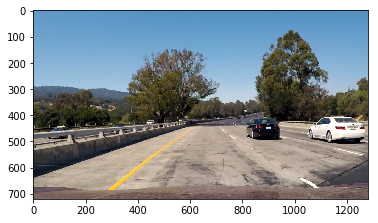


```python
#extract the features for cars/ noncars
car_features = extract_features(car_images, color_space=color_space, 
                        spatial_size=spatial_size, hist_bins=hist_bins, 
                        orient=orient, pix_per_cell=pix_per_cell, 
                        cell_per_block=cell_per_block, 
                        hog_channel=hog_channel, spatial_feat=spatial_feat, 
                        hist_feat=hist_feat, hog_feat=hog_feat)
notcar_features = extract_features(noncar_images, color_space=color_space, 
                        spatial_size=spatial_size, hist_bins=hist_bins, 
                        orient=orient, pix_per_cell=pix_per_cell, 
                        cell_per_block=cell_per_block, 
                        hog_channel=hog_channel, spatial_feat=spatial_feat, 
                        hist_feat=hist_feat, hog_feat=hog_feat)
```


```python
#Define the features and labels vectors
X = np.vstack((car_features, notcar_features)).astype(np.float64)                        
# Fit a per-column scaler
X_scaler = StandardScaler().fit(X)
# Apply the scaler to X
scaled_X = X_scaler.transform(X)

# Define the labels vector
y = np.hstack((np.ones(len(car_features)), np.zeros(len(notcar_features))))
```


```python
# Split up data into randomized training and test sets
rand_state = np.random.randint(0, 100)
X_train, X_test, y_train, y_test = train_test_split(
    scaled_X, y, test_size=0.2, random_state=rand_state)

```


```python
#Fit the classifier and make a prediction
print('Using:',orient,'orientations',pix_per_cell,
    'pixels per cell and', cell_per_block,'cells per block')
print('Feature vector length:', len(X_train[0]))
# Use a linear SVC 
svc = LinearSVC()
# Check the training time for the SVC
t=time.time()
svc.fit(X_train, y_train)
t2 = time.time()
print(round(t2-t, 2), 'Seconds to train SVC...')
# Check the score of the SVC
print('Test Accuracy of SVC = ', round(svc.score(X_test, y_test), 4))
# Check the prediction time for a single sample
t=time.time()
```

    Using: 12 orientations 8 pixels per cell and 2 cells per block
    Feature vector length: 19536
    27.63 Seconds to train SVC...
    Test Accuracy of SVC =  0.9941


```python
# #Use a decision tree classifier - this takes quite a while to train...
# #Fit the classifier and make a prediction
# # Use a decision tree 
# tree_clf = tree.DecisionTreeClassifier()
# tree_clf = tree_clf.fit(X_train, y_train)
# # Check the training time for the Decision tree
# t=time.time()
# tree_clf.fit(X_train, y_train)
# t2 = time.time()
# print(round(t2-t, 2), 'Seconds to train Decision Tree...')
# # Check the score of the tree
# print('Test Accuracy of Decision Tree = ', round(tree_clf.score(X_test, y_test), 4))
# # Check the prediction time for a single sample
# t=time.time()

# Random Forests
random_forest = RandomForestClassifier(n_estimators=128,criterion="entropy")
t=time.time()
random_forest.fit(X_train, y_train)
t2 = time.time()
print(round(t2 - t, 2), 'Seconds to train Random Forest...')
print('Test Accuracy of Random Forest = ', round(random_forest.score(X_test, y_test), 4))
t=time.time()
```

    104.1 Seconds to train Random Forest...
    Test Accuracy of Random Forest =  0.991


```python
# Naive Bayes

gaussianNB = GaussianNB()
t=time.time()
gaussianNB.fit(X_train, y_train)
t2 = time.time()
print(round(t2 - t, 2), 'Seconds to train Gaussian Naive Bayes...')
print('Test Accuracy of GaussNB = ', round(gaussianNB.score(X_test, y_test), 4))
t=time.time()
```

    5.63 Seconds to train Gaussian Naive Bayes...
    Test Accuracy of GaussNB =  0.9217


```python
#K neighbors classifier
knn = KNeighborsClassifier(n_neighbors = 9)
t=time.time()
knn.fit(X_train, y_train)
t2 = time.time()
print(round(t2 - t, 2), 'Seconds to train KNN...')
print('Test Accuracy of KNN = ', round(knn.score(X_test, y_test), 4))
t=time.time()
```

    23.37 Seconds to train KNN...
    Test Accuracy of KNN =  0.9347


```python
#Multi-layer perceptron
mlp = MLPClassifier(solver='lbfgs', alpha=1e-5, hidden_layer_sizes=(12,8), random_state=1)
t=time.time()
mlp.fit(X_train, y_train)
t2 = time.time()
print(round(t2 - t, 2), 'Seconds to train MLP...')
print('Test Accuracy of MLP = ', round(mlp.score(X_test, y_test), 4))
t=time.time()
```

    23.43 Seconds to train MLP...
    Test Accuracy of MLP =  0.9961


```python
image = mpimg.imread('test1.jpg')
draw_image = np.copy(image)

# Uncomment the following line if you extracted training
# data from .png images (scaled 0 to 1 by mpimg) and the
# image you are searching is a .jpg (scaled 0 to 255)
#image = image.astype(np.float32)/255

#define 5 spaces to grab windows of different size
windows = []
# # 1) from .4 - .55
y_start_stop = [int(image.shape[0]*.3), int(image.shape[0]*.45)] # Min and max in y to search in slide_window()
windows1 = slide_window(image, x_start_stop=[None, None], y_start_stop=y_start_stop, 
                    xy_window=(32,32), xy_overlap=(0.75, 0.75))
if len(windows1) > 0:
   windows += windows1
# 2) from .55 to .70 of image
y_start_stop = [int(image.shape[0]*.35), int(image.shape[0]*.6)] # Min and max in y to search in slide_window()
windows2 = slide_window(image, x_start_stop=[None, None], y_start_stop=y_start_stop, 
                    xy_window=(64,64), xy_overlap=(0.75, 0.75))
if len(windows2) > 0:
   windows += windows2
# 3) from .70 to .85
y_start_stop = [int(image.shape[0]*.5), int(image.shape[0]*.75)] # Min and max in y to search in slide_window()
windows3 = slide_window(image, x_start_stop=[None, None], y_start_stop=y_start_stop, 
                    xy_window=(96,96), xy_overlap=(0.75, 0.75))
if len(windows3) > 0:
    windows = windows + windows3
# 4) from .75 to .9 of image
y_start_stop = [int(image.shape[0]*.65), int(image.shape[0]*.9)] # Min and max in y to search in slide_window()
windows4 = slide_window(image, x_start_stop=[None, None], y_start_stop=y_start_stop, 
                    xy_window=(128,128), xy_overlap=(0.75, 0.75))
if len(windows4) > 0:
   windows += windows4

# 5) from .85 to .9 of image
y_start_stop = [int(image.shape[0]*.65), int(image.shape[0]*.9)] # Min and max in y to search in slide_window()
windows5 = slide_window(image, x_start_stop=[None, None], y_start_stop=y_start_stop, 
                    xy_window=(160,160), xy_overlap=(0.75, 0.75))
if len(windows5) > 0:
   windows += windows5

#one last one for a very large window area
y_start_stop = [int(image.shape[0]*.5), int(image.shape[0]*.9)] # Min and max in y to search in slide_window()
windows6 = slide_window(image, x_start_stop=[None, None], y_start_stop=y_start_stop, 
                    xy_window=(220,220), xy_overlap=(0.25, 0.25))
if len(windows6) > 0:
   windows += windows6

# y_start_stop = (int(image.shape[0]*.5),int(image.shape[0]))
# windows = slide_window(image, x_start_stop=[None, None], y_start_stop=y_start_stop, 
#                     xy_window=(96,96), xy_overlap=(0.75, 0.75))

hot_windows = search_windows(image, windows, [svc,mlp,gaussianNB], X_scaler, color_space=color_space, 
                        spatial_size=spatial_size, hist_bins=hist_bins, 
                        orient=orient, pix_per_cell=pix_per_cell, 
                        cell_per_block=cell_per_block, 
                        hog_channel=hog_channel, spatial_feat=spatial_feat, 
                        hist_feat=hist_feat, hog_feat=hog_feat)                       

window_img = draw_boxes(draw_image, hot_windows, color=(0, 0, 255), thick=6)
print('Number of windows: %d' % len(hot_windows))
plt.imshow(window_img)
```

    Number of windows: 15


    <matplotlib.image.AxesImage at 0x39bec3080>


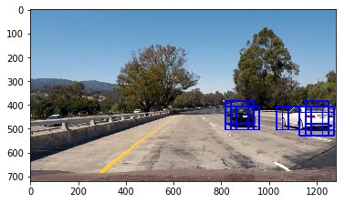


## Create a Heatmap and Label the Cars


```python
heat = np.zeros_like(image[:,:,0]).astype(np.float)
print(heat.shape)
#1 frame
heat = add_heat(heat,hot_windows)
# 2 frame
# heat = add_heat(heat, hot_windows)
# # 3 frame
# heat = add_heat(heat, hot_windows)
# #4 frame
# heat = add_heat(heat, hot_windows)
# #5 frame
# heat = add_heat(heat, hot_windows)
heat = apply_threshold(heat, 2)
labels = label(heat)
print(labels[1], 'cars found')
plt.imshow(labels[0], cmap='gray')
```

    (720, 1280)
    2 cars found


    <matplotlib.image.AxesImage at 0x3a771ffd0>


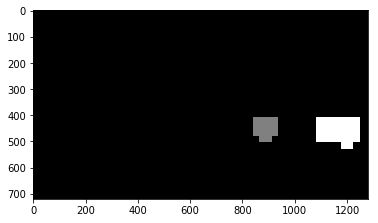


```python
# Draw bounding boxes on a copy of the image
draw_img = draw_labeled_bboxes(np.copy(image), labels)
# Display the image
plt.imshow(draw_img)
```


    <matplotlib.image.AxesImage at 0x3a81a59e8>


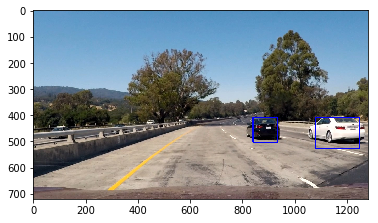


## Test on a test video first

The technique for the sliding windows that I employed was to go over different parts of the image with different size squares to capture cars further away and closer up. The window sizes increase as they go from the midpoint of the image to the bottom with plenty of overlap to avoid missing in cars. The smaller windows near the midpoint can capture cars far away and the larger ones near the bottom of the image will capture the cars closer to the camera.


```python
#define a new heatmap for the video
ex_image = cv2.imread('ex_vid_img.jpg')
heat = np.zeros_like(ex_image[:,:,0]).astype(np.float)
total = 0
print(heat.shape)
plt.imshow(ex_image)
```

    (540, 960)


    <matplotlib.image.AxesImage at 0x3a5f9b400>


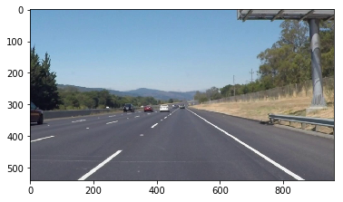


```python

def processImage(image):
    #print(img.shape)
    global heat
    #print(heat2.shape)
    global total
    global svc
    global random_forest
    global mlp
    global gaussianNB
    global knn
    global X_scaler
    ### Tweak these parameters and see how the results change.
    color_space = 'YUV' # Can be RGB, HSV, LUV, HLS, YUV, YCrCb
    orient = 12  # HOG orientations
    pix_per_cell = 8 # HOG pixels per cell
    cell_per_block = 2 # HOG cells per block
    hog_channel = "ALL" # Can be 0, 1, 2, or "ALL"
    spatial_size = (64, 64) # Spatial binning dimensions
    hist_bins = 64    # Number of histogram bins
    spatial_feat = True # Spatial features on or off
    hist_feat = True # Histogram features on or off
    hog_feat = True # HOG features on or off
    y_start_stop = (int(image.shape[0]*.4), int(image.shape[0]*.9))
   
#     windows = slide_window(image, x_start_stop=[None, None], y_start_stop=y_start_stop, 
#                     xy_window=(32,32), xy_overlap=(0.75, 0.75))

    #define spaces to grab windows of different size
    windows = []
    # 1) from .4 - .55
#     y_start_stop = [int(image.shape[0]*.3), int(image.shape[0]*.45)] # Min and max in y to search in slide_window()
#     windows1 = slide_window(image, x_start_stop=[None, None], y_start_stop=y_start_stop, 
#                         xy_window=(16,16), xy_overlap=(0.5, 0.5))
#     if len(windows1) > 0:
#        windows += windows1
    
    # 1a) add another smaller windows to capture far away cars
#     y_start_stop = [int(image.shape[0]*.3), int(image.shape[0]*.45)] # Min and max in y to search in slide_window()
#     windows1a = slide_window(image, x_start_stop=[None, None], y_start_stop=y_start_stop, 
#                         xy_window=(8,8), xy_overlap=(0.75, 0.75))
#     if len(windows1a) > 0:
#        windows += windows1a
    # 2) from .55 to .70 of image
#     y_start_stop = [int(image.shape[0]*.5), int(image.shape[0]*.95)] # Min and max in y to search in slide_window()
#     windows2 = slide_window(image, x_start_stop=[None, None], y_start_stop=y_start_stop, 
#                         xy_window=(32,32), xy_overlap=(0.5, 0.5))
#     if len(windows2) > 0:
#        windows += windows2
#     # 3) from .70 to .85 THIS CAPTURES SMALLER WINDOWS OF THE CARS
    y_start_stop = [int(image.shape[0]*.5), int(image.shape[0]*.95)] # Min and max in y to search in slide_window()
    windows3 = slide_window(image, x_start_stop=[None, None], y_start_stop=y_start_stop, 
                        xy_window=(64,64), xy_overlap=(0.6, 0.6))
    if len(windows3) > 0:
        windows += windows3
    
    #3a   THIS CAPTURES THE MAJORITY OF THE WINDOWS
    y_start_stop = [int(image.shape[0]*.5), int(image.shape[0]*.95)] # Min and max in y to search in slide_window()
    windows3a = slide_window(image, x_start_stop=[None, None], y_start_stop=y_start_stop, 
                        xy_window=(96,96), xy_overlap=(0.6, 0.6))
    if len(windows3a) > 0:
        windows += windows3a
    # 4) from .65 to .9 of image THIS CAPTURES NOTHING
#     y_start_stop = [int(image.shape[0]*.65), int(image.shape[0]*.95)] # Min and max in y to search in slide_window()
#     windows4 = slide_window(image, x_start_stop=[None, None], y_start_stop=y_start_stop, 
#                         xy_window=(128,128), xy_overlap=(0.75, 0.75))
#     if len(windows4) > 0:
#        windows += windows4

    # 5) from .75 to .9 of image THIS CAPTURES NEARLY NOTHING
#     y_start_stop = [int(image.shape[0]*.65), int(image.shape[0]*.95)] # Min and max in y to search in slide_window()
#     windows5 = slide_window(image, x_start_stop=[None, None], y_start_stop=y_start_stop, 
#                         xy_window=(160,160), xy_overlap=(0.5, 0.5))
#     if len(windows5) > 0:
#        windows += windows5
    
    #one last one for a very large window area THIS CAPTURES A FEW UP CLOSE BUT NOT MUCH
#     y_start_stop = [int(image.shape[0]*.5), int(image.shape[0]*.9)] # Min and max in y to search in slide_window()
#     windows6 = slide_window(image, x_start_stop=[None, None], y_start_stop=y_start_stop, 
#                         xy_window=(220,220), xy_overlap=(0.5, 0.5))
#     if len(windows6) > 0:
#        windows += windows6

    hot_windows = search_windows(image, windows, [svc,mlp,gaussianNB], X_scaler, color_space=color_space, 
                        spatial_size=spatial_size, hist_bins=hist_bins, 
                        orient=orient, pix_per_cell=pix_per_cell, 
                        cell_per_block=cell_per_block, 
                        hog_channel=hog_channel, spatial_feat=spatial_feat, 
                        hist_feat=hist_feat, hog_feat=hog_feat)
    
    #window_img = draw_boxes(image, hot_windows, color=(125, 125, 255), thick=2)
    heat_new = np.zeros_like(image[:,:,0]).astype(np.float)
    heat = add_heat(heat_new,hot_windows) #add more heat to the original heatmap
    apply_threshold(heat, 0)
    labels = label(heat)
    #print(labels[1], 'cars found')
    # Draw bounding boxes on a copy of the image
    result = draw_labeled_bboxes(image, labels)
    total+=1
    return result
```


```python
#test on video

video_output = 'test_project_video_output.mp4'
clip1 = VideoFileClip("solidWhiteRight.mp4")

output_clip = clip1.fl_image(processImage) #NOTE: this function expects color images!!
%time output_clip.write_videofile(video_output, audio=False)
```

    [MoviePy] >>>> Building video test_project_video_output.mp4
    [MoviePy] Writing video test_project_video_output.mp4


    
    
    
    
      0%|          | 0/222 [00:00<?, ?it/s]
    
    
    
      0%|          | 1/222 [00:02<09:35,  2.61s/it]
    
    
    
      1%|          | 2/222 [00:05<09:34,  2.61s/it]
    
    
    
      1%|▏         | 3/222 [00:08<10:22,  2.84s/it]
    
    
    
      2%|▏         | 4/222 [00:11<10:38,  2.93s/it]
    
    
    
      2%|▏         | 5/222 [00:15<11:07,  3.08s/it]
    
    
    
      3%|▎         | 6/222 [00:18<11:23,  3.17s/it]
    
    
    
      3%|▎         | 7/222 [00:22<11:41,  3.26s/it]
    
    
    
      4%|▎         | 8/222 [00:25<11:55,  3.34s/it]
    
    
    
      4%|▍         | 9/222 [00:28<11:56,  3.37s/it]
    
    
    
      5%|▍         | 10/222 [00:32<11:49,  3.35s/it]
    
    
    
      5%|▍         | 11/222 [00:35<11:45,  3.34s/it]
    
    
    
      5%|▌         | 12/222 [00:38<11:29,  3.28s/it]
    
    
    
      6%|▌         | 13/222 [00:41<11:08,  3.20s/it]
    
    
    
      6%|▋         | 14/222 [00:44<10:50,  3.13s/it]
    
    
    
      7%|▋         | 15/222 [00:47<10:34,  3.06s/it]
    
    
    
      7%|▋         | 16/222 [00:50<10:20,  3.01s/it]
    
    
    
      8%|▊         | 17/222 [00:53<10:11,  2.98s/it]
    
    
    
      8%|▊         | 18/222 [00:56<10:12,  3.00s/it]
    
    
    
      9%|▊         | 19/222 [00:59<10:15,  3.03s/it]
    
    
    
      9%|▉         | 20/222 [01:02<10:11,  3.03s/it]
    
    
    
      9%|▉         | 21/222 [01:05<10:15,  3.06s/it]
    
    
    
     10%|▉         | 22/222 [01:08<10:23,  3.12s/it]
    
    
    
     10%|█         | 23/222 [01:12<10:34,  3.19s/it]
    
    
    
     11%|█         | 24/222 [01:15<10:26,  3.17s/it]
    
    
    
     11%|█▏        | 25/222 [01:18<10:23,  3.16s/it]
    
    
    
     12%|█▏        | 26/222 [01:21<10:28,  3.21s/it]
    
    
    
     12%|█▏        | 27/222 [01:25<10:29,  3.23s/it]
    
    
    
     13%|█▎        | 28/222 [01:28<10:37,  3.28s/it]
    
    
    
     13%|█▎        | 29/222 [01:32<10:40,  3.32s/it]
    
    
    
     14%|█▎        | 30/222 [01:35<10:27,  3.27s/it]
    
    
    
     14%|█▍        | 31/222 [01:38<10:29,  3.30s/it]
    
    
    
     14%|█▍        | 32/222 [01:41<10:20,  3.27s/it]
    
    
    
     15%|█▍        | 33/222 [01:45<10:35,  3.36s/it]
    
    
    
     15%|█▌        | 34/222 [01:48<10:25,  3.33s/it]
    
    
    
     16%|█▌        | 35/222 [01:52<10:42,  3.43s/it]
    
    
    
     16%|█▌        | 36/222 [01:55<10:27,  3.37s/it]
    
    
    
     17%|█▋        | 37/222 [01:58<10:24,  3.38s/it]
    
    
    
     17%|█▋        | 38/222 [02:02<10:44,  3.51s/it]
    
    
    
     18%|█▊        | 39/222 [02:06<11:00,  3.61s/it]
    
    
    
     18%|█▊        | 40/222 [02:10<11:16,  3.71s/it]
    
    
    
     18%|█▊        | 41/222 [02:14<11:20,  3.76s/it]
    
    
    
     19%|█▉        | 42/222 [02:17<10:55,  3.64s/it]
    
    
    
     19%|█▉        | 43/222 [02:21<10:41,  3.58s/it]
    
    
    
     20%|█▉        | 44/222 [02:24<10:24,  3.51s/it]
    
    
    
     20%|██        | 45/222 [02:27<10:20,  3.51s/it]
    
    
    
     21%|██        | 46/222 [02:31<10:09,  3.46s/it]
    
    
    
     21%|██        | 47/222 [02:34<09:54,  3.39s/it]
    
    
    
     22%|██▏       | 48/222 [02:38<09:59,  3.45s/it]
    
    
    
     22%|██▏       | 49/222 [02:41<09:59,  3.46s/it]
    
    
    
     23%|██▎       | 50/222 [02:45<10:00,  3.49s/it]
    
    
    
     23%|██▎       | 51/222 [02:48<09:46,  3.43s/it]
    
    
    
     23%|██▎       | 52/222 [02:51<09:46,  3.45s/it]
    
    
    
     24%|██▍       | 53/222 [02:55<09:36,  3.41s/it]
    
    
    
     24%|██▍       | 54/222 [02:58<09:25,  3.37s/it]
    
    
    
     25%|██▍       | 55/222 [03:01<09:21,  3.36s/it]
    
    
    
     25%|██▌       | 56/222 [03:05<09:07,  3.30s/it]
    
    
    
     26%|██▌       | 57/222 [03:08<08:56,  3.25s/it]
    
    
    
     26%|██▌       | 58/222 [03:11<08:47,  3.22s/it]
    
    
    
     27%|██▋       | 59/222 [03:14<08:35,  3.16s/it]
    
    
    
     27%|██▋       | 60/222 [03:17<08:28,  3.14s/it]
    
    
    
     27%|██▋       | 61/222 [03:20<08:25,  3.14s/it]
    
    
    
     28%|██▊       | 62/222 [03:23<08:22,  3.14s/it]
    
    
    
     28%|██▊       | 63/222 [03:26<08:21,  3.16s/it]
    
    
    
     29%|██▉       | 64/222 [03:30<08:25,  3.20s/it]
    
    
    
     29%|██▉       | 65/222 [03:33<08:27,  3.23s/it]
    
    
    
     30%|██▉       | 66/222 [03:36<08:26,  3.25s/it]
    
    
    
     30%|███       | 67/222 [03:40<08:24,  3.26s/it]
    
    
    
     31%|███       | 68/222 [03:43<08:21,  3.26s/it]
    
    
    
     31%|███       | 69/222 [03:46<08:17,  3.25s/it]
    
    
    
     32%|███▏      | 70/222 [03:49<08:18,  3.28s/it]
    
    
    
     32%|███▏      | 71/222 [03:53<08:15,  3.28s/it]
    
    
    
     32%|███▏      | 72/222 [03:56<08:16,  3.31s/it]
    
    
    
     33%|███▎      | 73/222 [03:59<08:08,  3.28s/it]
    
    
    
     33%|███▎      | 74/222 [04:03<08:07,  3.29s/it]
    
    
    
     34%|███▍      | 75/222 [04:06<08:02,  3.28s/it]
    
    
    
     34%|███▍      | 76/222 [04:09<08:02,  3.31s/it]
    
    
    
     35%|███▍      | 77/222 [04:12<07:53,  3.27s/it]
    
    
    
     35%|███▌      | 78/222 [04:16<07:52,  3.28s/it]
    
    
    
     36%|███▌      | 79/222 [04:19<07:48,  3.28s/it]
    
    
    
     36%|███▌      | 80/222 [04:22<07:42,  3.26s/it]
    
    
    
     36%|███▋      | 81/222 [04:26<07:39,  3.26s/it]
    
    
    
     37%|███▋      | 82/222 [04:29<07:42,  3.30s/it]
    
    
    
     37%|███▋      | 83/222 [04:32<07:49,  3.37s/it]
    
    
    
     38%|███▊      | 84/222 [04:36<07:39,  3.33s/it]
    
    
    
     38%|███▊      | 85/222 [04:39<07:30,  3.29s/it]
    
    
    
     39%|███▊      | 86/222 [04:42<07:27,  3.29s/it]
    
    
    
     39%|███▉      | 87/222 [04:45<07:24,  3.29s/it]
    
    
    
     40%|███▉      | 88/222 [04:49<07:18,  3.27s/it]
    
    
    
     40%|████      | 89/222 [04:52<07:12,  3.25s/it]
    
    
    
     41%|████      | 90/222 [04:55<07:10,  3.26s/it]
    
    
    
     41%|████      | 91/222 [04:58<07:04,  3.24s/it]
    
    
    
     41%|████▏     | 92/222 [05:02<07:04,  3.26s/it]
    
    
    
     42%|████▏     | 93/222 [05:05<07:00,  3.26s/it]
    
    
    
     42%|████▏     | 94/222 [05:08<06:52,  3.23s/it]
    
    
    
     43%|████▎     | 95/222 [05:11<06:46,  3.20s/it]
    
    
    
     43%|████▎     | 96/222 [05:14<06:40,  3.18s/it]
    
    
    
     44%|████▎     | 97/222 [05:18<06:38,  3.19s/it]
    
    
    
     44%|████▍     | 98/222 [05:21<06:35,  3.19s/it]
    
    
    
     45%|████▍     | 99/222 [05:24<06:36,  3.22s/it]
    
    
    
     45%|████▌     | 100/222 [05:27<06:34,  3.23s/it]
    
    
    
     45%|████▌     | 101/222 [05:30<06:28,  3.21s/it]
    
    
    
     46%|████▌     | 102/222 [05:34<06:26,  3.22s/it]
    
    
    
     46%|████▋     | 103/222 [05:37<06:21,  3.21s/it]
    
    
    
     47%|████▋     | 104/222 [05:40<06:18,  3.21s/it]
    
    
    
     47%|████▋     | 105/222 [05:43<06:17,  3.23s/it]
    
    
    
     48%|████▊     | 106/222 [05:47<06:16,  3.24s/it]
    
    
    
     48%|████▊     | 107/222 [05:50<06:14,  3.25s/it]
    
    
    
     49%|████▊     | 108/222 [05:53<06:13,  3.28s/it]
    
    
    
     49%|████▉     | 109/222 [05:57<06:09,  3.27s/it]
    
    
    
     50%|████▉     | 110/222 [06:00<06:00,  3.22s/it]
    
    
    
     50%|█████     | 111/222 [06:03<06:06,  3.31s/it]
    
    
    
     50%|█████     | 112/222 [06:07<06:07,  3.34s/it]
    
    
    
     51%|█████     | 113/222 [06:10<05:55,  3.26s/it]
    
    
    
     51%|█████▏    | 114/222 [06:13<05:51,  3.25s/it]
    
    
    
     52%|█████▏    | 115/222 [06:16<05:46,  3.24s/it]
    
    
    
     52%|█████▏    | 116/222 [06:19<05:43,  3.24s/it]
    
    
    
     53%|█████▎    | 117/222 [06:22<05:36,  3.21s/it]
    
    
    
     53%|█████▎    | 118/222 [06:26<05:35,  3.23s/it]
    
    
    
     54%|█████▎    | 119/222 [06:29<05:34,  3.25s/it]
    
    
    
     54%|█████▍    | 120/222 [06:32<05:29,  3.23s/it]
    
    
    
     55%|█████▍    | 121/222 [06:35<05:26,  3.23s/it]
    
    
    
     55%|█████▍    | 122/222 [06:39<05:25,  3.25s/it]
    
    
    
     55%|█████▌    | 123/222 [06:42<05:20,  3.24s/it]
    
    
    
     56%|█████▌    | 124/222 [06:45<05:11,  3.18s/it]
    
    
    
     56%|█████▋    | 125/222 [06:48<05:02,  3.12s/it]
    
    
    
     57%|█████▋    | 126/222 [06:51<04:54,  3.07s/it]
    
    
    
     57%|█████▋    | 127/222 [06:54<04:55,  3.11s/it]
    
    
    
     58%|█████▊    | 128/222 [06:57<04:53,  3.12s/it]
    
    
    
     58%|█████▊    | 129/222 [07:00<04:50,  3.12s/it]
    
    
    
     59%|█████▊    | 130/222 [07:04<04:48,  3.14s/it]
    
    
    
     59%|█████▉    | 131/222 [07:07<04:44,  3.12s/it]
    
    
    
     59%|█████▉    | 132/222 [07:10<04:46,  3.18s/it]
    
    
    
     60%|█████▉    | 133/222 [07:13<04:45,  3.21s/it]
    
    
    
     60%|██████    | 134/222 [07:16<04:40,  3.19s/it]
    
    
    
     61%|██████    | 135/222 [07:19<04:33,  3.15s/it]
    
    
    
     61%|██████▏   | 136/222 [07:23<04:33,  3.18s/it]
    
    
    
     62%|██████▏   | 137/222 [07:26<04:28,  3.16s/it]
    
    
    
     62%|██████▏   | 138/222 [07:29<04:31,  3.23s/it]
    
    
    
     63%|██████▎   | 139/222 [07:32<04:23,  3.17s/it]
    
    
    
     63%|██████▎   | 140/222 [07:36<04:24,  3.22s/it]
    
    
    
     64%|██████▎   | 141/222 [07:39<04:24,  3.26s/it]
    
    
    
     64%|██████▍   | 142/222 [07:42<04:22,  3.28s/it]
    
    
    
     64%|██████▍   | 143/222 [07:45<04:15,  3.23s/it]
    
    
    
     65%|██████▍   | 144/222 [07:49<04:10,  3.21s/it]
    
    
    
     65%|██████▌   | 145/222 [07:52<04:14,  3.30s/it]
    
    
    
     66%|██████▌   | 146/222 [07:55<04:09,  3.29s/it]
    
    
    
     66%|██████▌   | 147/222 [07:59<04:10,  3.34s/it]
    
    
    
     67%|██████▋   | 148/222 [08:03<04:16,  3.46s/it]
    
    
    
     67%|██████▋   | 149/222 [08:06<04:16,  3.52s/it]
    
    
    
     68%|██████▊   | 150/222 [08:10<04:17,  3.57s/it]
    
    
    
     68%|██████▊   | 151/222 [08:13<04:05,  3.46s/it]
    
    
    
     68%|██████▊   | 152/222 [08:16<03:53,  3.34s/it]
    
    
    
     69%|██████▉   | 153/222 [08:19<03:45,  3.27s/it]
    
    
    
     69%|██████▉   | 154/222 [08:22<03:37,  3.20s/it]
    
    
    
     70%|██████▉   | 155/222 [08:26<03:38,  3.26s/it]
    
    
    
     70%|███████   | 156/222 [08:29<03:34,  3.25s/it]
    
    
    
     71%|███████   | 157/222 [08:32<03:29,  3.22s/it]
    
    
    
     71%|███████   | 158/222 [08:35<03:24,  3.20s/it]
    
    
    
     72%|███████▏  | 159/222 [08:38<03:23,  3.23s/it]
    
    
    
     72%|███████▏  | 160/222 [08:42<03:20,  3.23s/it]
    
    
    
     73%|███████▎  | 161/222 [08:45<03:16,  3.23s/it]
    
    
    
     73%|███████▎  | 162/222 [08:48<03:12,  3.21s/it]
    
    
    
     73%|███████▎  | 163/222 [08:51<03:10,  3.23s/it]
    
    
    
     74%|███████▍  | 164/222 [08:55<03:09,  3.26s/it]
    
    
    
     74%|███████▍  | 165/222 [08:58<03:05,  3.25s/it]
    
    
    
     75%|███████▍  | 166/222 [09:01<03:02,  3.26s/it]
    
    
    
     75%|███████▌  | 167/222 [09:04<02:57,  3.23s/it]
    
    
    
     76%|███████▌  | 168/222 [09:08<02:54,  3.24s/it]
    
    
    
     76%|███████▌  | 169/222 [09:11<02:52,  3.25s/it]
    
    
    
     77%|███████▋  | 170/222 [09:14<02:47,  3.22s/it]
    
    
    
     77%|███████▋  | 171/222 [09:17<02:43,  3.21s/it]
    
    
    
     77%|███████▋  | 172/222 [09:20<02:39,  3.19s/it]
    
    
    
     78%|███████▊  | 173/222 [09:24<02:36,  3.19s/it]
    
    
    
     78%|███████▊  | 174/222 [09:27<02:34,  3.21s/it]
    
    
    
     79%|███████▉  | 175/222 [09:30<02:33,  3.26s/it]
    
    
    
     79%|███████▉  | 176/222 [09:34<02:33,  3.35s/it]
    
    
    
     80%|███████▉  | 177/222 [09:37<02:29,  3.31s/it]
    
    
    
     80%|████████  | 178/222 [09:40<02:23,  3.26s/it]
    
    
    
     81%|████████  | 179/222 [09:43<02:17,  3.19s/it]
    
    
    
     81%|████████  | 180/222 [09:46<02:10,  3.11s/it]
    
    
    
     82%|████████▏ | 181/222 [09:49<02:05,  3.07s/it]
    
    
    
     82%|████████▏ | 182/222 [09:52<02:03,  3.09s/it]
    
    
    
     82%|████████▏ | 183/222 [09:56<02:03,  3.17s/it]
    
    
    
     83%|████████▎ | 184/222 [09:59<02:01,  3.19s/it]
    
    
    
     83%|████████▎ | 185/222 [10:02<01:58,  3.21s/it]
    
    
    
     84%|████████▍ | 186/222 [10:05<01:55,  3.20s/it]
    
    
    
     84%|████████▍ | 187/222 [10:09<01:53,  3.24s/it]
    
    
    
     85%|████████▍ | 188/222 [10:12<01:52,  3.31s/it]
    
    
    
     85%|████████▌ | 189/222 [10:15<01:48,  3.30s/it]
    
    
    
     86%|████████▌ | 190/222 [10:18<01:44,  3.26s/it]
    
    
    
     86%|████████▌ | 191/222 [10:22<01:41,  3.27s/it]
    
    
    
     86%|████████▋ | 192/222 [10:25<01:38,  3.29s/it]
    
    
    
     87%|████████▋ | 193/222 [10:28<01:35,  3.29s/it]
    
    
    
     87%|████████▋ | 194/222 [10:32<01:32,  3.29s/it]
    
    
    
     88%|████████▊ | 195/222 [10:35<01:28,  3.28s/it]
    
    
    
     88%|████████▊ | 196/222 [10:38<01:24,  3.27s/it]
    
    
    
     89%|████████▊ | 197/222 [10:41<01:22,  3.28s/it]
    
    
    
     89%|████████▉ | 198/222 [10:45<01:18,  3.27s/it]
    
    
    
     90%|████████▉ | 199/222 [10:48<01:14,  3.25s/it]
    
    
    
     90%|█████████ | 200/222 [10:51<01:11,  3.26s/it]
    
    
    
     91%|█████████ | 201/222 [10:54<01:07,  3.21s/it]
    
    
    
     91%|█████████ | 202/222 [10:57<01:02,  3.12s/it]
    
    
    
     91%|█████████▏| 203/222 [11:00<00:58,  3.10s/it]
    
    
    
     92%|█████████▏| 204/222 [11:04<00:56,  3.14s/it]
    
    
    
     92%|█████████▏| 205/222 [11:07<00:54,  3.21s/it]
    
    
    
     93%|█████████▎| 206/222 [11:10<00:51,  3.20s/it]
    
    
    
     93%|█████████▎| 207/222 [11:13<00:48,  3.24s/it]
    
    
    
     94%|█████████▎| 208/222 [11:17<00:46,  3.31s/it]
    
    
    
     94%|█████████▍| 209/222 [11:20<00:42,  3.28s/it]
    
    
    
     95%|█████████▍| 210/222 [11:23<00:39,  3.28s/it]
    
    
    
     95%|█████████▌| 211/222 [11:27<00:36,  3.30s/it]
    
    
    
     95%|█████████▌| 212/222 [11:30<00:32,  3.23s/it]
    
    
    
     96%|█████████▌| 213/222 [11:33<00:28,  3.15s/it]
    
    
    
     96%|█████████▋| 214/222 [11:36<00:24,  3.08s/it]
    
    
    
     97%|█████████▋| 215/222 [11:39<00:21,  3.03s/it]
    
    
    
     97%|█████████▋| 216/222 [11:42<00:18,  3.08s/it]
    
    
    
     98%|█████████▊| 217/222 [11:45<00:15,  3.18s/it]
    
    
    
     98%|█████████▊| 218/222 [11:48<00:12,  3.21s/it]
    
    
    
     99%|█████████▊| 219/222 [11:52<00:09,  3.26s/it]
    
    
    
     99%|█████████▉| 220/222 [11:55<00:06,  3.32s/it]
    
    
    
    100%|█████████▉| 221/222 [11:59<00:03,  3.30s/it]
    
    
    
    

    [MoviePy] Done.
    [MoviePy] >>>> Video ready: test_project_video_output.mp4 
    
    CPU times: user 13min 46s, sys: 5min 9s, total: 18min 55s
    Wall time: 11min 59s


```python
HTML("""
<video width="960" height="540" controls>
  <source src="{0}">
</video>
""".format(video_output))
```


<video width="960" height="540" controls>
  <source src="test_project_video_output.mp4">
</video>


Here's a link to the video:
https://youtu.be/SCMoAWXBIh4

Excellent! No false positives and the cars (not in the distance) were continuously identified throughout the video!

The performance was not good: it took over 4.5 hours to complete this short video....

## Test on the project video result with lane line detection included

For this video I removed the Random Forest classifier as the performance was terrible. The above video took over 4.5 hours with all sized windows and classifiers so this one (and I tried will take around 24hrs. to complete). Removing the Random Forest will help improve performance hopefully to where I can complete the video and the project. I also reduced the number of windows to 64 x 64 and 96 x 96 sets.


```python
project_video_output = 'project_video_output.mp4'
clip1 = VideoFileClip("project_video.mp4")

#reset the heatmap
heat = np.zeros_like(ex_image[:,:,0]).astype(np.float)

output_clip2 = clip1.fl_image(processImage) #NOTE: this function expects color images!!
%time output_clip2.write_videofile(project_video_output, audio=False)
```

    [MoviePy] >>>> Building video project_video_output.mp4
    [MoviePy] Writing video project_video_output.mp4


    
    
    
    
      0%|          | 0/1261 [00:00<?, ?it/s]
    
    
    
      0%|          | 1/1261 [00:04<1:36:51,  4.61s/it]
    
    
    
      0%|          | 2/1261 [00:09<1:36:37,  4.60s/it]
    
    
    
      0%|          | 3/1261 [00:13<1:36:25,  4.60s/it]
    
    
    
      0%|          | 4/1261 [00:18<1:36:09,  4.59s/it]
    
    
    
      0%|          | 5/1261 [00:22<1:35:50,  4.58s/it]
    
    
    
      0%|          | 6/1261 [00:27<1:35:44,  4.58s/it]
    
    
    
      1%|          | 7/1261 [00:32<1:35:42,  4.58s/it]
    
    
    
      1%|          | 8/1261 [00:36<1:35:40,  4.58s/it]
    
    
    
      1%|          | 9/1261 [00:41<1:35:48,  4.59s/it]
    
    
    
      1%|          | 10/1261 [00:45<1:36:03,  4.61s/it]
    
    
    
      1%|          | 11/1261 [00:50<1:36:14,  4.62s/it]
    
    
    
      1%|          | 12/1261 [00:55<1:36:15,  4.62s/it]
    
    
    
      1%|          | 13/1261 [00:59<1:36:34,  4.64s/it]
    
    
    
      1%|          | 14/1261 [01:04<1:36:54,  4.66s/it]
    
    
    
      1%|          | 15/1261 [01:09<1:37:09,  4.68s/it]
    
    
    
      1%|▏         | 16/1261 [01:14<1:37:17,  4.69s/it]
    
    
    
      1%|▏         | 17/1261 [01:18<1:37:15,  4.69s/it]
    
    
    
      1%|▏         | 18/1261 [01:23<1:37:25,  4.70s/it]
    
    
    
      2%|▏         | 19/1261 [01:28<1:37:28,  4.71s/it]
    
    
    
      2%|▏         | 20/1261 [01:32<1:37:18,  4.70s/it]
    
    
    
      2%|▏         | 21/1261 [01:37<1:37:29,  4.72s/it]
    
    
    
      2%|▏         | 22/1261 [01:42<1:37:51,  4.74s/it]
    
    
    
      2%|▏         | 23/1261 [01:47<1:39:55,  4.84s/it]
    
    
    
      2%|▏         | 24/1261 [01:53<1:44:17,  5.06s/it]
    
    
    
      2%|▏         | 25/1261 [01:58<1:46:49,  5.19s/it]
    
    
    
      2%|▏         | 26/1261 [02:03<1:47:12,  5.21s/it]
    
    
    
      2%|▏         | 27/1261 [02:09<1:48:10,  5.26s/it]
    
    
    
      2%|▏         | 28/1261 [02:14<1:47:33,  5.23s/it]
    
    
    
      2%|▏         | 29/1261 [02:19<1:45:17,  5.13s/it]
    
    
    
      2%|▏         | 30/1261 [02:24<1:45:26,  5.14s/it]
    
    
    
      2%|▏         | 31/1261 [02:30<1:50:51,  5.41s/it]
    
    
    
      3%|▎         | 32/1261 [02:35<1:49:49,  5.36s/it]
    
    
    
      3%|▎         | 33/1261 [02:40<1:49:22,  5.34s/it]
    
    
    
      3%|▎         | 34/1261 [02:46<1:49:36,  5.36s/it]
    
    
    
      3%|▎         | 35/1261 [02:51<1:49:55,  5.38s/it]
    
    
    
      3%|▎         | 36/1261 [02:57<1:51:49,  5.48s/it]
    
    
    
      3%|▎         | 37/1261 [03:03<1:56:46,  5.72s/it]
    
    
    
      3%|▎         | 38/1261 [03:09<1:57:15,  5.75s/it]
    
    
    
      3%|▎         | 39/1261 [03:15<1:58:00,  5.79s/it]
    
    
    
      3%|▎         | 40/1261 [03:21<1:57:33,  5.78s/it]
    
    
    
      3%|▎         | 41/1261 [03:27<1:57:42,  5.79s/it]
    
    
    
      3%|▎         | 42/1261 [03:32<1:56:05,  5.71s/it]
    
    
    
      3%|▎         | 43/1261 [03:38<1:54:35,  5.64s/it]
    
    
    
      3%|▎         | 44/1261 [03:43<1:52:05,  5.53s/it]
    
    
    
      4%|▎         | 45/1261 [03:48<1:51:26,  5.50s/it]
    
    
    
      4%|▎         | 46/1261 [03:54<1:51:08,  5.49s/it]
    
    
    
      4%|▎         | 47/1261 [03:59<1:49:38,  5.42s/it]
    
    
    
      4%|▍         | 48/1261 [04:04<1:49:54,  5.44s/it]
    
    
    
      4%|▍         | 49/1261 [04:10<1:50:10,  5.45s/it]
    
    
    
      4%|▍         | 50/1261 [04:15<1:48:52,  5.39s/it]
    
    
    
      4%|▍         | 51/1261 [04:21<1:49:05,  5.41s/it]
    
    
    
      4%|▍         | 52/1261 [04:26<1:49:31,  5.44s/it]
    
    
    
      4%|▍         | 53/1261 [04:31<1:48:38,  5.40s/it]
    
    
    
      4%|▍         | 54/1261 [04:37<1:48:27,  5.39s/it]
    
    
    
      4%|▍         | 55/1261 [04:42<1:48:57,  5.42s/it]
    
    
    
      4%|▍         | 56/1261 [04:48<1:48:28,  5.40s/it]
    
    
    
      5%|▍         | 57/1261 [04:53<1:47:58,  5.38s/it]
    
    
    
      5%|▍         | 58/1261 [04:59<1:48:27,  5.41s/it]
    
    
    
      5%|▍         | 59/1261 [05:04<1:49:24,  5.46s/it]
    
    
    
      5%|▍         | 60/1261 [05:10<1:54:13,  5.71s/it]
    
    
    
      5%|▍         | 61/1261 [05:17<1:58:54,  5.95s/it]
    
    
    
      5%|▍         | 62/1261 [05:23<2:00:13,  6.02s/it]
    
    
    
      5%|▍         | 63/1261 [05:29<1:59:30,  5.99s/it]
    
    
    
      5%|▌         | 64/1261 [05:35<1:57:37,  5.90s/it]
    
    
    
      5%|▌         | 65/1261 [05:40<1:55:19,  5.79s/it]
    
    
    
      5%|▌         | 66/1261 [05:46<1:57:59,  5.92s/it]
    
    
    
      5%|▌         | 67/1261 [05:52<1:56:47,  5.87s/it]
    
    
    
      5%|▌         | 68/1261 [05:58<1:57:40,  5.92s/it]
    
    
    
      5%|▌         | 69/1261 [06:05<2:00:17,  6.05s/it]
    
    
    
      6%|▌         | 70/1261 [06:11<2:01:19,  6.11s/it]
    
    
    
      6%|▌         | 71/1261 [06:17<2:02:03,  6.15s/it]
    
    
    
      6%|▌         | 72/1261 [06:23<2:03:16,  6.22s/it]
    
    
    
      6%|▌         | 73/1261 [06:29<2:01:06,  6.12s/it]
    
    
    
      6%|▌         | 74/1261 [06:35<1:57:44,  5.95s/it]
    
    
    
      6%|▌         | 75/1261 [06:40<1:54:02,  5.77s/it]
    
    
    
      6%|▌         | 76/1261 [06:46<1:54:13,  5.78s/it]
    
    
    
      6%|▌         | 77/1261 [06:52<1:56:32,  5.91s/it]
    
    
    
      6%|▌         | 78/1261 [06:58<1:57:49,  5.98s/it]
    
    
    
      6%|▋         | 79/1261 [07:05<2:01:41,  6.18s/it]
    
    
    
      6%|▋         | 80/1261 [07:11<2:00:22,  6.12s/it]
    
    
    
      6%|▋         | 81/1261 [07:17<1:58:48,  6.04s/it]
    
    
    
      7%|▋         | 82/1261 [07:23<1:58:49,  6.05s/it]
    
    
    
      7%|▋         | 83/1261 [07:29<1:58:52,  6.05s/it]
    
    
    
      7%|▋         | 84/1261 [07:35<1:58:57,  6.06s/it]
    
    
    
      7%|▋         | 85/1261 [07:41<2:00:44,  6.16s/it]
    
    
    
      7%|▋         | 86/1261 [07:48<2:00:59,  6.18s/it]
    
    
    
      7%|▋         | 87/1261 [07:54<2:00:56,  6.18s/it]
    
    
    
      7%|▋         | 88/1261 [08:00<1:59:51,  6.13s/it]
    
    
    
      7%|▋         | 89/1261 [08:06<1:57:08,  6.00s/it]
    
    
    
      7%|▋         | 90/1261 [08:12<1:57:27,  6.02s/it]
    
    
    
      7%|▋         | 91/1261 [08:18<2:00:37,  6.19s/it]
    
    
    
      7%|▋         | 92/1261 [08:24<1:59:44,  6.15s/it]
    
    
    
      7%|▋         | 93/1261 [08:30<1:57:57,  6.06s/it]
    
    
    
      7%|▋         | 94/1261 [08:36<1:54:58,  5.91s/it]
    
    
    
      8%|▊         | 95/1261 [08:42<1:54:49,  5.91s/it]
    
    
    
      8%|▊         | 96/1261 [08:47<1:53:15,  5.83s/it]
    
    
    
      8%|▊         | 97/1261 [08:53<1:50:01,  5.67s/it]
    
    
    
      8%|▊         | 98/1261 [08:58<1:48:10,  5.58s/it]
    
    
    
      8%|▊         | 99/1261 [09:03<1:47:09,  5.53s/it]
    
    
    
      8%|▊         | 100/1261 [09:09<1:45:29,  5.45s/it]
    
    
    
      8%|▊         | 101/1261 [09:14<1:44:01,  5.38s/it]
    
    
    
      8%|▊         | 102/1261 [09:19<1:44:25,  5.41s/it]
    
    
    
      8%|▊         | 103/1261 [09:25<1:44:09,  5.40s/it]
    
    
    
      8%|▊         | 104/1261 [09:30<1:42:59,  5.34s/it]
    
    
    
      8%|▊         | 105/1261 [09:35<1:42:53,  5.34s/it]
    
    
    
      8%|▊         | 106/1261 [09:41<1:43:32,  5.38s/it]
    
    
    
      8%|▊         | 107/1261 [09:46<1:42:51,  5.35s/it]
    
    
    
      9%|▊         | 108/1261 [09:51<1:42:37,  5.34s/it]
    
    
    
      9%|▊         | 109/1261 [09:57<1:44:43,  5.45s/it]
    
    
    
      9%|▊         | 110/1261 [10:03<1:50:34,  5.76s/it]
    
    
    
      9%|▉         | 111/1261 [10:09<1:49:40,  5.72s/it]
    
    
    
      9%|▉         | 112/1261 [10:14<1:47:31,  5.61s/it]
    
    
    
      9%|▉         | 113/1261 [10:20<1:45:07,  5.49s/it]
    
    
    
      9%|▉         | 114/1261 [10:25<1:43:34,  5.42s/it]
    
    
    
      9%|▉         | 115/1261 [10:30<1:43:46,  5.43s/it]
    
    
    
      9%|▉         | 116/1261 [10:36<1:43:52,  5.44s/it]
    
    
    
      9%|▉         | 117/1261 [10:41<1:43:09,  5.41s/it]
    
    
    
      9%|▉         | 118/1261 [10:47<1:43:22,  5.43s/it]
    
    
    
      9%|▉         | 119/1261 [10:52<1:43:28,  5.44s/it]
    
    
    
     10%|▉         | 120/1261 [10:57<1:42:26,  5.39s/it]
    
    
    
     10%|▉         | 121/1261 [11:03<1:41:24,  5.34s/it]
    
    
    
     10%|▉         | 122/1261 [11:08<1:41:55,  5.37s/it]
    
    
    
     10%|▉         | 123/1261 [11:13<1:41:32,  5.35s/it]
    
    
    
     10%|▉         | 124/1261 [11:19<1:43:09,  5.44s/it]
    
    
    
     10%|▉         | 125/1261 [11:25<1:44:17,  5.51s/it]
    
    
    
     10%|▉         | 126/1261 [11:30<1:43:24,  5.47s/it]
    
    
    
     10%|█         | 127/1261 [11:35<1:42:11,  5.41s/it]
    
    
    
     10%|█         | 128/1261 [11:41<1:42:30,  5.43s/it]
    
    
    
     10%|█         | 129/1261 [11:46<1:43:24,  5.48s/it]
    
    
    
     10%|█         | 130/1261 [11:52<1:43:45,  5.50s/it]
    
    
    
     10%|█         | 131/1261 [11:57<1:42:25,  5.44s/it]
    
    
    
     10%|█         | 132/1261 [12:02<1:41:02,  5.37s/it]
    
    
    
     11%|█         | 133/1261 [12:08<1:43:14,  5.49s/it]
    
    
    
     11%|█         | 134/1261 [12:14<1:44:47,  5.58s/it]
    
    
    
     11%|█         | 135/1261 [12:20<1:44:43,  5.58s/it]
    
    
    
     11%|█         | 136/1261 [12:25<1:45:22,  5.62s/it]
    
    
    
     11%|█         | 137/1261 [12:31<1:46:02,  5.66s/it]
    
    
    
     11%|█         | 138/1261 [12:37<1:48:54,  5.82s/it]
    
    
    
     11%|█         | 139/1261 [12:43<1:49:57,  5.88s/it]
    
    
    
     11%|█         | 140/1261 [12:49<1:48:31,  5.81s/it]
    
    
    
     11%|█         | 141/1261 [12:54<1:47:00,  5.73s/it]
    
    
    
     11%|█▏        | 142/1261 [13:00<1:45:59,  5.68s/it]
    
    
    
     11%|█▏        | 143/1261 [13:06<1:47:58,  5.79s/it]
    
    
    
     11%|█▏        | 144/1261 [13:12<1:50:39,  5.94s/it]
    
    
    
     11%|█▏        | 145/1261 [13:19<1:52:00,  6.02s/it]
    
    
    
     12%|█▏        | 146/1261 [13:24<1:51:16,  5.99s/it]
    
    
    
     12%|█▏        | 147/1261 [13:31<1:51:14,  5.99s/it]
    
    
    
     12%|█▏        | 148/1261 [13:36<1:49:48,  5.92s/it]
    
    
    
     12%|█▏        | 149/1261 [13:42<1:48:27,  5.85s/it]
    
    
    
     12%|█▏        | 150/1261 [13:47<1:46:16,  5.74s/it]
    
    
    
     12%|█▏        | 151/1261 [13:53<1:44:26,  5.65s/it]
    
    
    
     12%|█▏        | 152/1261 [13:58<1:42:05,  5.52s/it]
    
    
    
     12%|█▏        | 153/1261 [14:03<1:41:07,  5.48s/it]
    
    
    
     12%|█▏        | 154/1261 [14:09<1:40:16,  5.44s/it]
    
    
    
     12%|█▏        | 155/1261 [14:14<1:38:55,  5.37s/it]
    
    
    
     12%|█▏        | 156/1261 [14:19<1:37:57,  5.32s/it]
    
    
    
     12%|█▏        | 157/1261 [14:25<1:38:02,  5.33s/it]
    
    
    
     13%|█▎        | 158/1261 [14:30<1:38:01,  5.33s/it]
    
    
    
     13%|█▎        | 159/1261 [14:35<1:37:13,  5.29s/it]
    
    
    
     13%|█▎        | 160/1261 [14:40<1:37:38,  5.32s/it]
    
    
    
     13%|█▎        | 161/1261 [14:46<1:37:33,  5.32s/it]
    
    
    
     13%|█▎        | 162/1261 [14:51<1:36:55,  5.29s/it]
    
    
    
     13%|█▎        | 163/1261 [14:56<1:36:46,  5.29s/it]
    
    
    
     13%|█▎        | 164/1261 [15:02<1:37:32,  5.34s/it]
    
    
    
     13%|█▎        | 165/1261 [15:07<1:36:49,  5.30s/it]
    
    
    
     13%|█▎        | 166/1261 [15:12<1:36:29,  5.29s/it]
    
    
    
     13%|█▎        | 167/1261 [15:18<1:37:22,  5.34s/it]
    
    
    
     13%|█▎        | 168/1261 [15:23<1:37:12,  5.34s/it]
    
    
    
     13%|█▎        | 169/1261 [15:28<1:36:33,  5.31s/it]
    
    
    
     13%|█▎        | 170/1261 [15:34<1:36:57,  5.33s/it]
    
    
    
     14%|█▎        | 171/1261 [15:39<1:36:55,  5.34s/it]
    
    
    
     14%|█▎        | 172/1261 [15:44<1:36:13,  5.30s/it]
    
    
    
     14%|█▎        | 173/1261 [15:50<1:36:13,  5.31s/it]
    
    
    
     14%|█▍        | 174/1261 [15:55<1:36:46,  5.34s/it]
    
    
    
     14%|█▍        | 175/1261 [16:00<1:36:04,  5.31s/it]
    
    
    
     14%|█▍        | 176/1261 [16:05<1:35:58,  5.31s/it]
    
    
    
     14%|█▍        | 177/1261 [16:11<1:36:22,  5.33s/it]
    
    
    
     14%|█▍        | 178/1261 [16:16<1:35:50,  5.31s/it]
    
    
    
     14%|█▍        | 179/1261 [16:21<1:35:23,  5.29s/it]
    
    
    
     14%|█▍        | 180/1261 [16:27<1:36:14,  5.34s/it]
    
    
    
     14%|█▍        | 181/1261 [16:32<1:35:55,  5.33s/it]
    
    
    
     14%|█▍        | 182/1261 [16:37<1:35:19,  5.30s/it]
    
    
    
     15%|█▍        | 183/1261 [16:43<1:35:54,  5.34s/it]
    
    
    
     15%|█▍        | 184/1261 [16:48<1:35:19,  5.31s/it]
    
    
    
     15%|█▍        | 185/1261 [16:53<1:35:30,  5.33s/it]
    
    
    
     15%|█▍        | 186/1261 [16:59<1:35:24,  5.32s/it]
    
    
    
     15%|█▍        | 187/1261 [17:04<1:35:56,  5.36s/it]
    
    
    
     15%|█▍        | 188/1261 [17:10<1:38:44,  5.52s/it]
    
    
    
     15%|█▍        | 189/1261 [17:16<1:42:49,  5.76s/it]
    
    
    
     15%|█▌        | 190/1261 [17:22<1:43:50,  5.82s/it]
    
    
    
     15%|█▌        | 191/1261 [17:28<1:42:25,  5.74s/it]
    
    
    
     15%|█▌        | 192/1261 [17:33<1:40:04,  5.62s/it]
    
    
    
     15%|█▌        | 193/1261 [17:39<1:39:20,  5.58s/it]
    
    
    
     15%|█▌        | 194/1261 [17:44<1:38:38,  5.55s/it]
    
    
    
     15%|█▌        | 195/1261 [17:50<1:42:06,  5.75s/it]
    
    
    
     16%|█▌        | 196/1261 [17:57<1:44:02,  5.86s/it]
    
    
    
     16%|█▌        | 197/1261 [18:03<1:45:32,  5.95s/it]
    
    
    
     16%|█▌        | 198/1261 [18:09<1:46:23,  6.00s/it]
    
    
    
     16%|█▌        | 199/1261 [18:15<1:47:21,  6.07s/it]
    
    
    
     16%|█▌        | 200/1261 [18:21<1:46:46,  6.04s/it]
    
    
    
     16%|█▌        | 201/1261 [18:26<1:43:19,  5.85s/it]
    
    
    
     16%|█▌        | 202/1261 [18:32<1:40:19,  5.68s/it]
    
    
    
     16%|█▌        | 203/1261 [18:37<1:39:36,  5.65s/it]
    
    
    
     16%|█▌        | 204/1261 [18:43<1:40:04,  5.68s/it]
    
    
    
     16%|█▋        | 205/1261 [18:49<1:40:03,  5.68s/it]
    
    
    
     16%|█▋        | 206/1261 [18:55<1:42:27,  5.83s/it]
    
    
    
     16%|█▋        | 207/1261 [19:01<1:43:22,  5.89s/it]
    
    
    
     16%|█▋        | 208/1261 [19:06<1:41:11,  5.77s/it]
    
    
    
     17%|█▋        | 209/1261 [19:12<1:41:02,  5.76s/it]
    
    
    
     17%|█▋        | 210/1261 [19:17<1:34:12,  5.38s/it]
    
    
    
     17%|█▋        | 211/1261 [19:20<1:25:11,  4.87s/it]
    
    
    
     17%|█▋        | 212/1261 [19:24<1:18:15,  4.48s/it]
    
    
    
     17%|█▋        | 213/1261 [19:27<1:13:25,  4.20s/it]
    
    
    
     17%|█▋        | 214/1261 [19:31<1:10:27,  4.04s/it]
    
    
    
     17%|█▋        | 215/1261 [19:35<1:07:46,  3.89s/it]
    
    
    
     17%|█▋        | 216/1261 [19:38<1:05:58,  3.79s/it]
    
    
    
     17%|█▋        | 217/1261 [19:42<1:04:35,  3.71s/it]
    
    
    
     17%|█▋        | 218/1261 [19:45<1:03:32,  3.66s/it]
    
    
    
     17%|█▋        | 219/1261 [19:49<1:02:47,  3.62s/it]
    
    
    
     17%|█▋        | 220/1261 [19:52<1:02:15,  3.59s/it]
    
    
    
     18%|█▊        | 221/1261 [19:56<1:01:54,  3.57s/it]
    
    
    
     18%|█▊        | 222/1261 [19:59<1:01:36,  3.56s/it]
    
    
    
     18%|█▊        | 223/1261 [20:03<1:01:32,  3.56s/it]
    
    
    
     18%|█▊        | 224/1261 [20:06<1:01:32,  3.56s/it]
    
    
    
     18%|█▊        | 225/1261 [20:10<1:01:32,  3.56s/it]
    
    
    
     18%|█▊        | 226/1261 [20:14<1:01:28,  3.56s/it]
    
    
    
     18%|█▊        | 227/1261 [20:17<1:01:27,  3.57s/it]
    
    
    
     18%|█▊        | 228/1261 [20:21<1:01:23,  3.57s/it]
    
    
    
     18%|█▊        | 229/1261 [20:24<1:01:12,  3.56s/it]
    
    
    
     18%|█▊        | 230/1261 [20:28<1:01:23,  3.57s/it]
    
    
    
     18%|█▊        | 231/1261 [20:31<1:01:22,  3.58s/it]
    
    
    
     18%|█▊        | 232/1261 [20:35<1:01:24,  3.58s/it]
    
    
    
     18%|█▊        | 233/1261 [20:39<1:01:17,  3.58s/it]
    
    
    
     19%|█▊        | 234/1261 [20:42<1:02:13,  3.64s/it]
    
    
    
     19%|█▊        | 235/1261 [20:46<1:02:28,  3.65s/it]
    
    
    
     19%|█▊        | 236/1261 [20:50<1:02:01,  3.63s/it]
    
    
    
     19%|█▉        | 237/1261 [20:53<1:01:56,  3.63s/it]
    
    
    
     19%|█▉        | 238/1261 [20:57<1:01:43,  3.62s/it]
    
    
    
     19%|█▉        | 239/1261 [21:01<1:01:39,  3.62s/it]
    
    
    
     19%|█▉        | 240/1261 [21:04<1:02:10,  3.65s/it]
    
    
    
     19%|█▉        | 241/1261 [21:08<1:02:33,  3.68s/it]
    
    
    
     19%|█▉        | 242/1261 [21:12<1:02:04,  3.66s/it]
    
    
    
     19%|█▉        | 243/1261 [21:15<1:02:52,  3.71s/it]
    
    
    
     19%|█▉        | 244/1261 [21:20<1:05:10,  3.85s/it]
    
    
    
     19%|█▉        | 245/1261 [21:24<1:07:58,  4.01s/it]
    
    
    
     20%|█▉        | 246/1261 [21:28<1:09:15,  4.09s/it]
    
    
    
     20%|█▉        | 247/1261 [21:33<1:09:50,  4.13s/it]
    
    
    
     20%|█▉        | 248/1261 [21:36<1:07:49,  4.02s/it]
    
    
    
     20%|█▉        | 249/1261 [21:40<1:06:19,  3.93s/it]
    
    
    
     20%|█▉        | 250/1261 [21:44<1:05:19,  3.88s/it]
    
    
    
     20%|█▉        | 251/1261 [21:48<1:06:18,  3.94s/it]
    
    
    
     20%|█▉        | 252/1261 [21:52<1:06:30,  3.96s/it]
    
    
    
     20%|██        | 253/1261 [21:56<1:07:05,  3.99s/it]
    
    
    
     20%|██        | 254/1261 [22:00<1:09:28,  4.14s/it]
    
    
    
     20%|██        | 255/1261 [22:05<1:10:27,  4.20s/it]
    
    
    
     20%|██        | 256/1261 [22:09<1:08:43,  4.10s/it]
    
    
    
     20%|██        | 257/1261 [22:12<1:07:17,  4.02s/it]
    
    
    
     20%|██        | 258/1261 [22:16<1:05:38,  3.93s/it]
    
    
    
     21%|██        | 259/1261 [22:20<1:05:01,  3.89s/it]
    
    
    
     21%|██        | 260/1261 [22:24<1:04:15,  3.85s/it]
    
    
    
     21%|██        | 261/1261 [22:27<1:03:49,  3.83s/it]
    
    
    
     21%|██        | 262/1261 [22:31<1:03:29,  3.81s/it]
    
    
    
     21%|██        | 263/1261 [22:35<1:02:10,  3.74s/it]
    
    
    
     21%|██        | 264/1261 [22:39<1:02:47,  3.78s/it]
    
    
    
     21%|██        | 265/1261 [22:43<1:03:58,  3.85s/it]
    
    
    
     21%|██        | 266/1261 [22:47<1:06:07,  3.99s/it]
    
    
    
     21%|██        | 267/1261 [22:51<1:05:42,  3.97s/it]
    
    
    
     21%|██▏       | 268/1261 [22:55<1:04:51,  3.92s/it]
    
    
    
     21%|██▏       | 269/1261 [22:59<1:04:35,  3.91s/it]
    
    
    
     21%|██▏       | 270/1261 [23:03<1:05:16,  3.95s/it]
    
    
    
     21%|██▏       | 271/1261 [23:07<1:05:36,  3.98s/it]
    
    
    
     22%|██▏       | 272/1261 [23:11<1:05:18,  3.96s/it]
    
    
    
     22%|██▏       | 273/1261 [23:15<1:04:55,  3.94s/it]
    
    
    
     22%|██▏       | 274/1261 [23:18<1:03:57,  3.89s/it]
    
    
    
     22%|██▏       | 275/1261 [23:22<1:03:10,  3.84s/it]
    
    
    
     22%|██▏       | 276/1261 [23:26<1:02:19,  3.80s/it]
    
    
    
     22%|██▏       | 277/1261 [23:30<1:02:38,  3.82s/it]
    
    
    
     22%|██▏       | 278/1261 [23:33<1:02:38,  3.82s/it]
    
    
    
     22%|██▏       | 279/1261 [23:37<1:02:13,  3.80s/it]
    
    
    
     22%|██▏       | 280/1261 [23:41<1:02:25,  3.82s/it]
    
    
    
     22%|██▏       | 281/1261 [23:45<1:02:19,  3.82s/it]
    
    
    
     22%|██▏       | 282/1261 [23:49<1:01:24,  3.76s/it]
    
    
    
     22%|██▏       | 283/1261 [23:52<1:00:27,  3.71s/it]
    
    
    
     23%|██▎       | 284/1261 [23:56<1:00:00,  3.68s/it]
    
    
    
     23%|██▎       | 285/1261 [23:59<1:00:14,  3.70s/it]
    
    
    
     23%|██▎       | 286/1261 [24:03<1:00:40,  3.73s/it]
    
    
    
     23%|██▎       | 287/1261 [24:07<1:01:47,  3.81s/it]
    
    
    
     23%|██▎       | 288/1261 [24:11<1:02:03,  3.83s/it]
    
    
    
     23%|██▎       | 289/1261 [24:15<1:01:27,  3.79s/it]
    
    
    
     23%|██▎       | 290/1261 [24:19<1:01:19,  3.79s/it]
    
    
    
     23%|██▎       | 291/1261 [24:23<1:02:30,  3.87s/it]
    
    
    
     23%|██▎       | 292/1261 [24:27<1:03:18,  3.92s/it]
    
    
    
     23%|██▎       | 293/1261 [24:30<1:01:56,  3.84s/it]
    
    
    
     23%|██▎       | 294/1261 [24:34<1:00:46,  3.77s/it]
    
    
    
     23%|██▎       | 295/1261 [24:38<59:45,  3.71s/it]  
    
    
    
     23%|██▎       | 296/1261 [24:41<59:01,  3.67s/it]
    
    
    
     24%|██▎       | 297/1261 [24:45<58:30,  3.64s/it]
    
    
    
     24%|██▎       | 298/1261 [24:48<58:08,  3.62s/it]
    
    
    
     24%|██▎       | 299/1261 [24:52<57:48,  3.61s/it]
    
    
    
     24%|██▍       | 300/1261 [24:55<57:33,  3.59s/it]
    
    
    
     24%|██▍       | 301/1261 [24:59<57:22,  3.59s/it]
    
    
    
     24%|██▍       | 302/1261 [25:03<57:12,  3.58s/it]
    
    
    
     24%|██▍       | 303/1261 [25:06<56:59,  3.57s/it]
    
    
    
     24%|██▍       | 304/1261 [25:10<56:49,  3.56s/it]
    
    
    
     24%|██▍       | 305/1261 [25:13<56:43,  3.56s/it]
    
    
    
     24%|██▍       | 306/1261 [25:17<56:37,  3.56s/it]
    
    
    
     24%|██▍       | 307/1261 [25:20<56:29,  3.55s/it]
    
    
    
     24%|██▍       | 308/1261 [25:24<56:24,  3.55s/it]
    
    
    
     25%|██▍       | 309/1261 [25:27<56:20,  3.55s/it]
    
    
    
     25%|██▍       | 310/1261 [25:31<56:17,  3.55s/it]
    
    
    
     25%|██▍       | 311/1261 [25:34<56:10,  3.55s/it]
    
    
    
     25%|██▍       | 312/1261 [25:38<56:10,  3.55s/it]
    
    
    
     25%|██▍       | 313/1261 [25:42<56:07,  3.55s/it]
    
    
    
     25%|██▍       | 314/1261 [25:45<56:07,  3.56s/it]
    
    
    
     25%|██▍       | 315/1261 [25:49<56:03,  3.56s/it]
    
    
    
     25%|██▌       | 316/1261 [25:52<56:01,  3.56s/it]
    
    
    
     25%|██▌       | 317/1261 [25:56<56:02,  3.56s/it]
    
    
    
     25%|██▌       | 318/1261 [25:59<55:59,  3.56s/it]
    
    
    
     25%|██▌       | 319/1261 [26:03<56:04,  3.57s/it]
    
    
    
     25%|██▌       | 320/1261 [26:07<55:59,  3.57s/it]
    
    
    
     25%|██▌       | 321/1261 [26:10<55:57,  3.57s/it]
    
    
    
     26%|██▌       | 322/1261 [26:14<55:53,  3.57s/it]
    
    
    
     26%|██▌       | 323/1261 [26:17<55:48,  3.57s/it]
    
    
    
     26%|██▌       | 324/1261 [26:21<55:47,  3.57s/it]
    
    
    
     26%|██▌       | 325/1261 [26:24<55:46,  3.58s/it]
    
    
    
     26%|██▌       | 326/1261 [26:28<55:42,  3.57s/it]
    
    
    
     26%|██▌       | 327/1261 [26:32<55:45,  3.58s/it]
    
    
    
     26%|██▌       | 328/1261 [26:35<55:42,  3.58s/it]
    
    
    
     26%|██▌       | 329/1261 [26:39<55:37,  3.58s/it]
    
    
    
     26%|██▌       | 330/1261 [26:42<55:38,  3.59s/it]
    
    
    
     26%|██▌       | 331/1261 [26:46<55:45,  3.60s/it]
    
    
    
     26%|██▋       | 332/1261 [26:50<55:39,  3.60s/it]
    
    
    
     26%|██▋       | 333/1261 [26:53<55:33,  3.59s/it]
    
    
    
     26%|██▋       | 334/1261 [26:57<55:24,  3.59s/it]
    
    
    
     27%|██▋       | 335/1261 [27:00<55:17,  3.58s/it]
    
    
    
     27%|██▋       | 336/1261 [27:04<55:07,  3.58s/it]
    
    
    
     27%|██▋       | 337/1261 [27:07<55:01,  3.57s/it]
    
    
    
     27%|██▋       | 338/1261 [27:11<56:11,  3.65s/it]
    
    
    
     27%|██▋       | 339/1261 [27:16<1:02:35,  4.07s/it]
    
    
    
     27%|██▋       | 340/1261 [27:20<1:00:15,  3.93s/it]
    
    
    
     27%|██▋       | 341/1261 [27:23<58:40,  3.83s/it]  
    
    
    
     27%|██▋       | 342/1261 [27:27<57:35,  3.76s/it]
    
    
    
     27%|██▋       | 343/1261 [27:31<57:32,  3.76s/it]
    
    
    
     27%|██▋       | 344/1261 [27:35<57:37,  3.77s/it]
    
    
    
     27%|██▋       | 345/1261 [27:38<56:47,  3.72s/it]
    
    
    
     27%|██▋       | 346/1261 [27:42<56:19,  3.69s/it]
    
    
    
     28%|██▊       | 347/1261 [27:45<55:52,  3.67s/it]
    
    
    
     28%|██▊       | 348/1261 [27:49<55:24,  3.64s/it]
    
    
    
     28%|██▊       | 349/1261 [27:53<55:05,  3.62s/it]
    
    
    
     28%|██▊       | 350/1261 [27:56<55:01,  3.62s/it]
    
    
    
     28%|██▊       | 351/1261 [28:00<54:52,  3.62s/it]
    
    
    
     28%|██▊       | 352/1261 [28:03<54:42,  3.61s/it]
    
    
    
     28%|██▊       | 353/1261 [28:07<54:26,  3.60s/it]
    
    
    
     28%|██▊       | 354/1261 [28:11<54:13,  3.59s/it]
    
    
    
     28%|██▊       | 355/1261 [28:14<54:13,  3.59s/it]
    
    
    
     28%|██▊       | 356/1261 [28:18<54:03,  3.58s/it]
    
    
    
     28%|██▊       | 357/1261 [28:22<58:14,  3.87s/it]
    
    
    
     28%|██▊       | 358/1261 [28:26<56:52,  3.78s/it]
    
    
    
     28%|██▊       | 359/1261 [28:29<55:49,  3.71s/it]
    
    
    
     29%|██▊       | 360/1261 [28:33<55:14,  3.68s/it]
    
    
    
     29%|██▊       | 361/1261 [28:37<54:50,  3.66s/it]
    
    
    
     29%|██▊       | 362/1261 [28:40<54:21,  3.63s/it]
    
    
    
     29%|██▉       | 363/1261 [28:44<54:00,  3.61s/it]
    
    
    
     29%|██▉       | 364/1261 [28:47<53:40,  3.59s/it]
    
    
    
     29%|██▉       | 365/1261 [28:51<53:32,  3.58s/it]
    
    
    
     29%|██▉       | 366/1261 [28:54<53:19,  3.57s/it]
    
    
    
     29%|██▉       | 367/1261 [28:58<53:11,  3.57s/it]
    
    
    
     29%|██▉       | 368/1261 [29:02<53:05,  3.57s/it]
    
    
    
     29%|██▉       | 369/1261 [29:05<52:59,  3.56s/it]
    
    
    
     29%|██▉       | 370/1261 [29:09<52:56,  3.56s/it]
    
    
    
     29%|██▉       | 371/1261 [29:12<52:53,  3.57s/it]
    
    
    
     30%|██▉       | 372/1261 [29:16<52:54,  3.57s/it]
    
    
    
     30%|██▉       | 373/1261 [29:19<52:46,  3.57s/it]
    
    
    
     30%|██▉       | 374/1261 [29:23<52:46,  3.57s/it]
    
    
    
     30%|██▉       | 375/1261 [29:27<52:47,  3.57s/it]
    
    
    
     30%|██▉       | 376/1261 [29:30<52:40,  3.57s/it]
    
    
    
     30%|██▉       | 377/1261 [29:34<52:33,  3.57s/it]
    
    
    
     30%|██▉       | 378/1261 [29:37<52:37,  3.58s/it]
    
    
    
     30%|███       | 379/1261 [29:41<52:31,  3.57s/it]
    
    
    
     30%|███       | 380/1261 [29:44<52:22,  3.57s/it]
    
    
    
     30%|███       | 381/1261 [29:48<52:16,  3.56s/it]
    
    
    
     30%|███       | 382/1261 [29:52<52:15,  3.57s/it]
    
    
    
     30%|███       | 383/1261 [29:55<52:10,  3.57s/it]
    
    
    
     30%|███       | 384/1261 [29:59<52:06,  3.57s/it]
    
    
    
     31%|███       | 385/1261 [30:02<52:13,  3.58s/it]
    
    
    
     31%|███       | 386/1261 [30:06<52:15,  3.58s/it]
    
    
    
     31%|███       | 387/1261 [30:09<52:09,  3.58s/it]
    
    
    
     31%|███       | 388/1261 [30:13<52:02,  3.58s/it]
    
    
    
     31%|███       | 389/1261 [30:17<51:56,  3.57s/it]
    
    
    
     31%|███       | 390/1261 [30:20<51:50,  3.57s/it]
    
    
    
     31%|███       | 391/1261 [30:24<51:46,  3.57s/it]
    
    
    
     31%|███       | 392/1261 [30:27<51:40,  3.57s/it]
    
    
    
     31%|███       | 393/1261 [30:31<51:36,  3.57s/it]
    
    
    
     31%|███       | 394/1261 [30:34<51:35,  3.57s/it]
    
    
    
     31%|███▏      | 395/1261 [30:38<51:28,  3.57s/it]
    
    
    
     31%|███▏      | 396/1261 [30:42<51:24,  3.57s/it]
    
    
    
     31%|███▏      | 397/1261 [30:45<51:20,  3.57s/it]
    
    
    
     32%|███▏      | 398/1261 [30:49<51:15,  3.56s/it]
    
    
    
     32%|███▏      | 399/1261 [30:52<51:09,  3.56s/it]
    
    
    
     32%|███▏      | 400/1261 [30:56<51:05,  3.56s/it]
    
    
    
     32%|███▏      | 401/1261 [30:59<51:01,  3.56s/it]
    
    
    
     32%|███▏      | 402/1261 [31:03<50:57,  3.56s/it]
    
    
    
     32%|███▏      | 403/1261 [31:07<51:14,  3.58s/it]
    
    
    
     32%|███▏      | 404/1261 [31:10<51:31,  3.61s/it]
    
    
    
     32%|███▏      | 405/1261 [31:14<52:20,  3.67s/it]
    
    
    
     32%|███▏      | 406/1261 [31:18<53:44,  3.77s/it]
    
    
    
     32%|███▏      | 407/1261 [31:22<52:35,  3.70s/it]
    
    
    
     32%|███▏      | 408/1261 [31:25<51:45,  3.64s/it]
    
    
    
     32%|███▏      | 409/1261 [31:29<52:10,  3.67s/it]
    
    
    
     33%|███▎      | 410/1261 [31:33<53:15,  3.75s/it]
    
    
    
     33%|███▎      | 411/1261 [31:37<53:56,  3.81s/it]
    
    
    
     33%|███▎      | 412/1261 [31:41<54:23,  3.84s/it]
    
    
    
     33%|███▎      | 413/1261 [31:45<55:34,  3.93s/it]
    
    
    
     33%|███▎      | 414/1261 [31:49<55:41,  3.94s/it]
    
    
    
     33%|███▎      | 415/1261 [31:53<55:39,  3.95s/it]
    
    
    
     33%|███▎      | 416/1261 [31:57<55:35,  3.95s/it]
    
    
    
     33%|███▎      | 417/1261 [32:01<55:40,  3.96s/it]
    
    
    
     33%|███▎      | 418/1261 [32:05<55:49,  3.97s/it]
    
    
    
     33%|███▎      | 419/1261 [32:08<54:38,  3.89s/it]
    
    
    
     33%|███▎      | 420/1261 [32:12<54:03,  3.86s/it]
    
    
    
     33%|███▎      | 421/1261 [32:16<55:35,  3.97s/it]
    
    
    
     33%|███▎      | 422/1261 [32:20<56:24,  4.03s/it]
    
    
    
     34%|███▎      | 423/1261 [32:25<57:33,  4.12s/it]
    
    
    
     34%|███▎      | 424/1261 [32:29<55:44,  4.00s/it]
    
    
    
     34%|███▎      | 425/1261 [32:32<54:00,  3.88s/it]
    
    
    
     34%|███▍      | 426/1261 [32:36<52:53,  3.80s/it]
    
    
    
     34%|███▍      | 427/1261 [32:40<53:18,  3.84s/it]
    
    
    
     34%|███▍      | 428/1261 [32:44<53:40,  3.87s/it]
    
    
    
     34%|███▍      | 429/1261 [32:48<53:51,  3.88s/it]
    
    
    
     34%|███▍      | 430/1261 [32:51<53:58,  3.90s/it]
    
    
    
     34%|███▍      | 431/1261 [32:56<54:59,  3.98s/it]
    
    
    
     34%|███▍      | 432/1261 [33:00<55:22,  4.01s/it]
    
    
    
     34%|███▍      | 433/1261 [33:04<55:01,  3.99s/it]
    
    
    
     34%|███▍      | 434/1261 [33:08<54:40,  3.97s/it]
    
    
    
     34%|███▍      | 435/1261 [33:12<54:35,  3.97s/it]
    
    
    
     35%|███▍      | 436/1261 [33:15<54:32,  3.97s/it]
    
    
    
     35%|███▍      | 437/1261 [33:20<55:13,  4.02s/it]
    
    
    
     35%|███▍      | 438/1261 [33:24<55:42,  4.06s/it]
    
    
    
     35%|███▍      | 439/1261 [33:28<56:13,  4.10s/it]
    
    
    
     35%|███▍      | 440/1261 [33:32<56:32,  4.13s/it]
    
    
    
     35%|███▍      | 441/1261 [33:36<55:46,  4.08s/it]
    
    
    
     35%|███▌      | 442/1261 [33:40<55:10,  4.04s/it]
    
    
    
     35%|███▌      | 443/1261 [33:44<54:40,  4.01s/it]
    
    
    
     35%|███▌      | 444/1261 [33:48<54:15,  3.98s/it]
    
    
    
     35%|███▌      | 445/1261 [33:52<53:56,  3.97s/it]
    
    
    
     35%|███▌      | 446/1261 [33:56<53:42,  3.95s/it]
    
    
    
     35%|███▌      | 447/1261 [34:00<53:29,  3.94s/it]
    
    
    
     36%|███▌      | 448/1261 [34:04<53:23,  3.94s/it]
    
    
    
     36%|███▌      | 449/1261 [34:08<53:11,  3.93s/it]
    
    
    
     36%|███▌      | 450/1261 [34:11<53:06,  3.93s/it]
    
    
    
     36%|███▌      | 451/1261 [34:15<53:05,  3.93s/it]
    
    
    
     36%|███▌      | 452/1261 [34:19<52:58,  3.93s/it]
    
    
    
     36%|███▌      | 453/1261 [34:23<52:52,  3.93s/it]
    
    
    
     36%|███▌      | 454/1261 [34:27<52:46,  3.92s/it]
    
    
    
     36%|███▌      | 455/1261 [34:31<52:43,  3.92s/it]
    
    
    
     36%|███▌      | 456/1261 [34:35<52:39,  3.93s/it]
    
    
    
     36%|███▌      | 457/1261 [34:39<52:36,  3.93s/it]
    
    
    
     36%|███▋      | 458/1261 [34:43<52:33,  3.93s/it]
    
    
    
     36%|███▋      | 459/1261 [34:47<52:39,  3.94s/it]
    
    
    
     36%|███▋      | 460/1261 [34:51<52:35,  3.94s/it]
    
    
    
     37%|███▋      | 461/1261 [34:55<52:26,  3.93s/it]
    
    
    
     37%|███▋      | 462/1261 [34:59<52:21,  3.93s/it]
    
    
    
     37%|███▋      | 463/1261 [35:03<52:19,  3.93s/it]
    
    
    
     37%|███▋      | 464/1261 [35:07<52:11,  3.93s/it]
    
    
    
     37%|███▋      | 465/1261 [35:10<52:09,  3.93s/it]
    
    
    
     37%|███▋      | 466/1261 [35:14<52:04,  3.93s/it]
    
    
    
     37%|███▋      | 467/1261 [35:18<51:59,  3.93s/it]
    
    
    
     37%|███▋      | 468/1261 [35:22<51:59,  3.93s/it]
    
    
    
     37%|███▋      | 469/1261 [35:26<51:57,  3.94s/it]
    
    
    
     37%|███▋      | 470/1261 [35:30<51:52,  3.93s/it]
    
    
    
     37%|███▋      | 471/1261 [35:34<51:50,  3.94s/it]
    
    
    
     37%|███▋      | 472/1261 [35:38<51:37,  3.93s/it]
    
    
    
     38%|███▊      | 473/1261 [35:41<49:54,  3.80s/it]
    
    
    
     38%|███▊      | 474/1261 [35:45<48:43,  3.71s/it]
    
    
    
     38%|███▊      | 475/1261 [35:49<47:54,  3.66s/it]
    
    
    
     38%|███▊      | 476/1261 [35:52<47:37,  3.64s/it]
    
    
    
     38%|███▊      | 477/1261 [35:56<49:46,  3.81s/it]
    
    
    
     38%|███▊      | 478/1261 [36:00<50:26,  3.86s/it]
    
    
    
     38%|███▊      | 479/1261 [36:04<50:46,  3.90s/it]
    
    
    
     38%|███▊      | 480/1261 [36:08<50:43,  3.90s/it]
    
    
    
     38%|███▊      | 481/1261 [36:12<50:48,  3.91s/it]
    
    
    
     38%|███▊      | 482/1261 [36:16<50:38,  3.90s/it]
    
    
    
     38%|███▊      | 483/1261 [36:20<50:35,  3.90s/it]
    
    
    
     38%|███▊      | 484/1261 [36:24<50:31,  3.90s/it]
    
    
    
     38%|███▊      | 485/1261 [36:28<50:19,  3.89s/it]
    
    
    
     39%|███▊      | 486/1261 [36:32<50:19,  3.90s/it]
    
    
    
     39%|███▊      | 487/1261 [36:35<50:08,  3.89s/it]
    
    
    
     39%|███▊      | 488/1261 [36:39<50:09,  3.89s/it]
    
    
    
     39%|███▉      | 489/1261 [36:43<50:10,  3.90s/it]
    
    
    
     39%|███▉      | 490/1261 [36:47<50:06,  3.90s/it]
    
    
    
     39%|███▉      | 491/1261 [36:51<50:06,  3.90s/it]
    
    
    
     39%|███▉      | 492/1261 [36:55<49:57,  3.90s/it]
    
    
    
     39%|███▉      | 493/1261 [36:59<49:57,  3.90s/it]
    
    
    
     39%|███▉      | 494/1261 [37:03<49:55,  3.91s/it]
    
    
    
     39%|███▉      | 495/1261 [37:07<49:47,  3.90s/it]
    
    
    
     39%|███▉      | 496/1261 [37:11<49:45,  3.90s/it]
    
    
    
     39%|███▉      | 497/1261 [37:14<49:40,  3.90s/it]
    
    
    
     39%|███▉      | 498/1261 [37:18<49:38,  3.90s/it]
    
    
    
     40%|███▉      | 499/1261 [37:22<49:33,  3.90s/it]
    
    
    
     40%|███▉      | 500/1261 [37:26<49:36,  3.91s/it]
    
    
    
     40%|███▉      | 501/1261 [37:30<49:32,  3.91s/it]
    
    
    
     40%|███▉      | 502/1261 [37:34<49:29,  3.91s/it]
    
    
    
     40%|███▉      | 503/1261 [37:38<49:23,  3.91s/it]
    
    
    
     40%|███▉      | 504/1261 [37:42<49:23,  3.91s/it]
    
    
    
     40%|████      | 505/1261 [37:46<49:23,  3.92s/it]
    
    
    
     40%|████      | 506/1261 [37:50<49:17,  3.92s/it]
    
    
    
     40%|████      | 507/1261 [37:54<49:13,  3.92s/it]
    
    
    
     40%|████      | 508/1261 [37:58<49:05,  3.91s/it]
    
    
    
     40%|████      | 509/1261 [38:01<49:01,  3.91s/it]
    
    
    
     40%|████      | 510/1261 [38:05<48:56,  3.91s/it]
    
    
    
     41%|████      | 511/1261 [38:09<48:00,  3.84s/it]
    
    
    
     41%|████      | 512/1261 [38:13<46:41,  3.74s/it]
    
    
    
     41%|████      | 513/1261 [38:16<45:43,  3.67s/it]
    
    
    
     41%|████      | 514/1261 [38:20<45:02,  3.62s/it]
    
    
    
     41%|████      | 515/1261 [38:23<44:30,  3.58s/it]
    
    
    
     41%|████      | 516/1261 [38:27<44:08,  3.55s/it]
    
    
    
     41%|████      | 517/1261 [38:30<43:50,  3.54s/it]
    
    
    
     41%|████      | 518/1261 [38:34<43:39,  3.53s/it]
    
    
    
     41%|████      | 519/1261 [38:37<43:32,  3.52s/it]
    
    
    
     41%|████      | 520/1261 [38:41<43:22,  3.51s/it]
    
    
    
     41%|████▏     | 521/1261 [38:44<43:15,  3.51s/it]
    
    
    
     41%|████▏     | 522/1261 [38:48<43:21,  3.52s/it]
    
    
    
     41%|████▏     | 523/1261 [38:51<43:19,  3.52s/it]
    
    
    
     42%|████▏     | 524/1261 [38:55<43:20,  3.53s/it]
    
    
    
     42%|████▏     | 525/1261 [38:58<43:10,  3.52s/it]
    
    
    
     42%|████▏     | 526/1261 [39:02<43:05,  3.52s/it]
    
    
    
     42%|████▏     | 527/1261 [39:05<42:58,  3.51s/it]
    
    
    
     42%|████▏     | 528/1261 [39:09<42:53,  3.51s/it]
    
    
    
     42%|████▏     | 529/1261 [39:12<42:47,  3.51s/it]
    
    
    
     42%|████▏     | 530/1261 [39:16<42:42,  3.51s/it]
    
    
    
     42%|████▏     | 531/1261 [39:19<42:39,  3.51s/it]
    
    
    
     42%|████▏     | 532/1261 [39:23<42:38,  3.51s/it]
    
    
    
     42%|████▏     | 533/1261 [39:26<42:35,  3.51s/it]
    
    
    
     42%|████▏     | 534/1261 [39:30<42:33,  3.51s/it]
    
    
    
     42%|████▏     | 535/1261 [39:33<42:30,  3.51s/it]
    
    
    
     43%|████▎     | 536/1261 [39:37<42:26,  3.51s/it]
    
    
    
     43%|████▎     | 537/1261 [39:40<42:23,  3.51s/it]
    
    
    
     43%|████▎     | 538/1261 [39:44<42:19,  3.51s/it]
    
    
    
     43%|████▎     | 539/1261 [39:47<42:13,  3.51s/it]
    
    
    
     43%|████▎     | 540/1261 [39:51<42:08,  3.51s/it]
    
    
    
     43%|████▎     | 541/1261 [39:54<41:59,  3.50s/it]
    
    
    
     43%|████▎     | 542/1261 [39:58<41:55,  3.50s/it]
    
    
    
     43%|████▎     | 543/1261 [40:01<41:51,  3.50s/it]
    
    
    
     43%|████▎     | 544/1261 [40:05<41:53,  3.50s/it]
    
    
    
     43%|████▎     | 545/1261 [40:08<41:51,  3.51s/it]
    
    
    
     43%|████▎     | 546/1261 [40:12<41:47,  3.51s/it]
    
    
    
     43%|████▎     | 547/1261 [40:15<41:44,  3.51s/it]
    
    
    
     43%|████▎     | 548/1261 [40:19<41:40,  3.51s/it]
    
    
    
     44%|████▎     | 549/1261 [40:22<41:39,  3.51s/it]
    
    
    
     44%|████▎     | 550/1261 [40:26<41:35,  3.51s/it]
    
    
    
     44%|████▎     | 551/1261 [40:29<41:32,  3.51s/it]
    
    
    
     44%|████▍     | 552/1261 [40:33<41:33,  3.52s/it]
    
    
    
     44%|████▍     | 553/1261 [40:36<41:32,  3.52s/it]
    
    
    
     44%|████▍     | 554/1261 [40:40<41:31,  3.52s/it]
    
    
    
     44%|████▍     | 555/1261 [40:43<41:27,  3.52s/it]
    
    
    
     44%|████▍     | 556/1261 [40:47<41:26,  3.53s/it]
    
    
    
     44%|████▍     | 557/1261 [40:51<41:22,  3.53s/it]
    
    
    
     44%|████▍     | 558/1261 [40:54<41:44,  3.56s/it]
    
    
    
     44%|████▍     | 559/1261 [40:58<43:07,  3.69s/it]
    
    
    
     44%|████▍     | 560/1261 [41:02<43:57,  3.76s/it]
    
    
    
     44%|████▍     | 561/1261 [41:06<44:31,  3.82s/it]
    
    
    
     45%|████▍     | 562/1261 [41:10<44:55,  3.86s/it]
    
    
    
     45%|████▍     | 563/1261 [41:14<45:05,  3.88s/it]
    
    
    
     45%|████▍     | 564/1261 [41:18<45:18,  3.90s/it]
    
    
    
     45%|████▍     | 565/1261 [41:22<45:21,  3.91s/it]
    
    
    
     45%|████▍     | 566/1261 [41:26<45:23,  3.92s/it]
    
    
    
     45%|████▍     | 567/1261 [41:30<45:23,  3.92s/it]
    
    
    
     45%|████▌     | 568/1261 [41:34<45:21,  3.93s/it]
    
    
    
     45%|████▌     | 569/1261 [41:38<45:19,  3.93s/it]
    
    
    
     45%|████▌     | 570/1261 [41:41<45:14,  3.93s/it]
    
    
    
     45%|████▌     | 571/1261 [41:45<45:06,  3.92s/it]
    
    
    
     45%|████▌     | 572/1261 [41:49<44:54,  3.91s/it]
    
    
    
     45%|████▌     | 573/1261 [41:53<44:44,  3.90s/it]
    
    
    
     46%|████▌     | 574/1261 [41:57<44:43,  3.91s/it]
    
    
    
     46%|████▌     | 575/1261 [42:01<44:36,  3.90s/it]
    
    
    
     46%|████▌     | 576/1261 [42:05<44:38,  3.91s/it]
    
    
    
     46%|████▌     | 577/1261 [42:09<44:34,  3.91s/it]
    
    
    
     46%|████▌     | 578/1261 [42:13<44:28,  3.91s/it]
    
    
    
     46%|████▌     | 579/1261 [42:17<44:29,  3.91s/it]
    
    
    
     46%|████▌     | 580/1261 [42:20<44:20,  3.91s/it]
    
    
    
     46%|████▌     | 581/1261 [42:24<44:17,  3.91s/it]
    
    
    
     46%|████▌     | 582/1261 [42:28<44:11,  3.91s/it]
    
    
    
     46%|████▌     | 583/1261 [42:32<44:06,  3.90s/it]
    
    
    
     46%|████▋     | 584/1261 [42:36<44:08,  3.91s/it]
    
    
    
     46%|████▋     | 585/1261 [42:40<44:00,  3.91s/it]
    
    
    
     46%|████▋     | 586/1261 [42:44<44:00,  3.91s/it]
    
    
    
     47%|████▋     | 587/1261 [42:48<43:52,  3.91s/it]
    
    
    
     47%|████▋     | 588/1261 [42:52<43:47,  3.90s/it]
    
    
    
     47%|████▋     | 589/1261 [42:56<43:48,  3.91s/it]
    
    
    
     47%|████▋     | 590/1261 [43:00<43:36,  3.90s/it]
    
    
    
     47%|████▋     | 591/1261 [43:03<43:42,  3.91s/it]
    
    
    
     47%|████▋     | 592/1261 [43:07<43:18,  3.88s/it]
    
    
    
     47%|████▋     | 593/1261 [43:11<42:03,  3.78s/it]
    
    
    
     47%|████▋     | 594/1261 [43:15<41:49,  3.76s/it]
    
    
    
     47%|████▋     | 595/1261 [43:18<41:27,  3.74s/it]
    
    
    
     47%|████▋     | 596/1261 [43:22<40:53,  3.69s/it]
    
    
    
     47%|████▋     | 597/1261 [43:25<40:31,  3.66s/it]
    
    
    
     47%|████▋     | 598/1261 [43:29<40:02,  3.62s/it]
    
    
    
     48%|████▊     | 599/1261 [43:33<39:57,  3.62s/it]
    
    
    
     48%|████▊     | 600/1261 [43:36<39:52,  3.62s/it]
    
    
    
     48%|████▊     | 601/1261 [43:40<39:51,  3.62s/it]
    
    
    
     48%|████▊     | 602/1261 [43:43<39:40,  3.61s/it]
    
    
    
     48%|████▊     | 603/1261 [43:47<39:28,  3.60s/it]
    
    
    
     48%|████▊     | 604/1261 [43:51<39:22,  3.60s/it]
    
    
    
     48%|████▊     | 605/1261 [43:54<39:27,  3.61s/it]
    
    
    
     48%|████▊     | 606/1261 [43:58<39:23,  3.61s/it]
    
    
    
     48%|████▊     | 607/1261 [44:01<39:31,  3.63s/it]
    
    
    
     48%|████▊     | 608/1261 [44:05<39:30,  3.63s/it]
    
    
    
     48%|████▊     | 609/1261 [44:09<39:14,  3.61s/it]
    
    
    
     48%|████▊     | 610/1261 [44:12<38:53,  3.58s/it]
    
    
    
     48%|████▊     | 611/1261 [44:16<38:34,  3.56s/it]
    
    
    
     49%|████▊     | 612/1261 [44:19<38:24,  3.55s/it]
    
    
    
     49%|████▊     | 613/1261 [44:23<38:12,  3.54s/it]
    
    
    
     49%|████▊     | 614/1261 [44:26<38:04,  3.53s/it]
    
    
    
     49%|████▉     | 615/1261 [44:30<37:59,  3.53s/it]
    
    
    
     49%|████▉     | 616/1261 [44:33<37:53,  3.53s/it]
    
    
    
     49%|████▉     | 617/1261 [44:37<37:49,  3.52s/it]
    
    
    
     49%|████▉     | 618/1261 [44:40<37:42,  3.52s/it]
    
    
    
     49%|████▉     | 619/1261 [44:44<37:39,  3.52s/it]
    
    
    
     49%|████▉     | 620/1261 [44:47<37:33,  3.52s/it]
    
    
    
     49%|████▉     | 621/1261 [44:51<37:29,  3.52s/it]
    
    
    
     49%|████▉     | 622/1261 [44:54<37:25,  3.51s/it]
    
    
    
     49%|████▉     | 623/1261 [44:58<37:21,  3.51s/it]
    
    
    
     49%|████▉     | 624/1261 [45:01<37:23,  3.52s/it]
    
    
    
     50%|████▉     | 625/1261 [45:05<37:18,  3.52s/it]
    
    
    
     50%|████▉     | 626/1261 [45:08<37:13,  3.52s/it]
    
    
    
     50%|████▉     | 627/1261 [45:12<37:07,  3.51s/it]
    
    
    
     50%|████▉     | 628/1261 [45:15<37:04,  3.51s/it]
    
    
    
     50%|████▉     | 629/1261 [45:19<37:01,  3.51s/it]
    
    
    
     50%|████▉     | 630/1261 [45:22<36:56,  3.51s/it]
    
    
    
     50%|█████     | 631/1261 [45:26<36:52,  3.51s/it]
    
    
    
     50%|█████     | 632/1261 [45:30<36:47,  3.51s/it]
    
    
    
     50%|█████     | 633/1261 [45:33<36:42,  3.51s/it]
    
    
    
     50%|█████     | 634/1261 [45:37<36:38,  3.51s/it]
    
    
    
     50%|█████     | 635/1261 [45:40<36:33,  3.50s/it]
    
    
    
     50%|█████     | 636/1261 [45:44<36:29,  3.50s/it]
    
    
    
     51%|█████     | 637/1261 [45:47<36:24,  3.50s/it]
    
    
    
     51%|█████     | 638/1261 [45:51<36:22,  3.50s/it]
    
    
    
     51%|█████     | 639/1261 [45:54<36:21,  3.51s/it]
    
    
    
     51%|█████     | 640/1261 [45:58<36:17,  3.51s/it]
    
    
    
     51%|█████     | 641/1261 [46:01<36:13,  3.51s/it]
    
    
    
     51%|█████     | 642/1261 [46:05<36:08,  3.50s/it]
    
    
    
     51%|█████     | 643/1261 [46:08<36:06,  3.51s/it]
    
    
    
     51%|█████     | 644/1261 [46:12<36:01,  3.50s/it]
    
    
    
     51%|█████     | 645/1261 [46:15<35:56,  3.50s/it]
    
    
    
     51%|█████     | 646/1261 [46:19<35:53,  3.50s/it]
    
    
    
     51%|█████▏    | 647/1261 [46:22<35:50,  3.50s/it]
    
    
    
     51%|█████▏    | 648/1261 [46:26<35:47,  3.50s/it]
    
    
    
     51%|█████▏    | 649/1261 [46:29<35:43,  3.50s/it]
    
    
    
     52%|█████▏    | 650/1261 [46:33<35:41,  3.50s/it]
    
    
    
     52%|█████▏    | 651/1261 [46:36<35:39,  3.51s/it]
    
    
    
     52%|█████▏    | 652/1261 [46:40<35:36,  3.51s/it]
    
    
    
     52%|█████▏    | 653/1261 [46:43<35:32,  3.51s/it]
    
    
    
     52%|█████▏    | 654/1261 [46:47<35:28,  3.51s/it]
    
    
    
     52%|█████▏    | 655/1261 [46:50<35:42,  3.54s/it]
    
    
    
     52%|█████▏    | 656/1261 [46:54<35:44,  3.54s/it]
    
    
    
     52%|█████▏    | 657/1261 [46:57<35:33,  3.53s/it]
    
    
    
     52%|█████▏    | 658/1261 [47:01<35:26,  3.53s/it]
    
    
    
     52%|█████▏    | 659/1261 [47:04<35:37,  3.55s/it]
    
    
    
     52%|█████▏    | 660/1261 [47:08<35:49,  3.58s/it]
    
    
    
     52%|█████▏    | 661/1261 [47:12<35:37,  3.56s/it]
    
    
    
     52%|█████▏    | 662/1261 [47:15<35:21,  3.54s/it]
    
    
    
     53%|█████▎    | 663/1261 [47:19<35:24,  3.55s/it]
    
    
    
     53%|█████▎    | 664/1261 [47:22<35:25,  3.56s/it]
    
    
    
     53%|█████▎    | 665/1261 [47:26<35:10,  3.54s/it]
    
    
    
     53%|█████▎    | 666/1261 [47:29<34:59,  3.53s/it]
    
    
    
     53%|█████▎    | 667/1261 [47:33<34:51,  3.52s/it]
    
    
    
     53%|█████▎    | 668/1261 [47:36<34:58,  3.54s/it]
    
    
    
     53%|█████▎    | 669/1261 [47:40<35:04,  3.55s/it]
    
    
    
     53%|█████▎    | 670/1261 [47:43<35:02,  3.56s/it]
    
    
    
     53%|█████▎    | 671/1261 [47:47<35:05,  3.57s/it]
    
    
    
     53%|█████▎    | 672/1261 [47:51<35:14,  3.59s/it]
    
    
    
     53%|█████▎    | 673/1261 [47:54<34:55,  3.56s/it]
    
    
    
     53%|█████▎    | 674/1261 [47:58<34:41,  3.55s/it]
    
    
    
     54%|█████▎    | 675/1261 [48:01<34:31,  3.54s/it]
    
    
    
     54%|█████▎    | 676/1261 [48:05<34:24,  3.53s/it]
    
    
    
     54%|█████▎    | 677/1261 [48:08<34:17,  3.52s/it]
    
    
    
     54%|█████▍    | 678/1261 [48:12<34:10,  3.52s/it]
    
    
    
     54%|█████▍    | 679/1261 [48:15<34:05,  3.52s/it]
    
    
    
     54%|█████▍    | 680/1261 [48:19<34:00,  3.51s/it]
    
    
    
     54%|█████▍    | 681/1261 [48:22<33:54,  3.51s/it]
    
    
    
     54%|█████▍    | 682/1261 [48:26<33:50,  3.51s/it]
    
    
    
     54%|█████▍    | 683/1261 [48:29<33:48,  3.51s/it]
    
    
    
     54%|█████▍    | 684/1261 [48:33<33:43,  3.51s/it]
    
    
    
     54%|█████▍    | 685/1261 [48:36<33:39,  3.51s/it]
    
    
    
     54%|█████▍    | 686/1261 [48:40<33:35,  3.50s/it]
    
    
    
     54%|█████▍    | 687/1261 [48:43<33:31,  3.50s/it]
    
    
    
     55%|█████▍    | 688/1261 [48:47<33:31,  3.51s/it]
    
    
    
     55%|█████▍    | 689/1261 [48:50<33:27,  3.51s/it]
    
    
    
     55%|█████▍    | 690/1261 [48:54<33:24,  3.51s/it]
    
    
    
     55%|█████▍    | 691/1261 [48:57<33:20,  3.51s/it]
    
    
    
     55%|█████▍    | 692/1261 [49:01<33:14,  3.51s/it]
    
    
    
     55%|█████▍    | 693/1261 [49:04<33:11,  3.51s/it]
    
    
    
     55%|█████▌    | 694/1261 [49:08<33:08,  3.51s/it]
    
    
    
     55%|█████▌    | 695/1261 [49:11<33:04,  3.51s/it]
    
    
    
     55%|█████▌    | 696/1261 [49:15<33:00,  3.51s/it]
    
    
    
     55%|█████▌    | 697/1261 [49:18<32:54,  3.50s/it]
    
    
    
     55%|█████▌    | 698/1261 [49:22<32:52,  3.50s/it]
    
    
    
     55%|█████▌    | 699/1261 [49:25<32:50,  3.51s/it]
    
    
    
     56%|█████▌    | 700/1261 [49:29<32:47,  3.51s/it]
    
    
    
     56%|█████▌    | 701/1261 [49:32<32:46,  3.51s/it]
    
    
    
     56%|█████▌    | 702/1261 [49:36<32:42,  3.51s/it]
    
    
    
     56%|█████▌    | 703/1261 [49:39<32:38,  3.51s/it]
    
    
    
     56%|█████▌    | 704/1261 [49:43<32:35,  3.51s/it]
    
    
    
     56%|█████▌    | 705/1261 [49:46<32:32,  3.51s/it]
    
    
    
     56%|█████▌    | 706/1261 [49:50<32:31,  3.52s/it]
    
    
    
     56%|█████▌    | 707/1261 [49:53<32:30,  3.52s/it]
    
    
    
     56%|█████▌    | 708/1261 [49:57<32:26,  3.52s/it]
    
    
    
     56%|█████▌    | 709/1261 [50:01<32:23,  3.52s/it]
    
    
    
     56%|█████▋    | 710/1261 [50:04<32:21,  3.52s/it]
    
    
    
     56%|█████▋    | 711/1261 [50:08<32:18,  3.52s/it]
    
    
    
     56%|█████▋    | 712/1261 [50:11<32:18,  3.53s/it]
    
    
    
     57%|█████▋    | 713/1261 [50:15<32:21,  3.54s/it]
    
    
    
     57%|█████▋    | 714/1261 [50:18<32:22,  3.55s/it]
    
    
    
     57%|█████▋    | 715/1261 [50:22<32:13,  3.54s/it]
    
    
    
     57%|█████▋    | 716/1261 [50:25<32:05,  3.53s/it]
    
    
    
     57%|█████▋    | 717/1261 [50:29<31:59,  3.53s/it]
    
    
    
     57%|█████▋    | 718/1261 [50:32<31:54,  3.53s/it]
    
    
    
     57%|█████▋    | 719/1261 [50:36<31:51,  3.53s/it]
    
    
    
     57%|█████▋    | 720/1261 [50:39<31:44,  3.52s/it]
    
    
    
     57%|█████▋    | 721/1261 [50:43<31:43,  3.52s/it]
    
    
    
     57%|█████▋    | 722/1261 [50:47<31:51,  3.55s/it]
    
    
    
     57%|█████▋    | 723/1261 [50:50<31:52,  3.56s/it]
    
    
    
     57%|█████▋    | 724/1261 [50:54<32:19,  3.61s/it]
    
    
    
     57%|█████▋    | 725/1261 [50:57<32:20,  3.62s/it]
    
    
    
     58%|█████▊    | 726/1261 [51:01<32:24,  3.63s/it]
    
    
    
     58%|█████▊    | 727/1261 [51:05<32:25,  3.64s/it]
    
    
    
     58%|█████▊    | 728/1261 [51:08<32:21,  3.64s/it]
    
    
    
     58%|█████▊    | 729/1261 [51:12<32:17,  3.64s/it]
    
    
    
     58%|█████▊    | 730/1261 [51:16<32:16,  3.65s/it]
    
    
    
     58%|█████▊    | 731/1261 [51:19<32:10,  3.64s/it]
    
    
    
     58%|█████▊    | 732/1261 [51:23<31:58,  3.63s/it]
    
    
    
     58%|█████▊    | 733/1261 [51:27<31:56,  3.63s/it]
    
    
    
     58%|█████▊    | 734/1261 [51:30<31:34,  3.60s/it]
    
    
    
     58%|█████▊    | 735/1261 [51:34<31:21,  3.58s/it]
    
    
    
     58%|█████▊    | 736/1261 [51:37<31:10,  3.56s/it]
    
    
    
     58%|█████▊    | 737/1261 [51:41<31:15,  3.58s/it]
    
    
    
     59%|█████▊    | 738/1261 [51:44<31:15,  3.59s/it]
    
    
    
     59%|█████▊    | 739/1261 [51:48<31:01,  3.57s/it]
    
    
    
     59%|█████▊    | 740/1261 [51:51<30:51,  3.55s/it]
    
    
    
     59%|█████▉    | 741/1261 [51:55<30:42,  3.54s/it]
    
    
    
     59%|█████▉    | 742/1261 [51:58<30:35,  3.54s/it]
    
    
    
     59%|█████▉    | 743/1261 [52:02<30:30,  3.53s/it]
    
    
    
     59%|█████▉    | 744/1261 [52:06<30:25,  3.53s/it]
    
    
    
     59%|█████▉    | 745/1261 [52:09<30:21,  3.53s/it]
    
    
    
     59%|█████▉    | 746/1261 [52:13<30:17,  3.53s/it]
    
    
    
     59%|█████▉    | 747/1261 [52:16<30:12,  3.53s/it]
    
    
    
     59%|█████▉    | 748/1261 [52:20<30:10,  3.53s/it]
    
    
    
     59%|█████▉    | 749/1261 [52:23<30:08,  3.53s/it]
    
    
    
     59%|█████▉    | 750/1261 [52:27<30:09,  3.54s/it]
    
    
    
     60%|█████▉    | 751/1261 [52:30<30:19,  3.57s/it]
    
    
    
     60%|█████▉    | 752/1261 [52:34<30:20,  3.58s/it]
    
    
    
     60%|█████▉    | 753/1261 [52:38<30:20,  3.58s/it]
    
    
    
     60%|█████▉    | 754/1261 [52:41<30:07,  3.56s/it]
    
    
    
     60%|█████▉    | 755/1261 [52:45<30:02,  3.56s/it]
    
    
    
     60%|█████▉    | 756/1261 [52:48<29:54,  3.55s/it]
    
    
    
     60%|██████    | 757/1261 [52:52<29:46,  3.54s/it]
    
    
    
     60%|██████    | 758/1261 [52:55<29:43,  3.55s/it]
    
    
    
     60%|██████    | 759/1261 [52:59<29:34,  3.53s/it]
    
    
    
     60%|██████    | 760/1261 [53:02<29:33,  3.54s/it]
    
    
    
     60%|██████    | 761/1261 [53:06<29:41,  3.56s/it]
    
    
    
     60%|██████    | 762/1261 [53:10<29:54,  3.60s/it]
    
    
    
     61%|██████    | 763/1261 [53:13<29:58,  3.61s/it]
    
    
    
     61%|██████    | 764/1261 [53:17<29:56,  3.62s/it]
    
    
    
     61%|██████    | 765/1261 [53:21<29:58,  3.63s/it]
    
    
    
     61%|██████    | 766/1261 [53:24<29:47,  3.61s/it]
    
    
    
     61%|██████    | 767/1261 [53:28<29:35,  3.59s/it]
    
    
    
     61%|██████    | 768/1261 [53:31<29:28,  3.59s/it]
    
    
    
     61%|██████    | 769/1261 [53:35<29:18,  3.57s/it]
    
    
    
     61%|██████    | 770/1261 [53:38<29:08,  3.56s/it]
    
    
    
     61%|██████    | 771/1261 [53:42<29:02,  3.56s/it]
    
    
    
     61%|██████    | 772/1261 [53:45<28:54,  3.55s/it]
    
    
    
     61%|██████▏   | 773/1261 [53:49<28:47,  3.54s/it]
    
    
    
     61%|██████▏   | 774/1261 [53:52<28:45,  3.54s/it]
    
    
    
     61%|██████▏   | 775/1261 [53:56<28:52,  3.57s/it]
    
    
    
     62%|██████▏   | 776/1261 [54:00<28:56,  3.58s/it]
    
    
    
     62%|██████▏   | 777/1261 [54:03<29:03,  3.60s/it]
    
    
    
     62%|██████▏   | 778/1261 [54:07<29:11,  3.63s/it]
    
    
    
     62%|██████▏   | 779/1261 [54:11<29:24,  3.66s/it]
    
    
    
     62%|██████▏   | 780/1261 [54:14<29:00,  3.62s/it]
    
    
    
     62%|██████▏   | 781/1261 [54:18<28:46,  3.60s/it]
    
    
    
     62%|██████▏   | 782/1261 [54:21<28:38,  3.59s/it]
    
    
    
     62%|██████▏   | 783/1261 [54:25<28:39,  3.60s/it]
    
    
    
     62%|██████▏   | 784/1261 [54:29<28:24,  3.57s/it]
    
    
    
     62%|██████▏   | 785/1261 [54:32<28:18,  3.57s/it]
    
    
    
     62%|██████▏   | 786/1261 [54:36<28:08,  3.55s/it]
    
    
    
     62%|██████▏   | 787/1261 [54:39<28:00,  3.55s/it]
    
    
    
     62%|██████▏   | 788/1261 [54:43<27:53,  3.54s/it]
    
    
    
     63%|██████▎   | 789/1261 [54:46<27:48,  3.53s/it]
    
    
    
     63%|██████▎   | 790/1261 [54:50<27:41,  3.53s/it]
    
    
    
     63%|██████▎   | 791/1261 [54:53<27:37,  3.53s/it]
    
    
    
     63%|██████▎   | 792/1261 [54:57<27:42,  3.54s/it]
    
    
    
     63%|██████▎   | 793/1261 [55:00<27:52,  3.57s/it]
    
    
    
     63%|██████▎   | 794/1261 [55:04<27:57,  3.59s/it]
    
    
    
     63%|██████▎   | 795/1261 [55:08<28:02,  3.61s/it]
    
    
    
     63%|██████▎   | 796/1261 [55:11<28:01,  3.62s/it]
    
    
    
     63%|██████▎   | 797/1261 [55:15<27:54,  3.61s/it]
    
    
    
     63%|██████▎   | 798/1261 [55:19<27:45,  3.60s/it]
    
    
    
     63%|██████▎   | 799/1261 [55:22<27:32,  3.58s/it]
    
    
    
     63%|██████▎   | 800/1261 [55:26<27:26,  3.57s/it]
    
    
    
     64%|██████▎   | 801/1261 [55:29<27:25,  3.58s/it]
    
    
    
     64%|██████▎   | 802/1261 [55:33<27:48,  3.63s/it]
    
    
    
     64%|██████▎   | 803/1261 [55:37<27:32,  3.61s/it]
    
    
    
     64%|██████▍   | 804/1261 [55:40<27:17,  3.58s/it]
    
    
    
     64%|██████▍   | 805/1261 [55:44<27:31,  3.62s/it]
    
    
    
     64%|██████▍   | 806/1261 [55:48<27:59,  3.69s/it]
    
    
    
     64%|██████▍   | 807/1261 [55:51<27:41,  3.66s/it]
    
    
    
     64%|██████▍   | 808/1261 [55:55<28:11,  3.73s/it]
    
    
    
     64%|██████▍   | 809/1261 [55:59<27:49,  3.69s/it]
    
    
    
     64%|██████▍   | 810/1261 [56:02<27:33,  3.67s/it]
    
    
    
     64%|██████▍   | 811/1261 [56:06<27:21,  3.65s/it]
    
    
    
     64%|██████▍   | 812/1261 [56:10<27:17,  3.65s/it]
    
    
    
     64%|██████▍   | 813/1261 [56:13<27:08,  3.64s/it]
    
    
    
     65%|██████▍   | 814/1261 [56:17<27:09,  3.65s/it]
    
    
    
     65%|██████▍   | 815/1261 [56:20<26:52,  3.62s/it]
    
    
    
     65%|██████▍   | 816/1261 [56:24<26:50,  3.62s/it]
    
    
    
     65%|██████▍   | 817/1261 [56:28<26:41,  3.61s/it]
    
    
    
     65%|██████▍   | 818/1261 [56:31<26:38,  3.61s/it]
    
    
    
     65%|██████▍   | 819/1261 [56:35<26:44,  3.63s/it]
    
    
    
     65%|██████▌   | 820/1261 [56:39<27:00,  3.67s/it]
    
    
    
     65%|██████▌   | 821/1261 [56:42<26:45,  3.65s/it]
    
    
    
     65%|██████▌   | 822/1261 [56:46<26:23,  3.61s/it]
    
    
    
     65%|██████▌   | 823/1261 [56:49<26:06,  3.58s/it]
    
    
    
     65%|██████▌   | 824/1261 [56:53<25:54,  3.56s/it]
    
    
    
     65%|██████▌   | 825/1261 [56:56<25:45,  3.54s/it]
    
    
    
     66%|██████▌   | 826/1261 [57:00<25:37,  3.53s/it]
    
    
    
     66%|██████▌   | 827/1261 [57:04<26:06,  3.61s/it]
    
    
    
     66%|██████▌   | 828/1261 [57:07<26:11,  3.63s/it]
    
    
    
     66%|██████▌   | 829/1261 [57:11<26:07,  3.63s/it]
    
    
    
     66%|██████▌   | 830/1261 [57:15<26:45,  3.73s/it]
    
    
    
     66%|██████▌   | 831/1261 [57:18<26:30,  3.70s/it]
    
    
    
     66%|██████▌   | 832/1261 [57:22<26:52,  3.76s/it]
    
    
    
     66%|██████▌   | 833/1261 [57:26<27:09,  3.81s/it]
    
    
    
     66%|██████▌   | 834/1261 [57:30<27:05,  3.81s/it]
    
    
    
     66%|██████▌   | 835/1261 [57:34<26:33,  3.74s/it]
    
    
    
     66%|██████▋   | 836/1261 [57:37<26:25,  3.73s/it]
    
    
    
     66%|██████▋   | 837/1261 [57:41<26:09,  3.70s/it]
    
    
    
     66%|██████▋   | 838/1261 [57:45<25:50,  3.67s/it]
    
    
    
     67%|██████▋   | 839/1261 [57:48<25:39,  3.65s/it]
    
    
    
     67%|██████▋   | 840/1261 [57:52<25:29,  3.63s/it]
    
    
    
     67%|██████▋   | 841/1261 [57:55<25:21,  3.62s/it]
    
    
    
     67%|██████▋   | 842/1261 [57:59<25:13,  3.61s/it]
    
    
    
     67%|██████▋   | 843/1261 [58:03<25:13,  3.62s/it]
    
    
    
     67%|██████▋   | 844/1261 [58:06<25:07,  3.61s/it]
    
    
    
     67%|██████▋   | 845/1261 [58:10<25:07,  3.62s/it]
    
    
    
     67%|██████▋   | 846/1261 [58:13<25:04,  3.62s/it]
    
    
    
     67%|██████▋   | 847/1261 [58:17<24:50,  3.60s/it]
    
    
    
     67%|██████▋   | 848/1261 [58:21<24:41,  3.59s/it]
    
    
    
     67%|██████▋   | 849/1261 [58:24<24:41,  3.60s/it]
    
    
    
     67%|██████▋   | 850/1261 [58:28<24:33,  3.59s/it]
    
    
    
     67%|██████▋   | 851/1261 [58:31<24:24,  3.57s/it]
    
    
    
     68%|██████▊   | 852/1261 [58:35<24:14,  3.56s/it]
    
    
    
     68%|██████▊   | 853/1261 [58:38<24:05,  3.54s/it]
    
    
    
     68%|██████▊   | 854/1261 [58:42<24:06,  3.55s/it]
    
    
    
     68%|██████▊   | 855/1261 [58:45<24:03,  3.56s/it]
    
    
    
     68%|██████▊   | 856/1261 [58:49<24:00,  3.56s/it]
    
    
    
     68%|██████▊   | 857/1261 [58:53<24:00,  3.57s/it]
    
    
    
     68%|██████▊   | 858/1261 [58:56<24:01,  3.58s/it]
    
    
    
     68%|██████▊   | 859/1261 [59:00<24:06,  3.60s/it]
    
    
    
     68%|██████▊   | 860/1261 [59:04<24:06,  3.61s/it]
    
    
    
     68%|██████▊   | 861/1261 [59:07<23:58,  3.60s/it]
    
    
    
     68%|██████▊   | 862/1261 [59:11<23:51,  3.59s/it]
    
    
    
     68%|██████▊   | 863/1261 [59:14<23:49,  3.59s/it]
    
    
    
     69%|██████▊   | 864/1261 [59:18<23:43,  3.59s/it]
    
    
    
     69%|██████▊   | 865/1261 [59:21<23:45,  3.60s/it]
    
    
    
     69%|██████▊   | 866/1261 [59:25<23:41,  3.60s/it]
    
    
    
     69%|██████▉   | 867/1261 [59:29<23:39,  3.60s/it]
    
    
    
     69%|██████▉   | 868/1261 [59:33<24:12,  3.70s/it]
    
    
    
     69%|██████▉   | 869/1261 [59:36<23:58,  3.67s/it]
    
    
    
     69%|██████▉   | 870/1261 [59:40<24:12,  3.72s/it]
    
    
    
     69%|██████▉   | 871/1261 [59:44<24:16,  3.73s/it]
    
    
    
     69%|██████▉   | 872/1261 [59:47<24:08,  3.72s/it]
    
    
    
     69%|██████▉   | 873/1261 [59:51<24:01,  3.72s/it]
    
    
    
     69%|██████▉   | 874/1261 [59:55<23:58,  3.72s/it]
    
    
    
     69%|██████▉   | 875/1261 [59:59<23:55,  3.72s/it]
    
    
    
     69%|██████▉   | 876/1261 [1:00:02<24:03,  3.75s/it]
    
    
    
     70%|██████▉   | 877/1261 [1:00:06<23:48,  3.72s/it]
    
    
    
     70%|██████▉   | 878/1261 [1:00:10<23:35,  3.70s/it]
    
    
    
     70%|██████▉   | 879/1261 [1:00:13<23:15,  3.65s/it]
    
    
    
     70%|██████▉   | 880/1261 [1:00:17<23:19,  3.67s/it]
    
    
    
     70%|██████▉   | 881/1261 [1:00:21<23:13,  3.67s/it]
    
    
    
     70%|██████▉   | 882/1261 [1:00:24<23:09,  3.67s/it]
    
    
    
     70%|███████   | 883/1261 [1:00:28<22:52,  3.63s/it]
    
    
    
     70%|███████   | 884/1261 [1:00:31<22:36,  3.60s/it]
    
    
    
     70%|███████   | 885/1261 [1:00:35<22:23,  3.57s/it]
    
    
    
     70%|███████   | 886/1261 [1:00:39<22:30,  3.60s/it]
    
    
    
     70%|███████   | 887/1261 [1:00:42<22:27,  3.60s/it]
    
    
    
     70%|███████   | 888/1261 [1:00:46<22:26,  3.61s/it]
    
    
    
     70%|███████   | 889/1261 [1:00:49<22:19,  3.60s/it]
    
    
    
     71%|███████   | 890/1261 [1:00:53<22:05,  3.57s/it]
    
    
    
     71%|███████   | 891/1261 [1:00:56<21:56,  3.56s/it]
    
    
    
     71%|███████   | 892/1261 [1:01:00<21:47,  3.54s/it]
    
    
    
     71%|███████   | 893/1261 [1:01:03<21:39,  3.53s/it]
    
    
    
     71%|███████   | 894/1261 [1:01:07<21:33,  3.52s/it]
    
    
    
     71%|███████   | 895/1261 [1:01:10<21:29,  3.52s/it]
    
    
    
     71%|███████   | 896/1261 [1:01:14<21:25,  3.52s/it]
    
    
    
     71%|███████   | 897/1261 [1:01:17<21:21,  3.52s/it]
    
    
    
     71%|███████   | 898/1261 [1:01:21<21:17,  3.52s/it]
    
    
    
     71%|███████▏  | 899/1261 [1:01:25<21:15,  3.52s/it]
    
    
    
     71%|███████▏  | 900/1261 [1:01:28<21:12,  3.53s/it]
    
    
    
     71%|███████▏  | 901/1261 [1:01:32<21:12,  3.54s/it]
    
    
    
     72%|███████▏  | 902/1261 [1:01:35<21:06,  3.53s/it]
    
    
    
     72%|███████▏  | 903/1261 [1:01:39<21:00,  3.52s/it]
    
    
    
     72%|███████▏  | 904/1261 [1:01:42<20:54,  3.51s/it]
    
    
    
     72%|███████▏  | 905/1261 [1:01:46<20:49,  3.51s/it]
    
    
    
     72%|███████▏  | 906/1261 [1:01:49<20:45,  3.51s/it]
    
    
    
     72%|███████▏  | 907/1261 [1:01:53<20:41,  3.51s/it]
    
    
    
     72%|███████▏  | 908/1261 [1:01:56<20:37,  3.51s/it]
    
    
    
     72%|███████▏  | 909/1261 [1:02:00<20:33,  3.50s/it]
    
    
    
     72%|███████▏  | 910/1261 [1:02:03<20:30,  3.50s/it]
    
    
    
     72%|███████▏  | 911/1261 [1:02:07<20:27,  3.51s/it]
    
    
    
     72%|███████▏  | 912/1261 [1:02:10<20:23,  3.51s/it]
    
    
    
     72%|███████▏  | 913/1261 [1:02:14<20:20,  3.51s/it]
    
    
    
     72%|███████▏  | 914/1261 [1:02:17<20:16,  3.51s/it]
    
    
    
     73%|███████▎  | 915/1261 [1:02:21<20:13,  3.51s/it]
    
    
    
     73%|███████▎  | 916/1261 [1:02:24<20:09,  3.51s/it]
    
    
    
     73%|███████▎  | 917/1261 [1:02:28<20:05,  3.51s/it]
    
    
    
     73%|███████▎  | 918/1261 [1:02:31<20:02,  3.51s/it]
    
    
    
     73%|███████▎  | 919/1261 [1:02:35<19:58,  3.51s/it]
    
    
    
     73%|███████▎  | 920/1261 [1:02:38<19:55,  3.51s/it]
    
    
    
     73%|███████▎  | 921/1261 [1:02:42<19:52,  3.51s/it]
    
    
    
     73%|███████▎  | 922/1261 [1:02:45<19:48,  3.51s/it]
    
    
    
     73%|███████▎  | 923/1261 [1:02:49<19:45,  3.51s/it]
    
    
    
     73%|███████▎  | 924/1261 [1:02:52<19:42,  3.51s/it]
    
    
    
     73%|███████▎  | 925/1261 [1:02:56<19:40,  3.51s/it]
    
    
    
     73%|███████▎  | 926/1261 [1:02:59<19:37,  3.51s/it]
    
    
    
     74%|███████▎  | 927/1261 [1:03:03<19:33,  3.51s/it]
    
    
    
     74%|███████▎  | 928/1261 [1:03:06<19:30,  3.51s/it]
    
    
    
     74%|███████▎  | 929/1261 [1:03:10<19:26,  3.51s/it]
    
    
    
     74%|███████▍  | 930/1261 [1:03:13<19:22,  3.51s/it]
    
    
    
     74%|███████▍  | 931/1261 [1:03:17<19:20,  3.52s/it]
    
    
    
     74%|███████▍  | 932/1261 [1:03:20<19:16,  3.52s/it]
    
    
    
     74%|███████▍  | 933/1261 [1:03:24<19:12,  3.51s/it]
    
    
    
     74%|███████▍  | 934/1261 [1:03:27<19:08,  3.51s/it]
    
    
    
     74%|███████▍  | 935/1261 [1:03:31<19:05,  3.51s/it]
    
    
    
     74%|███████▍  | 936/1261 [1:03:34<19:01,  3.51s/it]
    
    
    
     74%|███████▍  | 937/1261 [1:03:38<18:57,  3.51s/it]
    
    
    
     74%|███████▍  | 938/1261 [1:03:41<18:54,  3.51s/it]
    
    
    
     74%|███████▍  | 939/1261 [1:03:45<18:50,  3.51s/it]
    
    
    
     75%|███████▍  | 940/1261 [1:03:48<18:46,  3.51s/it]
    
    
    
     75%|███████▍  | 941/1261 [1:03:52<18:43,  3.51s/it]
    
    
    
     75%|███████▍  | 942/1261 [1:03:56<18:39,  3.51s/it]
    
    
    
     75%|███████▍  | 943/1261 [1:03:59<18:35,  3.51s/it]
    
    
    
     75%|███████▍  | 944/1261 [1:04:03<18:37,  3.52s/it]
    
    
    
     75%|███████▍  | 945/1261 [1:04:06<18:36,  3.53s/it]
    
    
    
     75%|███████▌  | 946/1261 [1:04:10<18:41,  3.56s/it]
    
    
    
     75%|███████▌  | 947/1261 [1:04:13<18:35,  3.55s/it]
    
    
    
     75%|███████▌  | 948/1261 [1:04:17<18:38,  3.57s/it]
    
    
    
     75%|███████▌  | 949/1261 [1:04:20<18:36,  3.58s/it]
    
    
    
     75%|███████▌  | 950/1261 [1:04:24<18:27,  3.56s/it]
    
    
    
     75%|███████▌  | 951/1261 [1:04:28<18:19,  3.55s/it]
    
    
    
     75%|███████▌  | 952/1261 [1:04:31<18:12,  3.54s/it]
    
    
    
     76%|███████▌  | 953/1261 [1:04:35<18:07,  3.53s/it]
    
    
    
     76%|███████▌  | 954/1261 [1:04:38<18:02,  3.53s/it]
    
    
    
     76%|███████▌  | 955/1261 [1:04:42<18:26,  3.61s/it]
    
    
    
     76%|███████▌  | 956/1261 [1:04:46<18:29,  3.64s/it]
    
    
    
     76%|███████▌  | 957/1261 [1:04:49<18:20,  3.62s/it]
    
    
    
     76%|███████▌  | 958/1261 [1:04:53<18:13,  3.61s/it]
    
    
    
     76%|███████▌  | 959/1261 [1:04:56<18:02,  3.59s/it]
    
    
    
     76%|███████▌  | 960/1261 [1:05:00<17:54,  3.57s/it]
    
    
    
     76%|███████▌  | 961/1261 [1:05:03<17:51,  3.57s/it]
    
    
    
     76%|███████▋  | 962/1261 [1:05:07<17:44,  3.56s/it]
    
    
    
     76%|███████▋  | 963/1261 [1:05:10<17:38,  3.55s/it]
    
    
    
     76%|███████▋  | 964/1261 [1:05:14<17:31,  3.54s/it]
    
    
    
     77%|███████▋  | 965/1261 [1:05:17<17:26,  3.54s/it]
    
    
    
     77%|███████▋  | 966/1261 [1:05:21<17:21,  3.53s/it]
    
    
    
     77%|███████▋  | 967/1261 [1:05:25<17:18,  3.53s/it]
    
    
    
     77%|███████▋  | 968/1261 [1:05:28<17:14,  3.53s/it]
    
    
    
     77%|███████▋  | 969/1261 [1:05:32<17:13,  3.54s/it]
    
    
    
     77%|███████▋  | 970/1261 [1:05:35<17:09,  3.54s/it]
    
    
    
     77%|███████▋  | 971/1261 [1:05:39<17:06,  3.54s/it]
    
    
    
     77%|███████▋  | 972/1261 [1:05:42<17:03,  3.54s/it]
    
    
    
     77%|███████▋  | 973/1261 [1:05:46<17:00,  3.54s/it]
    
    
    
     77%|███████▋  | 974/1261 [1:05:49<16:58,  3.55s/it]
    
    
    
     77%|███████▋  | 975/1261 [1:05:53<16:59,  3.56s/it]
    
    
    
     77%|███████▋  | 976/1261 [1:05:57<16:54,  3.56s/it]
    
    
    
     77%|███████▋  | 977/1261 [1:06:00<16:48,  3.55s/it]
    
    
    
     78%|███████▊  | 978/1261 [1:06:04<16:43,  3.54s/it]
    
    
    
     78%|███████▊  | 979/1261 [1:06:07<16:37,  3.54s/it]
    
    
    
     78%|███████▊  | 980/1261 [1:06:11<16:32,  3.53s/it]
    
    
    
     78%|███████▊  | 981/1261 [1:06:14<16:28,  3.53s/it]
    
    
    
     78%|███████▊  | 982/1261 [1:06:18<16:24,  3.53s/it]
    
    
    
     78%|███████▊  | 983/1261 [1:06:21<16:20,  3.53s/it]
    
    
    
     78%|███████▊  | 984/1261 [1:06:25<16:16,  3.53s/it]
    
    
    
     78%|███████▊  | 985/1261 [1:06:28<16:12,  3.52s/it]
    
    
    
     78%|███████▊  | 986/1261 [1:06:32<16:18,  3.56s/it]
    
    
    
     78%|███████▊  | 987/1261 [1:06:35<16:17,  3.57s/it]
    
    
    
     78%|███████▊  | 988/1261 [1:06:39<16:21,  3.59s/it]
    
    
    
     78%|███████▊  | 989/1261 [1:06:43<16:21,  3.61s/it]
    
    
    
     79%|███████▊  | 990/1261 [1:06:46<16:20,  3.62s/it]
    
    
    
     79%|███████▊  | 991/1261 [1:06:50<16:08,  3.59s/it]
    
    
    
     79%|███████▊  | 992/1261 [1:06:54<16:06,  3.59s/it]
    
    
    
     79%|███████▊  | 993/1261 [1:06:57<16:01,  3.59s/it]
    
    
    
     79%|███████▉  | 994/1261 [1:07:01<15:58,  3.59s/it]
    
    
    
     79%|███████▉  | 995/1261 [1:07:04<15:59,  3.61s/it]
    
    
    
     79%|███████▉  | 996/1261 [1:07:08<16:00,  3.63s/it]
    
    
    
     79%|███████▉  | 997/1261 [1:07:12<15:57,  3.63s/it]
    
    
    
     79%|███████▉  | 998/1261 [1:07:15<15:47,  3.60s/it]
    
    
    
     79%|███████▉  | 999/1261 [1:07:19<15:50,  3.63s/it]
    
    
    
     79%|███████▉  | 1000/1261 [1:07:22<15:46,  3.63s/it]
    
    
    
     79%|███████▉  | 1001/1261 [1:07:26<15:50,  3.66s/it]
    
    
    
     79%|███████▉  | 1002/1261 [1:07:30<16:03,  3.72s/it]
    
    
    
     80%|███████▉  | 1003/1261 [1:07:34<15:58,  3.71s/it]
    
    
    
     80%|███████▉  | 1004/1261 [1:07:37<15:52,  3.71s/it]
    
    
    
     80%|███████▉  | 1005/1261 [1:07:41<15:46,  3.70s/it]
    
    
    
     80%|███████▉  | 1006/1261 [1:07:45<15:33,  3.66s/it]
    
    
    
     80%|███████▉  | 1007/1261 [1:07:48<15:27,  3.65s/it]
    
    
    
     80%|███████▉  | 1008/1261 [1:07:52<15:22,  3.65s/it]
    
    
    
     80%|████████  | 1009/1261 [1:07:56<15:19,  3.65s/it]
    
    
    
     80%|████████  | 1010/1261 [1:07:59<15:17,  3.66s/it]
    
    
    
     80%|████████  | 1011/1261 [1:08:03<15:20,  3.68s/it]
    
    
    
     80%|████████  | 1012/1261 [1:08:07<15:37,  3.76s/it]
    
    
    
     80%|████████  | 1013/1261 [1:08:11<15:27,  3.74s/it]
    
    
    
     80%|████████  | 1014/1261 [1:08:14<15:20,  3.73s/it]
    
    
    
     80%|████████  | 1015/1261 [1:08:18<15:06,  3.69s/it]
    
    
    
     81%|████████  | 1016/1261 [1:08:22<14:57,  3.66s/it]
    
    
    
     81%|████████  | 1017/1261 [1:08:25<14:50,  3.65s/it]
    
    
    
     81%|████████  | 1018/1261 [1:08:29<14:41,  3.63s/it]
    
    
    
     81%|████████  | 1019/1261 [1:08:32<14:36,  3.62s/it]
    
    
    
     81%|████████  | 1020/1261 [1:08:36<14:30,  3.61s/it]
    
    
    
     81%|████████  | 1021/1261 [1:08:40<14:41,  3.67s/it]
    
    
    
     81%|████████  | 1022/1261 [1:08:43<14:34,  3.66s/it]
    
    
    
     81%|████████  | 1023/1261 [1:08:47<14:27,  3.64s/it]
    
    
    
     81%|████████  | 1024/1261 [1:08:51<14:18,  3.62s/it]
    
    
    
     81%|████████▏ | 1025/1261 [1:08:54<14:14,  3.62s/it]
    
    
    
     81%|████████▏ | 1026/1261 [1:08:58<14:12,  3.63s/it]
    
    
    
     81%|████████▏ | 1027/1261 [1:09:01<14:05,  3.62s/it]
    
    
    
     82%|████████▏ | 1028/1261 [1:09:05<14:04,  3.62s/it]
    
    
    
     82%|████████▏ | 1029/1261 [1:09:09<14:01,  3.63s/it]
    
    
    
     82%|████████▏ | 1030/1261 [1:09:12<14:02,  3.65s/it]
    
    
    
     82%|████████▏ | 1031/1261 [1:09:16<14:10,  3.70s/it]
    
    
    
     82%|████████▏ | 1032/1261 [1:09:20<14:05,  3.69s/it]
    
    
    
     82%|████████▏ | 1033/1261 [1:09:24<13:58,  3.68s/it]
    
    
    
     82%|████████▏ | 1034/1261 [1:09:27<13:57,  3.69s/it]
    
    
    
     82%|████████▏ | 1035/1261 [1:09:31<13:49,  3.67s/it]
    
    
    
     82%|████████▏ | 1036/1261 [1:09:35<13:41,  3.65s/it]
    
    
    
     82%|████████▏ | 1037/1261 [1:09:38<13:34,  3.64s/it]
    
    
    
     82%|████████▏ | 1038/1261 [1:09:42<13:38,  3.67s/it]
    
    
    
     82%|████████▏ | 1039/1261 [1:09:46<13:37,  3.68s/it]
    
    
    
     82%|████████▏ | 1040/1261 [1:09:49<13:23,  3.64s/it]
    
    
    
     83%|████████▎ | 1041/1261 [1:09:53<13:24,  3.66s/it]
    
    
    
     83%|████████▎ | 1042/1261 [1:09:56<13:13,  3.62s/it]
    
    
    
     83%|████████▎ | 1043/1261 [1:10:00<13:03,  3.59s/it]
    
    
    
     83%|████████▎ | 1044/1261 [1:10:03<12:57,  3.58s/it]
    
    
    
     83%|████████▎ | 1045/1261 [1:10:07<12:54,  3.59s/it]
    
    
    
     83%|████████▎ | 1046/1261 [1:10:11<12:48,  3.57s/it]
    
    
    
     83%|████████▎ | 1047/1261 [1:10:14<12:45,  3.58s/it]
    
    
    
     83%|████████▎ | 1048/1261 [1:10:18<12:43,  3.59s/it]
    
    
    
     83%|████████▎ | 1049/1261 [1:10:22<12:57,  3.67s/it]
    
    
    
     83%|████████▎ | 1050/1261 [1:10:25<12:53,  3.67s/it]
    
    
    
     83%|████████▎ | 1051/1261 [1:10:29<12:58,  3.71s/it]
    
    
    
     83%|████████▎ | 1052/1261 [1:10:33<12:44,  3.66s/it]
    
    
    
     84%|████████▎ | 1053/1261 [1:10:36<12:38,  3.65s/it]
    
    
    
     84%|████████▎ | 1054/1261 [1:10:40<12:29,  3.62s/it]
    
    
    
     84%|████████▎ | 1055/1261 [1:10:43<12:26,  3.62s/it]
    
    
    
     84%|████████▎ | 1056/1261 [1:10:47<12:16,  3.59s/it]
    
    
    
     84%|████████▍ | 1057/1261 [1:10:50<12:07,  3.57s/it]
    
    
    
     84%|████████▍ | 1058/1261 [1:10:54<12:00,  3.55s/it]
    
    
    
     84%|████████▍ | 1059/1261 [1:10:57<11:54,  3.54s/it]
    
    
    
     84%|████████▍ | 1060/1261 [1:11:01<11:49,  3.53s/it]
    
    
    
     84%|████████▍ | 1061/1261 [1:11:05<11:45,  3.53s/it]
    
    
    
     84%|████████▍ | 1062/1261 [1:11:08<11:41,  3.53s/it]
    
    
    
     84%|████████▍ | 1063/1261 [1:11:12<11:39,  3.53s/it]
    
    
    
     84%|████████▍ | 1064/1261 [1:11:15<11:35,  3.53s/it]
    
    
    
     84%|████████▍ | 1065/1261 [1:11:19<11:36,  3.55s/it]
    
    
    
     85%|████████▍ | 1066/1261 [1:11:22<11:38,  3.58s/it]
    
    
    
     85%|████████▍ | 1067/1261 [1:11:26<11:39,  3.60s/it]
    
    
    
     85%|████████▍ | 1068/1261 [1:11:30<11:34,  3.60s/it]
    
    
    
     85%|████████▍ | 1069/1261 [1:11:33<11:38,  3.64s/it]
    
    
    
     85%|████████▍ | 1070/1261 [1:11:37<11:40,  3.67s/it]
    
    
    
     85%|████████▍ | 1071/1261 [1:11:41<11:35,  3.66s/it]
    
    
    
     85%|████████▌ | 1072/1261 [1:11:44<11:24,  3.62s/it]
    
    
    
     85%|████████▌ | 1073/1261 [1:11:48<11:14,  3.59s/it]
    
    
    
     85%|████████▌ | 1074/1261 [1:11:51<11:07,  3.57s/it]
    
    
    
     85%|████████▌ | 1075/1261 [1:11:55<11:01,  3.56s/it]
    
    
    
     85%|████████▌ | 1076/1261 [1:11:58<10:56,  3.55s/it]
    
    
    
     85%|████████▌ | 1077/1261 [1:12:02<10:52,  3.54s/it]
    
    
    
     85%|████████▌ | 1078/1261 [1:12:05<10:48,  3.55s/it]
    
    
    
     86%|████████▌ | 1079/1261 [1:12:09<10:44,  3.54s/it]
    
    
    
     86%|████████▌ | 1080/1261 [1:12:13<10:42,  3.55s/it]
    
    
    
     86%|████████▌ | 1081/1261 [1:12:16<10:35,  3.53s/it]
    
    
    
     86%|████████▌ | 1082/1261 [1:12:20<10:30,  3.52s/it]
    
    
    
     86%|████████▌ | 1083/1261 [1:12:23<10:26,  3.52s/it]
    
    
    
     86%|████████▌ | 1084/1261 [1:12:27<10:21,  3.51s/it]
    
    
    
     86%|████████▌ | 1085/1261 [1:12:30<10:23,  3.54s/it]
    
    
    
     86%|████████▌ | 1086/1261 [1:12:34<10:19,  3.54s/it]
    
    
    
     86%|████████▌ | 1087/1261 [1:12:37<10:15,  3.53s/it]
    
    
    
     86%|████████▋ | 1088/1261 [1:12:41<10:11,  3.54s/it]
    
    
    
     86%|████████▋ | 1089/1261 [1:12:44<10:14,  3.57s/it]
    
    
    
     86%|████████▋ | 1090/1261 [1:12:48<10:10,  3.57s/it]
    
    
    
     87%|████████▋ | 1091/1261 [1:12:52<10:06,  3.57s/it]
    
    
    
     87%|████████▋ | 1092/1261 [1:12:55<10:01,  3.56s/it]
    
    
    
     87%|████████▋ | 1093/1261 [1:12:59<09:57,  3.56s/it]
    
    
    
     87%|████████▋ | 1094/1261 [1:13:02<09:53,  3.55s/it]
    
    
    
     87%|████████▋ | 1095/1261 [1:13:06<09:49,  3.55s/it]
    
    
    
     87%|████████▋ | 1096/1261 [1:13:09<09:45,  3.55s/it]
    
    
    
     87%|████████▋ | 1097/1261 [1:13:13<09:42,  3.55s/it]
    
    
    
     87%|████████▋ | 1098/1261 [1:13:16<09:38,  3.55s/it]
    
    
    
     87%|████████▋ | 1099/1261 [1:13:20<09:34,  3.55s/it]
    
    
    
     87%|████████▋ | 1100/1261 [1:13:23<09:31,  3.55s/it]
    
    
    
     87%|████████▋ | 1101/1261 [1:13:27<09:27,  3.55s/it]
    
    
    
     87%|████████▋ | 1102/1261 [1:13:31<09:23,  3.54s/it]
    
    
    
     87%|████████▋ | 1103/1261 [1:13:34<09:20,  3.55s/it]
    
    
    
     88%|████████▊ | 1104/1261 [1:13:38<09:17,  3.55s/it]
    
    
    
     88%|████████▊ | 1105/1261 [1:13:41<09:13,  3.55s/it]
    
    
    
     88%|████████▊ | 1106/1261 [1:13:45<09:10,  3.55s/it]
    
    
    
     88%|████████▊ | 1107/1261 [1:13:48<09:06,  3.55s/it]
    
    
    
     88%|████████▊ | 1108/1261 [1:13:52<09:02,  3.55s/it]
    
    
    
     88%|████████▊ | 1109/1261 [1:13:55<08:58,  3.55s/it]
    
    
    
     88%|████████▊ | 1110/1261 [1:13:59<08:54,  3.54s/it]
    
    
    
     88%|████████▊ | 1111/1261 [1:14:02<08:50,  3.54s/it]
    
    
    
     88%|████████▊ | 1112/1261 [1:14:06<08:46,  3.54s/it]
    
    
    
     88%|████████▊ | 1113/1261 [1:14:09<08:44,  3.54s/it]
    
    
    
     88%|████████▊ | 1114/1261 [1:14:13<08:40,  3.54s/it]
    
    
    
     88%|████████▊ | 1115/1261 [1:14:17<08:37,  3.54s/it]
    
    
    
     89%|████████▊ | 1116/1261 [1:14:20<08:33,  3.54s/it]
    
    
    
     89%|████████▊ | 1117/1261 [1:14:24<08:31,  3.55s/it]
    
    
    
     89%|████████▊ | 1118/1261 [1:14:27<08:34,  3.60s/it]
    
    
    
     89%|████████▊ | 1119/1261 [1:14:31<08:27,  3.58s/it]
    
    
    
     89%|████████▉ | 1120/1261 [1:14:34<08:22,  3.56s/it]
    
    
    
     89%|████████▉ | 1121/1261 [1:14:38<08:17,  3.56s/it]
    
    
    
     89%|████████▉ | 1122/1261 [1:14:42<08:12,  3.54s/it]
    
    
    
     89%|████████▉ | 1123/1261 [1:14:45<08:07,  3.54s/it]
    
    
    
     89%|████████▉ | 1124/1261 [1:14:49<08:03,  3.53s/it]
    
    
    
     89%|████████▉ | 1125/1261 [1:14:52<08:00,  3.53s/it]
    
    
    
     89%|████████▉ | 1126/1261 [1:14:56<07:58,  3.55s/it]
    
    
    
     89%|████████▉ | 1127/1261 [1:14:59<07:57,  3.56s/it]
    
    
    
     89%|████████▉ | 1128/1261 [1:15:03<07:58,  3.59s/it]
    
    
    
     90%|████████▉ | 1129/1261 [1:15:07<07:53,  3.59s/it]
    
    
    
     90%|████████▉ | 1130/1261 [1:15:11<08:10,  3.74s/it]
    
    
    
     90%|████████▉ | 1131/1261 [1:15:15<08:12,  3.79s/it]
    
    
    
     90%|████████▉ | 1132/1261 [1:15:19<08:16,  3.85s/it]
    
    
    
     90%|████████▉ | 1133/1261 [1:15:22<08:14,  3.86s/it]
    
    
    
     90%|████████▉ | 1134/1261 [1:15:26<08:13,  3.88s/it]
    
    
    
     90%|█████████ | 1135/1261 [1:15:30<08:10,  3.90s/it]
    
    
    
     90%|█████████ | 1136/1261 [1:15:34<08:06,  3.89s/it]
    
    
    
     90%|█████████ | 1137/1261 [1:15:38<08:03,  3.90s/it]
    
    
    
     90%|█████████ | 1138/1261 [1:15:42<07:59,  3.90s/it]
    
    
    
     90%|█████████ | 1139/1261 [1:15:46<07:56,  3.91s/it]
    
    
    
     90%|█████████ | 1140/1261 [1:15:50<07:53,  3.91s/it]
    
    
    
     90%|█████████ | 1141/1261 [1:15:54<07:48,  3.90s/it]
    
    
    
     91%|█████████ | 1142/1261 [1:15:58<07:45,  3.91s/it]
    
    
    
     91%|█████████ | 1143/1261 [1:16:02<07:40,  3.91s/it]
    
    
    
     91%|█████████ | 1144/1261 [1:16:05<07:36,  3.91s/it]
    
    
    
     91%|█████████ | 1145/1261 [1:16:09<07:33,  3.91s/it]
    
    
    
     91%|█████████ | 1146/1261 [1:16:13<07:28,  3.90s/it]
    
    
    
     91%|█████████ | 1147/1261 [1:16:17<07:25,  3.91s/it]
    
    
    
     91%|█████████ | 1148/1261 [1:16:21<07:21,  3.91s/it]
    
    
    
     91%|█████████ | 1149/1261 [1:16:25<07:21,  3.94s/it]
    
    
    
     91%|█████████ | 1150/1261 [1:16:29<07:20,  3.97s/it]
    
    
    
     91%|█████████▏| 1151/1261 [1:16:33<07:10,  3.92s/it]
    
    
    
     91%|█████████▏| 1152/1261 [1:16:36<06:53,  3.80s/it]
    
    
    
     91%|█████████▏| 1153/1261 [1:16:40<06:40,  3.71s/it]
    
    
    
     92%|█████████▏| 1154/1261 [1:16:43<06:31,  3.66s/it]
    
    
    
     92%|█████████▏| 1155/1261 [1:16:47<06:22,  3.61s/it]
    
    
    
     92%|█████████▏| 1156/1261 [1:16:50<06:16,  3.58s/it]
    
    
    
     92%|█████████▏| 1157/1261 [1:16:54<06:10,  3.56s/it]
    
    
    
     92%|█████████▏| 1158/1261 [1:16:57<06:05,  3.55s/it]
    
    
    
     92%|█████████▏| 1159/1261 [1:17:01<06:00,  3.53s/it]
    
    
    
     92%|█████████▏| 1160/1261 [1:17:05<05:59,  3.56s/it]
    
    
    
     92%|█████████▏| 1161/1261 [1:17:08<05:54,  3.55s/it]
    
    
    
     92%|█████████▏| 1162/1261 [1:17:12<05:50,  3.54s/it]
    
    
    
     92%|█████████▏| 1163/1261 [1:17:15<05:46,  3.53s/it]
    
    
    
     92%|█████████▏| 1164/1261 [1:17:19<05:50,  3.61s/it]
    
    
    
     92%|█████████▏| 1165/1261 [1:17:23<05:55,  3.71s/it]
    
    
    
     92%|█████████▏| 1166/1261 [1:17:27<05:59,  3.78s/it]
    
    
    
     93%|█████████▎| 1167/1261 [1:17:31<05:59,  3.83s/it]
    
    
    
     93%|█████████▎| 1168/1261 [1:17:35<05:58,  3.86s/it]
    
    
    
     93%|█████████▎| 1169/1261 [1:17:39<05:56,  3.88s/it]
    
    
    
     93%|█████████▎| 1170/1261 [1:17:43<05:54,  3.89s/it]
    
    
    
     93%|█████████▎| 1171/1261 [1:17:47<05:51,  3.90s/it]
    
    
    
     93%|█████████▎| 1172/1261 [1:17:50<05:48,  3.91s/it]
    
    
    
     93%|█████████▎| 1173/1261 [1:17:54<05:44,  3.91s/it]
    
    
    
     93%|█████████▎| 1174/1261 [1:17:58<05:40,  3.91s/it]
    
    
    
     93%|█████████▎| 1175/1261 [1:18:02<05:36,  3.91s/it]
    
    
    
     93%|█████████▎| 1176/1261 [1:18:06<05:32,  3.92s/it]
    
    
    
     93%|█████████▎| 1177/1261 [1:18:10<05:29,  3.92s/it]
    
    
    
     93%|█████████▎| 1178/1261 [1:18:14<05:24,  3.91s/it]
    
    
    
     93%|█████████▎| 1179/1261 [1:18:18<05:20,  3.91s/it]
    
    
    
     94%|█████████▎| 1180/1261 [1:18:22<05:17,  3.92s/it]
    
    
    
     94%|█████████▎| 1181/1261 [1:18:26<05:13,  3.92s/it]
    
    
    
     94%|█████████▎| 1182/1261 [1:18:30<05:09,  3.92s/it]
    
    
    
     94%|█████████▍| 1183/1261 [1:18:34<05:05,  3.92s/it]
    
    
    
     94%|█████████▍| 1184/1261 [1:18:37<05:01,  3.92s/it]
    
    
    
     94%|█████████▍| 1185/1261 [1:18:41<04:57,  3.92s/it]
    
    
    
     94%|█████████▍| 1186/1261 [1:18:45<04:56,  3.95s/it]
    
    
    
     94%|█████████▍| 1187/1261 [1:18:49<04:52,  3.95s/it]
    
    
    
     94%|█████████▍| 1188/1261 [1:18:53<04:47,  3.94s/it]
    
    
    
     94%|█████████▍| 1189/1261 [1:18:57<04:42,  3.93s/it]
    
    
    
     94%|█████████▍| 1190/1261 [1:19:01<04:38,  3.93s/it]
    
    
    
     94%|█████████▍| 1191/1261 [1:19:05<04:34,  3.92s/it]
    
    
    
     95%|█████████▍| 1192/1261 [1:19:09<04:30,  3.92s/it]
    
    
    
     95%|█████████▍| 1193/1261 [1:19:13<04:26,  3.92s/it]
    
    
    
     95%|█████████▍| 1194/1261 [1:19:17<04:22,  3.92s/it]
    
    
    
     95%|█████████▍| 1195/1261 [1:19:21<04:18,  3.92s/it]
    
    
    
     95%|█████████▍| 1196/1261 [1:19:25<04:14,  3.92s/it]
    
    
    
     95%|█████████▍| 1197/1261 [1:19:28<04:10,  3.92s/it]
    
    
    
     95%|█████████▌| 1198/1261 [1:19:32<04:06,  3.92s/it]
    
    
    
     95%|█████████▌| 1199/1261 [1:19:36<04:03,  3.92s/it]
    
    
    
     95%|█████████▌| 1200/1261 [1:19:40<03:59,  3.92s/it]
    
    
    
     95%|█████████▌| 1201/1261 [1:19:44<03:55,  3.92s/it]
    
    
    
     95%|█████████▌| 1202/1261 [1:19:48<03:52,  3.94s/it]
    
    
    
     95%|█████████▌| 1203/1261 [1:19:52<03:45,  3.88s/it]
    
    
    
     95%|█████████▌| 1204/1261 [1:19:56<03:36,  3.80s/it]
    
    
    
     96%|█████████▌| 1205/1261 [1:19:59<03:28,  3.73s/it]
    
    
    
     96%|█████████▌| 1206/1261 [1:20:03<03:21,  3.67s/it]
    
    
    
     96%|█████████▌| 1207/1261 [1:20:06<03:16,  3.64s/it]
    
    
    
     96%|█████████▌| 1208/1261 [1:20:10<03:10,  3.60s/it]
    
    
    
     96%|█████████▌| 1209/1261 [1:20:13<03:06,  3.58s/it]
    
    
    
     96%|█████████▌| 1210/1261 [1:20:17<03:01,  3.56s/it]
    
    
    
     96%|█████████▌| 1211/1261 [1:20:20<02:57,  3.55s/it]
    
    
    
     96%|█████████▌| 1212/1261 [1:20:24<02:53,  3.54s/it]
    
    
    
     96%|█████████▌| 1213/1261 [1:20:27<02:49,  3.53s/it]
    
    
    
     96%|█████████▋| 1214/1261 [1:20:31<02:45,  3.53s/it]
    
    
    
     96%|█████████▋| 1215/1261 [1:20:34<02:42,  3.53s/it]
    
    
    
     96%|█████████▋| 1216/1261 [1:20:38<02:38,  3.52s/it]
    
    
    
     97%|█████████▋| 1217/1261 [1:20:41<02:34,  3.52s/it]
    
    
    
     97%|█████████▋| 1218/1261 [1:20:45<02:31,  3.52s/it]
    
    
    
     97%|█████████▋| 1219/1261 [1:20:48<02:27,  3.52s/it]
    
    
    
     97%|█████████▋| 1220/1261 [1:20:52<02:24,  3.52s/it]
    
    
    
     97%|█████████▋| 1221/1261 [1:20:55<02:20,  3.52s/it]
    
    
    
     97%|█████████▋| 1222/1261 [1:20:59<02:17,  3.52s/it]
    
    
    
     97%|█████████▋| 1223/1261 [1:21:03<02:14,  3.53s/it]
    
    
    
     97%|█████████▋| 1224/1261 [1:21:06<02:10,  3.53s/it]
    
    
    
     97%|█████████▋| 1225/1261 [1:21:10<02:07,  3.54s/it]
    
    
    
     97%|█████████▋| 1226/1261 [1:21:13<02:03,  3.54s/it]
    
    
    
     97%|█████████▋| 1227/1261 [1:21:17<02:00,  3.54s/it]
    
    
    
     97%|█████████▋| 1228/1261 [1:21:20<01:56,  3.53s/it]
    
    
    
     97%|█████████▋| 1229/1261 [1:21:24<01:52,  3.52s/it]
    
    
    
     98%|█████████▊| 1230/1261 [1:21:27<01:49,  3.52s/it]
    
    
    
     98%|█████████▊| 1231/1261 [1:21:31<01:45,  3.52s/it]
    
    
    
     98%|█████████▊| 1232/1261 [1:21:34<01:42,  3.52s/it]
    
    
    
     98%|█████████▊| 1233/1261 [1:21:38<01:38,  3.52s/it]
    
    
    
     98%|█████████▊| 1234/1261 [1:21:41<01:34,  3.52s/it]
    
    
    
     98%|█████████▊| 1235/1261 [1:21:45<01:31,  3.52s/it]
    
    
    
     98%|█████████▊| 1236/1261 [1:21:48<01:27,  3.51s/it]
    
    
    
     98%|█████████▊| 1237/1261 [1:21:52<01:24,  3.51s/it]
    
    
    
     98%|█████████▊| 1238/1261 [1:21:55<01:20,  3.51s/it]
    
    
    
     98%|█████████▊| 1239/1261 [1:21:59<01:17,  3.51s/it]
    
    
    
     98%|█████████▊| 1240/1261 [1:22:02<01:13,  3.52s/it]
    
    
    
     98%|█████████▊| 1241/1261 [1:22:06<01:10,  3.52s/it]
    
    
    
     98%|█████████▊| 1242/1261 [1:22:09<01:06,  3.52s/it]
    
    
    
     99%|█████████▊| 1243/1261 [1:22:13<01:03,  3.52s/it]
    
    
    
     99%|█████████▊| 1244/1261 [1:22:16<00:59,  3.52s/it]
    
    
    
     99%|█████████▊| 1245/1261 [1:22:20<00:56,  3.52s/it]
    
    
    
     99%|█████████▉| 1246/1261 [1:22:23<00:52,  3.52s/it]
    
    
    
     99%|█████████▉| 1247/1261 [1:22:27<00:49,  3.52s/it]
    
    
    
     99%|█████████▉| 1248/1261 [1:22:31<00:45,  3.52s/it]
    
    
    
     99%|█████████▉| 1249/1261 [1:22:34<00:42,  3.52s/it]
    
    
    
     99%|█████████▉| 1250/1261 [1:22:38<00:38,  3.52s/it]
    
    
    
     99%|█████████▉| 1251/1261 [1:22:41<00:35,  3.52s/it]
    
    
    
     99%|█████████▉| 1252/1261 [1:22:45<00:31,  3.54s/it]
    
    
    
     99%|█████████▉| 1253/1261 [1:22:48<00:28,  3.53s/it]
    
    
    
     99%|█████████▉| 1254/1261 [1:22:52<00:24,  3.53s/it]
    
    
    
    100%|█████████▉| 1255/1261 [1:22:55<00:21,  3.53s/it]
    
    
    
    100%|█████████▉| 1256/1261 [1:22:59<00:17,  3.53s/it]
    
    
    
    100%|█████████▉| 1257/1261 [1:23:02<00:14,  3.53s/it]
    
    
    
    100%|█████████▉| 1258/1261 [1:23:06<00:10,  3.53s/it]
    
    
    
    100%|█████████▉| 1259/1261 [1:23:09<00:07,  3.53s/it]
    
    
    
    100%|█████████▉| 1260/1261 [1:23:13<00:03,  3.53s/it]
    
    
    
    

    [MoviePy] Done.
    [MoviePy] >>>> Video ready: project_video_output.mp4 
    
    CPU times: user 2h 8min 19s, sys: 28min 34s, total: 2h 36min 54s
    Wall time: 1h 23min 14s


```python
HTML("""
<video width="960" height="540" controls>
  <source src="{0}">
</video>
""".format(project_video_output))
```


<video width="960" height="540" controls>
  <source src="project_video_output.mp4">
</video>


Here's a link to the video:
https://youtu.be/V6bmAacTZqk

Nice! The cars were correctly identified throughout the video with almost no false-positives! In addition, cars on the other side of the road get identified correctly when they are in view. I can get rid of the false-positives by including more windows and increasing the threshold but the performance on the video is horrible.
I'm leaving it as it is now as I've run out of time for the project but I may go back to optimize performance and get rid of the false-positives.


```python
project_video_output_final = 'project_video_output_final5.mp4'
clip2 = VideoFileClip("project4_video.mp4")

#reset the heatmap
heat = np.zeros_like(ex_image[:,:,0]).astype(np.float)

output_clip = clip2.fl_image(processImage) #NOTE: this function expects color images!!
%time output_clip.write_videofile(project_video_output_final, audio=False)
```

    [MoviePy] >>>> Building video project_video_output_final5.mp4
    [MoviePy] Writing video project_video_output_final5.mp4


    
    
    
    
      0%|          | 0/1261 [00:00<?, ?it/s]
    
    
    
      0%|          | 1/1261 [00:03<1:14:44,  3.56s/it]
    
    
    
      0%|          | 2/1261 [00:07<1:15:08,  3.58s/it]
    
    
    
      0%|          | 3/1261 [00:10<1:15:51,  3.62s/it]
    
    
    
      0%|          | 4/1261 [00:14<1:16:13,  3.64s/it]
    
    
    
      0%|          | 5/1261 [00:18<1:16:46,  3.67s/it]
    
    
    
      0%|          | 6/1261 [00:22<1:17:28,  3.70s/it]
    
    
    
      1%|          | 7/1261 [00:25<1:17:46,  3.72s/it]
    
    
    
      1%|          | 8/1261 [00:29<1:18:01,  3.74s/it]
    
    
    
      1%|          | 9/1261 [00:33<1:17:14,  3.70s/it]
    
    
    
      1%|          | 10/1261 [00:36<1:17:07,  3.70s/it]
    
    
    
      1%|          | 11/1261 [00:40<1:16:43,  3.68s/it]
    
    
    
      1%|          | 12/1261 [00:44<1:16:36,  3.68s/it]
    
    
    
      1%|          | 13/1261 [00:48<1:16:54,  3.70s/it]
    
    
    
      1%|          | 14/1261 [00:51<1:16:35,  3.69s/it]
    
    
    
      1%|          | 15/1261 [00:55<1:16:01,  3.66s/it]
    
    
    
      1%|▏         | 16/1261 [00:58<1:15:35,  3.64s/it]
    
    
    
      1%|▏         | 17/1261 [01:02<1:15:11,  3.63s/it]
    
    
    
      1%|▏         | 18/1261 [01:06<1:14:42,  3.61s/it]
    
    
    
      2%|▏         | 19/1261 [01:09<1:14:18,  3.59s/it]
    
    
    
      2%|▏         | 20/1261 [01:13<1:14:54,  3.62s/it]
    
    
    
      2%|▏         | 21/1261 [01:16<1:14:58,  3.63s/it]
    
    
    
      2%|▏         | 22/1261 [01:20<1:15:19,  3.65s/it]
    
    
    
      2%|▏         | 23/1261 [01:24<1:15:10,  3.64s/it]
    
    
    
      2%|▏         | 24/1261 [01:27<1:14:53,  3.63s/it]
    
    
    
      2%|▏         | 25/1261 [01:31<1:14:25,  3.61s/it]
    
    
    
      2%|▏         | 26/1261 [01:34<1:13:56,  3.59s/it]
    
    
    
      2%|▏         | 27/1261 [01:38<1:14:07,  3.60s/it]
    
    
    
      2%|▏         | 28/1261 [01:42<1:14:48,  3.64s/it]
    
    
    
      2%|▏         | 29/1261 [01:45<1:14:04,  3.61s/it]
    
    
    
      2%|▏         | 30/1261 [01:49<1:13:30,  3.58s/it]
    
    
    
      2%|▏         | 31/1261 [01:52<1:13:13,  3.57s/it]
    
    
    
      3%|▎         | 32/1261 [01:56<1:12:54,  3.56s/it]
    
    
    
      3%|▎         | 33/1261 [01:59<1:12:48,  3.56s/it]
    
    
    
      3%|▎         | 34/1261 [02:03<1:12:34,  3.55s/it]
    
    
    
      3%|▎         | 35/1261 [02:07<1:12:39,  3.56s/it]
    
    
    
      3%|▎         | 36/1261 [02:10<1:14:12,  3.63s/it]
    
    
    
      3%|▎         | 37/1261 [02:14<1:15:06,  3.68s/it]
    
    
    
      3%|▎         | 38/1261 [02:18<1:16:07,  3.73s/it]
    
    
    
      3%|▎         | 39/1261 [02:22<1:16:39,  3.76s/it]
    
    
    
      3%|▎         | 40/1261 [02:26<1:16:32,  3.76s/it]
    
    
    
      3%|▎         | 41/1261 [02:29<1:16:42,  3.77s/it]
    
    
    
      3%|▎         | 42/1261 [02:33<1:16:51,  3.78s/it]
    
    
    
      3%|▎         | 43/1261 [02:37<1:16:54,  3.79s/it]
    
    
    
      3%|▎         | 44/1261 [02:41<1:16:32,  3.77s/it]
    
    
    
      4%|▎         | 45/1261 [02:45<1:16:20,  3.77s/it]
    
    
    
      4%|▎         | 46/1261 [02:48<1:15:50,  3.75s/it]
    
    
    
      4%|▎         | 47/1261 [02:52<1:15:22,  3.73s/it]
    
    
    
      4%|▍         | 48/1261 [02:55<1:14:20,  3.68s/it]
    
    
    
      4%|▍         | 49/1261 [02:59<1:13:28,  3.64s/it]
    
    
    
      4%|▍         | 50/1261 [03:03<1:12:47,  3.61s/it]
    
    
    
      4%|▍         | 51/1261 [03:06<1:12:15,  3.58s/it]
    
    
    
      4%|▍         | 52/1261 [03:10<1:11:50,  3.57s/it]
    
    
    
      4%|▍         | 53/1261 [03:13<1:11:32,  3.55s/it]
    
    
    
      4%|▍         | 54/1261 [03:17<1:11:17,  3.54s/it]
    
    
    
      4%|▍         | 55/1261 [03:20<1:11:07,  3.54s/it]
    
    
    
      4%|▍         | 56/1261 [03:24<1:11:23,  3.55s/it]
    
    
    
      5%|▍         | 57/1261 [03:28<1:12:37,  3.62s/it]
    
    
    
      5%|▍         | 58/1261 [03:31<1:13:13,  3.65s/it]
    
    
    
      5%|▍         | 59/1261 [03:35<1:13:36,  3.67s/it]
    
    
    
      5%|▍         | 60/1261 [03:39<1:14:17,  3.71s/it]
    
    
    
      5%|▍         | 61/1261 [03:43<1:14:35,  3.73s/it]
    
    
    
      5%|▍         | 62/1261 [03:46<1:14:35,  3.73s/it]
    
    
    
      5%|▍         | 63/1261 [03:50<1:15:09,  3.76s/it]
    
    
    
      5%|▌         | 64/1261 [03:54<1:15:41,  3.79s/it]
    
    
    
      5%|▌         | 65/1261 [03:58<1:15:15,  3.78s/it]
    
    
    
      5%|▌         | 66/1261 [04:02<1:15:04,  3.77s/it]
    
    
    
      5%|▌         | 67/1261 [04:05<1:14:02,  3.72s/it]
    
    
    
      5%|▌         | 68/1261 [04:09<1:14:49,  3.76s/it]
    
    
    
      5%|▌         | 69/1261 [04:13<1:15:18,  3.79s/it]
    
    
    
      6%|▌         | 70/1261 [04:17<1:15:04,  3.78s/it]
    
    
    
      6%|▌         | 71/1261 [04:20<1:15:32,  3.81s/it]
    
    
    
      6%|▌         | 72/1261 [04:24<1:15:38,  3.82s/it]
    
    
    
      6%|▌         | 73/1261 [04:28<1:16:54,  3.88s/it]
    
    
    
      6%|▌         | 74/1261 [04:32<1:16:37,  3.87s/it]
    
    
    
      6%|▌         | 75/1261 [04:36<1:15:36,  3.83s/it]
    
    
    
      6%|▌         | 76/1261 [04:40<1:14:51,  3.79s/it]
    
    
    
      6%|▌         | 77/1261 [04:43<1:14:27,  3.77s/it]
    
    
    
      6%|▌         | 78/1261 [04:47<1:14:47,  3.79s/it]
    
    
    
      6%|▋         | 79/1261 [04:51<1:17:00,  3.91s/it]
    
    
    
      6%|▋         | 80/1261 [04:55<1:16:43,  3.90s/it]
    
    
    
      6%|▋         | 81/1261 [04:59<1:16:18,  3.88s/it]
    
    
    
      7%|▋         | 82/1261 [05:03<1:16:35,  3.90s/it]
    
    
    
      7%|▋         | 83/1261 [05:07<1:15:27,  3.84s/it]
    
    
    
      7%|▋         | 84/1261 [05:10<1:14:46,  3.81s/it]
    
    
    
      7%|▋         | 85/1261 [05:14<1:15:11,  3.84s/it]
    
    
    
      7%|▋         | 86/1261 [05:18<1:15:17,  3.84s/it]
    
    
    
      7%|▋         | 87/1261 [05:22<1:14:56,  3.83s/it]
    
    
    
      7%|▋         | 88/1261 [05:26<1:14:19,  3.80s/it]
    
    
    
      7%|▋         | 89/1261 [05:29<1:13:36,  3.77s/it]
    
    
    
      7%|▋         | 90/1261 [05:33<1:13:24,  3.76s/it]
    
    
    
      7%|▋         | 91/1261 [05:37<1:13:13,  3.76s/it]
    
    
    
      7%|▋         | 92/1261 [05:41<1:13:04,  3.75s/it]
    
    
    
      7%|▋         | 93/1261 [05:44<1:13:27,  3.77s/it]
    
    
    
      7%|▋         | 94/1261 [05:48<1:12:58,  3.75s/it]
    
    
    
      8%|▊         | 95/1261 [05:52<1:13:01,  3.76s/it]
    
    
    
      8%|▊         | 96/1261 [05:56<1:13:25,  3.78s/it]
    
    
    
      8%|▊         | 97/1261 [06:00<1:13:56,  3.81s/it]
    
    
    
      8%|▊         | 98/1261 [06:03<1:13:11,  3.78s/it]
    
    
    
      8%|▊         | 99/1261 [06:07<1:12:58,  3.77s/it]
    
    
    
      8%|▊         | 100/1261 [06:11<1:12:49,  3.76s/it]
    
    
    
      8%|▊         | 101/1261 [06:15<1:12:39,  3.76s/it]
    
    
    
      8%|▊         | 102/1261 [06:18<1:12:34,  3.76s/it]
    
    
    
      8%|▊         | 103/1261 [06:22<1:11:43,  3.72s/it]
    
    
    
      8%|▊         | 104/1261 [06:26<1:10:41,  3.67s/it]
    
    
    
      8%|▊         | 105/1261 [06:29<1:10:49,  3.68s/it]
    
    
    
      8%|▊         | 106/1261 [06:33<1:11:20,  3.71s/it]
    
    
    
      8%|▊         | 107/1261 [06:37<1:11:30,  3.72s/it]
    
    
    
      9%|▊         | 108/1261 [06:41<1:11:55,  3.74s/it]
    
    
    
      9%|▊         | 109/1261 [06:44<1:11:49,  3.74s/it]
    
    
    
      9%|▊         | 110/1261 [06:48<1:11:44,  3.74s/it]
    
    
    
      9%|▉         | 111/1261 [06:52<1:11:58,  3.76s/it]
    
    
    
      9%|▉         | 112/1261 [06:56<1:12:31,  3.79s/it]
    
    
    
      9%|▉         | 113/1261 [07:00<1:13:30,  3.84s/it]
    
    
    
      9%|▉         | 114/1261 [07:04<1:13:44,  3.86s/it]
    
    
    
      9%|▉         | 115/1261 [07:07<1:13:13,  3.83s/it]
    
    
    
      9%|▉         | 116/1261 [07:11<1:13:09,  3.83s/it]
    
    
    
      9%|▉         | 117/1261 [07:15<1:13:14,  3.84s/it]
    
    
    
      9%|▉         | 118/1261 [07:19<1:12:20,  3.80s/it]
    
    
    
      9%|▉         | 119/1261 [07:23<1:12:36,  3.81s/it]
    
    
    
     10%|▉         | 120/1261 [07:26<1:12:06,  3.79s/it]
    
    
    
     10%|▉         | 121/1261 [07:30<1:11:30,  3.76s/it]
    
    
    
     10%|▉         | 122/1261 [07:34<1:11:44,  3.78s/it]
    
    
    
     10%|▉         | 123/1261 [07:38<1:12:02,  3.80s/it]
    
    
    
     10%|▉         | 124/1261 [07:41<1:11:35,  3.78s/it]
    
    
    
     10%|▉         | 125/1261 [07:45<1:11:52,  3.80s/it]
    
    
    
     10%|▉         | 126/1261 [07:49<1:11:18,  3.77s/it]
    
    
    
     10%|█         | 127/1261 [07:53<1:11:39,  3.79s/it]
    
    
    
     10%|█         | 128/1261 [07:57<1:12:29,  3.84s/it]
    
    
    
     10%|█         | 129/1261 [08:01<1:14:29,  3.95s/it]
    
    
    
     10%|█         | 130/1261 [08:05<1:15:56,  4.03s/it]
    
    
    
     10%|█         | 131/1261 [08:09<1:14:09,  3.94s/it]
    
    
    
     10%|█         | 132/1261 [08:13<1:13:11,  3.89s/it]
    
    
    
     11%|█         | 133/1261 [08:16<1:11:42,  3.81s/it]
    
    
    
     11%|█         | 134/1261 [08:20<1:10:32,  3.76s/it]
    
    
    
     11%|█         | 135/1261 [08:24<1:09:42,  3.71s/it]
    
    
    
     11%|█         | 136/1261 [08:27<1:09:27,  3.70s/it]
    
    
    
     11%|█         | 137/1261 [08:31<1:08:50,  3.67s/it]
    
    
    
     11%|█         | 138/1261 [08:34<1:08:23,  3.65s/it]
    
    
    
     11%|█         | 139/1261 [08:38<1:08:52,  3.68s/it]
    
    
    
     11%|█         | 140/1261 [08:42<1:08:41,  3.68s/it]
    
    
    
     11%|█         | 141/1261 [08:45<1:07:55,  3.64s/it]
    
    
    
     11%|█▏        | 142/1261 [08:49<1:07:24,  3.61s/it]
    
    
    
     11%|█▏        | 143/1261 [08:53<1:07:12,  3.61s/it]
    
    
    
     11%|█▏        | 144/1261 [08:56<1:07:01,  3.60s/it]
    
    
    
     11%|█▏        | 145/1261 [09:00<1:06:40,  3.58s/it]
    
    
    
     12%|█▏        | 146/1261 [09:03<1:06:32,  3.58s/it]
    
    
    
     12%|█▏        | 147/1261 [09:07<1:06:24,  3.58s/it]
    
    
    
     12%|█▏        | 148/1261 [09:10<1:06:18,  3.57s/it]
    
    
    
     12%|█▏        | 149/1261 [09:14<1:06:10,  3.57s/it]
    
    
    
     12%|█▏        | 150/1261 [09:18<1:06:00,  3.57s/it]
    
    
    
     12%|█▏        | 151/1261 [09:21<1:06:00,  3.57s/it]
    
    
    
     12%|█▏        | 152/1261 [09:25<1:05:56,  3.57s/it]
    
    
    
     12%|█▏        | 153/1261 [09:28<1:05:52,  3.57s/it]
    
    
    
     12%|█▏        | 154/1261 [09:32<1:05:40,  3.56s/it]
    
    
    
     12%|█▏        | 155/1261 [09:35<1:05:34,  3.56s/it]
    
    
    
     12%|█▏        | 156/1261 [09:39<1:05:28,  3.56s/it]
    
    
    
     12%|█▏        | 157/1261 [09:42<1:05:23,  3.55s/it]
    
    
    
     13%|█▎        | 158/1261 [09:46<1:05:18,  3.55s/it]
    
    
    
     13%|█▎        | 159/1261 [09:50<1:05:16,  3.55s/it]
    
    
    
     13%|█▎        | 160/1261 [09:53<1:05:15,  3.56s/it]
    
    
    
     13%|█▎        | 161/1261 [09:57<1:05:11,  3.56s/it]
    
    
    
     13%|█▎        | 162/1261 [10:00<1:05:04,  3.55s/it]
    
    
    
     13%|█▎        | 163/1261 [10:04<1:05:00,  3.55s/it]
    
    
    
     13%|█▎        | 164/1261 [10:07<1:05:05,  3.56s/it]
    
    
    
     13%|█▎        | 165/1261 [10:11<1:04:59,  3.56s/it]
    
    
    
     13%|█▎        | 166/1261 [10:14<1:04:54,  3.56s/it]
    
    
    
     13%|█▎        | 167/1261 [10:18<1:04:58,  3.56s/it]
    
    
    
     13%|█▎        | 168/1261 [10:22<1:04:52,  3.56s/it]
    
    
    
     13%|█▎        | 169/1261 [10:25<1:04:53,  3.57s/it]
    
    
    
     13%|█▎        | 170/1261 [10:29<1:04:50,  3.57s/it]
    
    
    
     14%|█▎        | 171/1261 [10:32<1:04:40,  3.56s/it]
    
    
    
     14%|█▎        | 172/1261 [10:36<1:04:37,  3.56s/it]
    
    
    
     14%|█▎        | 173/1261 [10:39<1:04:31,  3.56s/it]
    
    
    
     14%|█▍        | 174/1261 [10:43<1:04:35,  3.56s/it]
    
    
    
     14%|█▍        | 175/1261 [10:46<1:04:28,  3.56s/it]
    
    
    
     14%|█▍        | 176/1261 [10:50<1:04:30,  3.57s/it]
    
    
    
     14%|█▍        | 177/1261 [10:54<1:04:37,  3.58s/it]
    
    
    
     14%|█▍        | 178/1261 [10:57<1:04:33,  3.58s/it]
    
    
    
     14%|█▍        | 179/1261 [11:01<1:04:30,  3.58s/it]
    
    
    
     14%|█▍        | 180/1261 [11:04<1:04:41,  3.59s/it]
    
    
    
     14%|█▍        | 181/1261 [11:08<1:04:38,  3.59s/it]
    
    
    
     14%|█▍        | 182/1261 [11:12<1:05:04,  3.62s/it]
    
    
    
     15%|█▍        | 183/1261 [11:16<1:06:09,  3.68s/it]
    
    
    
     15%|█▍        | 184/1261 [11:19<1:06:19,  3.70s/it]
    
    
    
     15%|█▍        | 185/1261 [11:23<1:05:37,  3.66s/it]
    
    
    
     15%|█▍        | 186/1261 [11:27<1:05:29,  3.66s/it]
    
    
    
     15%|█▍        | 187/1261 [11:30<1:05:16,  3.65s/it]
    
    
    
     15%|█▍        | 188/1261 [11:34<1:05:03,  3.64s/it]
    
    
    
     15%|█▍        | 189/1261 [11:38<1:05:50,  3.69s/it]
    
    
    
     15%|█▌        | 190/1261 [11:42<1:07:18,  3.77s/it]
    
    
    
     15%|█▌        | 191/1261 [11:46<1:09:07,  3.88s/it]
    
    
    
     15%|█▌        | 192/1261 [11:50<1:09:06,  3.88s/it]
    
    
    
     15%|█▌        | 193/1261 [11:53<1:08:53,  3.87s/it]
    
    
    
     15%|█▌        | 194/1261 [11:57<1:09:06,  3.89s/it]
    
    
    
     15%|█▌        | 195/1261 [12:01<1:09:13,  3.90s/it]
    
    
    
     16%|█▌        | 196/1261 [12:05<1:09:59,  3.94s/it]
    
    
    
     16%|█▌        | 197/1261 [12:09<1:09:18,  3.91s/it]
    
    
    
     16%|█▌        | 198/1261 [12:13<1:08:29,  3.87s/it]
    
    
    
     16%|█▌        | 199/1261 [12:17<1:08:06,  3.85s/it]
    
    
    
     16%|█▌        | 200/1261 [12:21<1:08:03,  3.85s/it]
    
    
    
     16%|█▌        | 201/1261 [12:24<1:07:10,  3.80s/it]
    
    
    
     16%|█▌        | 202/1261 [12:28<1:06:45,  3.78s/it]
    
    
    
     16%|█▌        | 203/1261 [12:32<1:06:29,  3.77s/it]
    
    
    
     16%|█▌        | 204/1261 [12:36<1:06:48,  3.79s/it]
    
    
    
     16%|█▋        | 205/1261 [12:39<1:06:38,  3.79s/it]
    
    
    
     16%|█▋        | 206/1261 [12:43<1:06:23,  3.78s/it]
    
    
    
     16%|█▋        | 207/1261 [12:47<1:06:37,  3.79s/it]
    
    
    
     16%|█▋        | 208/1261 [12:51<1:06:22,  3.78s/it]
    
    
    
     17%|█▋        | 209/1261 [12:54<1:05:19,  3.73s/it]
    
    
    
     17%|█▋        | 210/1261 [12:58<1:05:01,  3.71s/it]
    
    
    
     17%|█▋        | 211/1261 [13:02<1:04:30,  3.69s/it]
    
    
    
     17%|█▋        | 212/1261 [13:05<1:04:05,  3.67s/it]
    
    
    
     17%|█▋        | 213/1261 [13:09<1:04:02,  3.67s/it]
    
    
    
     17%|█▋        | 214/1261 [13:13<1:04:51,  3.72s/it]
    
    
    
     17%|█▋        | 215/1261 [13:16<1:04:36,  3.71s/it]
    
    
    
     17%|█▋        | 216/1261 [13:20<1:03:49,  3.66s/it]
    
    
    
     17%|█▋        | 217/1261 [13:24<1:03:47,  3.67s/it]
    
    
    
     17%|█▋        | 218/1261 [13:27<1:04:11,  3.69s/it]
    
    
    
     17%|█▋        | 219/1261 [13:31<1:03:44,  3.67s/it]
    
    
    
     17%|█▋        | 220/1261 [13:35<1:03:23,  3.65s/it]
    
    
    
     18%|█▊        | 221/1261 [13:38<1:03:58,  3.69s/it]
    
    
    
     18%|█▊        | 222/1261 [13:42<1:03:50,  3.69s/it]
    
    
    
     18%|█▊        | 223/1261 [13:46<1:03:45,  3.69s/it]
    
    
    
     18%|█▊        | 224/1261 [13:49<1:03:54,  3.70s/it]
    
    
    
     18%|█▊        | 225/1261 [13:53<1:03:53,  3.70s/it]
    
    
    
     18%|█▊        | 226/1261 [13:57<1:03:44,  3.69s/it]
    
    
    
     18%|█▊        | 227/1261 [14:00<1:03:32,  3.69s/it]
    
    
    
     18%|█▊        | 228/1261 [14:04<1:04:49,  3.77s/it]
    
    
    
     18%|█▊        | 229/1261 [14:08<1:06:03,  3.84s/it]
    
    
    
     18%|█▊        | 230/1261 [14:12<1:05:50,  3.83s/it]
    
    
    
     18%|█▊        | 231/1261 [14:16<1:05:40,  3.83s/it]
    
    
    
     18%|█▊        | 232/1261 [14:20<1:05:21,  3.81s/it]
    
    
    
     18%|█▊        | 233/1261 [14:24<1:06:21,  3.87s/it]
    
    
    
     19%|█▊        | 234/1261 [14:28<1:05:51,  3.85s/it]
    
    
    
     19%|█▊        | 235/1261 [14:31<1:05:24,  3.83s/it]
    
    
    
     19%|█▊        | 236/1261 [14:35<1:05:01,  3.81s/it]
    
    
    
     19%|█▉        | 237/1261 [14:39<1:04:47,  3.80s/it]
    
    
    
     19%|█▉        | 238/1261 [14:43<1:04:48,  3.80s/it]
    
    
    
     19%|█▉        | 239/1261 [14:47<1:04:25,  3.78s/it]
    
    
    
     19%|█▉        | 240/1261 [14:50<1:03:31,  3.73s/it]
    
    
    
     19%|█▉        | 241/1261 [14:54<1:03:11,  3.72s/it]
    
    
    
     19%|█▉        | 242/1261 [14:57<1:02:36,  3.69s/it]
    
    
    
     19%|█▉        | 243/1261 [15:01<1:02:59,  3.71s/it]
    
    
    
     19%|█▉        | 244/1261 [15:05<1:03:53,  3.77s/it]
    
    
    
     19%|█▉        | 245/1261 [15:09<1:03:39,  3.76s/it]
    
    
    
     20%|█▉        | 246/1261 [15:13<1:03:31,  3.76s/it]
    
    
    
     20%|█▉        | 247/1261 [15:16<1:03:10,  3.74s/it]
    
    
    
     20%|█▉        | 248/1261 [15:20<1:02:09,  3.68s/it]
    
    
    
     20%|█▉        | 249/1261 [15:23<1:01:32,  3.65s/it]
    
    
    
     20%|█▉        | 250/1261 [15:27<1:01:09,  3.63s/it]
    
    
    
     20%|█▉        | 251/1261 [15:30<1:00:25,  3.59s/it]
    
    
    
     20%|█▉        | 252/1261 [15:34<1:01:15,  3.64s/it]
    
    
    
     20%|██        | 253/1261 [15:38<1:01:42,  3.67s/it]
    
    
    
     20%|██        | 254/1261 [15:42<1:01:47,  3.68s/it]
    
    
    
     20%|██        | 255/1261 [15:45<1:01:44,  3.68s/it]
    
    
    
     20%|██        | 256/1261 [15:49<1:01:49,  3.69s/it]
    
    
    
     20%|██        | 257/1261 [15:53<1:01:47,  3.69s/it]
    
    
    
     20%|██        | 258/1261 [15:56<1:01:38,  3.69s/it]
    
    
    
     21%|██        | 259/1261 [16:00<1:01:09,  3.66s/it]
    
    
    
     21%|██        | 260/1261 [16:04<1:00:56,  3.65s/it]
    
    
    
     21%|██        | 261/1261 [16:07<1:00:25,  3.63s/it]
    
    
    
     21%|██        | 262/1261 [16:11<1:00:10,  3.61s/it]
    
    
    
     21%|██        | 263/1261 [16:14<1:00:04,  3.61s/it]
    
    
    
     21%|██        | 264/1261 [16:18<1:00:15,  3.63s/it]
    
    
    
     21%|██        | 265/1261 [16:22<1:00:16,  3.63s/it]
    
    
    
     21%|██        | 266/1261 [16:25<1:00:11,  3.63s/it]
    
    
    
     21%|██        | 267/1261 [16:29<1:01:03,  3.69s/it]
    
    
    
     21%|██▏       | 268/1261 [16:33<1:02:09,  3.76s/it]
    
    
    
     21%|██▏       | 269/1261 [16:37<1:02:11,  3.76s/it]
    
    
    
     21%|██▏       | 270/1261 [16:41<1:01:57,  3.75s/it]
    
    
    
     21%|██▏       | 271/1261 [16:44<1:02:10,  3.77s/it]
    
    
    
     22%|██▏       | 272/1261 [16:48<1:02:10,  3.77s/it]
    
    
    
     22%|██▏       | 273/1261 [16:52<1:02:16,  3.78s/it]
    
    
    
     22%|██▏       | 274/1261 [16:56<1:01:51,  3.76s/it]
    
    
    
     22%|██▏       | 275/1261 [16:59<1:01:49,  3.76s/it]
    
    
    
     22%|██▏       | 276/1261 [17:03<1:01:25,  3.74s/it]
    
    
    
     22%|██▏       | 277/1261 [17:07<1:01:06,  3.73s/it]
    
    
    
     22%|██▏       | 278/1261 [17:11<1:01:18,  3.74s/it]
    
    
    
     22%|██▏       | 279/1261 [17:14<1:00:31,  3.70s/it]
    
    
    
     22%|██▏       | 280/1261 [17:18<59:43,  3.65s/it]  
    
    
    
     22%|██▏       | 281/1261 [17:21<59:10,  3.62s/it]
    
    
    
     22%|██▏       | 282/1261 [17:25<58:44,  3.60s/it]
    
    
    
     22%|██▏       | 283/1261 [17:28<58:26,  3.59s/it]
    
    
    
     23%|██▎       | 284/1261 [17:32<58:08,  3.57s/it]
    
    
    
     23%|██▎       | 285/1261 [17:36<57:55,  3.56s/it]
    
    
    
     23%|██▎       | 286/1261 [17:39<57:45,  3.55s/it]
    
    
    
     23%|██▎       | 287/1261 [17:43<57:35,  3.55s/it]
    
    
    
     23%|██▎       | 288/1261 [17:46<57:28,  3.54s/it]
    
    
    
     23%|██▎       | 289/1261 [17:50<57:28,  3.55s/it]
    
    
    
     23%|██▎       | 290/1261 [17:53<57:23,  3.55s/it]
    
    
    
     23%|██▎       | 291/1261 [17:57<57:20,  3.55s/it]
    
    
    
     23%|██▎       | 292/1261 [18:00<57:15,  3.55s/it]
    
    
    
     23%|██▎       | 293/1261 [18:04<57:13,  3.55s/it]
    
    
    
     23%|██▎       | 294/1261 [18:07<57:13,  3.55s/it]
    
    
    
     23%|██▎       | 295/1261 [18:11<57:08,  3.55s/it]
    
    
    
     23%|██▎       | 296/1261 [18:15<57:00,  3.54s/it]
    
    
    
     24%|██▎       | 297/1261 [18:18<56:59,  3.55s/it]
    
    
    
     24%|██▎       | 298/1261 [18:22<56:53,  3.55s/it]
    
    
    
     24%|██▎       | 299/1261 [18:25<56:54,  3.55s/it]
    
    
    
     24%|██▍       | 300/1261 [18:29<56:51,  3.55s/it]
    
    
    
     24%|██▍       | 301/1261 [18:32<56:51,  3.55s/it]
    
    
    
     24%|██▍       | 302/1261 [18:36<56:45,  3.55s/it]
    
    
    
     24%|██▍       | 303/1261 [18:39<56:42,  3.55s/it]
    
    
    
     24%|██▍       | 304/1261 [18:43<56:38,  3.55s/it]
    
    
    
     24%|██▍       | 305/1261 [18:46<56:35,  3.55s/it]
    
    
    
     24%|██▍       | 306/1261 [18:50<56:32,  3.55s/it]
    
    
    
     24%|██▍       | 307/1261 [18:54<56:25,  3.55s/it]
    
    
    
     24%|██▍       | 308/1261 [18:57<56:19,  3.55s/it]
    
    
    
     25%|██▍       | 309/1261 [19:01<56:14,  3.54s/it]
    
    
    
     25%|██▍       | 310/1261 [19:04<56:07,  3.54s/it]
    
    
    
     25%|██▍       | 311/1261 [19:08<56:06,  3.54s/it]
    
    
    
     25%|██▍       | 312/1261 [19:11<56:03,  3.54s/it]
    
    
    
     25%|██▍       | 313/1261 [19:15<55:59,  3.54s/it]
    
    
    
     25%|██▍       | 314/1261 [19:18<55:53,  3.54s/it]
    
    
    
     25%|██▍       | 315/1261 [19:22<55:53,  3.54s/it]
    
    
    
     25%|██▌       | 316/1261 [19:25<55:48,  3.54s/it]
    
    
    
     25%|██▌       | 317/1261 [19:29<55:47,  3.55s/it]
    
    
    
     25%|██▌       | 318/1261 [19:33<55:48,  3.55s/it]
    
    
    
     25%|██▌       | 319/1261 [19:36<55:44,  3.55s/it]
    
    
    
     25%|██▌       | 320/1261 [19:40<55:39,  3.55s/it]
    
    
    
     25%|██▌       | 321/1261 [19:43<55:36,  3.55s/it]
    
    
    
     26%|██▌       | 322/1261 [19:47<55:28,  3.54s/it]
    
    
    
     26%|██▌       | 323/1261 [19:50<55:26,  3.55s/it]
    
    
    
     26%|██▌       | 324/1261 [19:54<55:24,  3.55s/it]
    
    
    
     26%|██▌       | 325/1261 [19:57<55:20,  3.55s/it]
    
    
    
     26%|██▌       | 326/1261 [20:01<55:14,  3.55s/it]
    
    
    
     26%|██▌       | 327/1261 [20:04<55:10,  3.54s/it]
    
    
    
     26%|██▌       | 328/1261 [20:08<55:05,  3.54s/it]
    
    
    
     26%|██▌       | 329/1261 [20:12<55:01,  3.54s/it]
    
    
    
     26%|██▌       | 330/1261 [20:15<54:57,  3.54s/it]
    
    
    
     26%|██▌       | 331/1261 [20:19<55:00,  3.55s/it]
    
    
    
     26%|██▋       | 332/1261 [20:22<54:57,  3.55s/it]
    
    
    
     26%|██▋       | 333/1261 [20:26<54:56,  3.55s/it]
    
    
    
     26%|██▋       | 334/1261 [20:29<54:51,  3.55s/it]
    
    
    
     27%|██▋       | 335/1261 [20:33<54:46,  3.55s/it]
    
    
    
     27%|██▋       | 336/1261 [20:36<54:44,  3.55s/it]
    
    
    
     27%|██▋       | 337/1261 [20:40<55:21,  3.59s/it]
    
    
    
     27%|██▋       | 338/1261 [20:44<56:07,  3.65s/it]
    
    
    
     27%|██▋       | 339/1261 [20:48<56:32,  3.68s/it]
    
    
    
     27%|██▋       | 340/1261 [20:51<56:46,  3.70s/it]
    
    
    
     27%|██▋       | 341/1261 [20:55<56:49,  3.71s/it]
    
    
    
     27%|██▋       | 342/1261 [20:59<56:10,  3.67s/it]
    
    
    
     27%|██▋       | 343/1261 [21:02<55:53,  3.65s/it]
    
    
    
     27%|██▋       | 344/1261 [21:06<55:24,  3.63s/it]
    
    
    
     27%|██▋       | 345/1261 [21:09<55:16,  3.62s/it]
    
    
    
     27%|██▋       | 346/1261 [21:13<55:50,  3.66s/it]
    
    
    
     28%|██▊       | 347/1261 [21:17<56:10,  3.69s/it]
    
    
    
     28%|██▊       | 348/1261 [21:21<56:40,  3.72s/it]
    
    
    
     28%|██▊       | 349/1261 [21:24<56:20,  3.71s/it]
    
    
    
     28%|██▊       | 350/1261 [21:28<56:38,  3.73s/it]
    
    
    
     28%|██▊       | 351/1261 [21:32<57:08,  3.77s/it]
    
    
    
     28%|██▊       | 352/1261 [21:36<59:45,  3.94s/it]
    
    
    
     28%|██▊       | 353/1261 [21:40<58:57,  3.90s/it]
    
    
    
     28%|██▊       | 354/1261 [21:44<59:04,  3.91s/it]
    
    
    
     28%|██▊       | 355/1261 [21:48<58:46,  3.89s/it]
    
    
    
     28%|██▊       | 356/1261 [21:52<57:52,  3.84s/it]
    
    
    
     28%|██▊       | 357/1261 [21:56<57:49,  3.84s/it]
    
    
    
     28%|██▊       | 358/1261 [21:59<57:56,  3.85s/it]
    
    
    
     28%|██▊       | 359/1261 [22:04<58:53,  3.92s/it]
    
    
    
     29%|██▊       | 360/1261 [22:08<1:00:36,  4.04s/it]
    
    
    
     29%|██▊       | 361/1261 [22:12<1:00:43,  4.05s/it]
    
    
    
     29%|██▊       | 362/1261 [22:16<59:38,  3.98s/it]  
    
    
    
     29%|██▉       | 363/1261 [22:20<58:45,  3.93s/it]
    
    
    
     29%|██▉       | 364/1261 [22:23<58:09,  3.89s/it]
    
    
    
     29%|██▉       | 365/1261 [22:27<57:27,  3.85s/it]
    
    
    
     29%|██▉       | 366/1261 [22:31<57:19,  3.84s/it]
    
    
    
     29%|██▉       | 367/1261 [22:35<56:52,  3.82s/it]
    
    
    
     29%|██▉       | 368/1261 [22:38<56:39,  3.81s/it]
    
    
    
     29%|██▉       | 369/1261 [22:42<56:26,  3.80s/it]
    
    
    
     29%|██▉       | 370/1261 [22:46<56:41,  3.82s/it]
    
    
    
     29%|██▉       | 371/1261 [22:50<57:06,  3.85s/it]
    
    
    
     30%|██▉       | 372/1261 [22:54<57:27,  3.88s/it]
    
    
    
     30%|██▉       | 373/1261 [22:58<58:17,  3.94s/it]
    
    
    
     30%|██▉       | 374/1261 [23:02<57:21,  3.88s/it]
    
    
    
     30%|██▉       | 375/1261 [23:06<56:42,  3.84s/it]
    
    
    
     30%|██▉       | 376/1261 [23:09<55:57,  3.79s/it]
    
    
    
     30%|██▉       | 377/1261 [23:13<55:06,  3.74s/it]
    
    
    
     30%|██▉       | 378/1261 [23:16<54:16,  3.69s/it]
    
    
    
     30%|███       | 379/1261 [23:20<53:50,  3.66s/it]
    
    
    
     30%|███       | 380/1261 [23:24<54:14,  3.69s/it]
    
    
    
     30%|███       | 381/1261 [23:28<54:28,  3.71s/it]
    
    
    
     30%|███       | 382/1261 [23:31<54:40,  3.73s/it]
    
    
    
     30%|███       | 383/1261 [23:35<54:32,  3.73s/it]
    
    
    
     30%|███       | 384/1261 [23:39<54:34,  3.73s/it]
    
    
    
     31%|███       | 385/1261 [23:43<54:28,  3.73s/it]
    
    
    
     31%|███       | 386/1261 [23:46<54:13,  3.72s/it]
    
    
    
     31%|███       | 387/1261 [23:50<54:02,  3.71s/it]
    
    
    
     31%|███       | 388/1261 [23:54<54:55,  3.77s/it]
    
    
    
     31%|███       | 389/1261 [23:58<55:07,  3.79s/it]
    
    
    
     31%|███       | 390/1261 [24:01<54:48,  3.78s/it]
    
    
    
     31%|███       | 391/1261 [24:05<54:33,  3.76s/it]
    
    
    
     31%|███       | 392/1261 [24:09<54:48,  3.78s/it]
    
    
    
     31%|███       | 393/1261 [24:13<54:35,  3.77s/it]
    
    
    
     31%|███       | 394/1261 [24:17<54:42,  3.79s/it]
    
    
    
     31%|███▏      | 395/1261 [24:20<55:22,  3.84s/it]
    
    
    
     31%|███▏      | 396/1261 [24:24<55:49,  3.87s/it]
    
    
    
     31%|███▏      | 397/1261 [24:29<58:01,  4.03s/it]
    
    
    
     32%|███▏      | 398/1261 [24:33<57:56,  4.03s/it]
    
    
    
     32%|███▏      | 399/1261 [24:37<56:27,  3.93s/it]
    
    
    
     32%|███▏      | 400/1261 [24:40<55:38,  3.88s/it]
    
    
    
     32%|███▏      | 401/1261 [24:44<56:33,  3.95s/it]
    
    
    
     32%|███▏      | 402/1261 [24:49<57:52,  4.04s/it]
    
    
    
     32%|███▏      | 403/1261 [24:52<56:36,  3.96s/it]
    
    
    
     32%|███▏      | 404/1261 [24:56<55:43,  3.90s/it]
    
    
    
     32%|███▏      | 405/1261 [25:00<54:51,  3.84s/it]
    
    
    
     32%|███▏      | 406/1261 [25:04<54:32,  3.83s/it]
    
    
    
     32%|███▏      | 407/1261 [25:08<54:39,  3.84s/it]
    
    
    
     32%|███▏      | 408/1261 [25:11<54:27,  3.83s/it]
    
    
    
     32%|███▏      | 409/1261 [25:15<55:00,  3.87s/it]
    
    
    
     33%|███▎      | 410/1261 [25:19<55:39,  3.92s/it]
    
    
    
     33%|███▎      | 411/1261 [25:23<54:55,  3.88s/it]
    
    
    
     33%|███▎      | 412/1261 [25:27<53:49,  3.80s/it]
    
    
    
     33%|███▎      | 413/1261 [25:30<53:13,  3.77s/it]
    
    
    
     33%|███▎      | 414/1261 [25:34<53:11,  3.77s/it]
    
    
    
     33%|███▎      | 415/1261 [25:38<53:07,  3.77s/it]
    
    
    
     33%|███▎      | 416/1261 [25:42<53:13,  3.78s/it]
    
    
    
     33%|███▎      | 417/1261 [25:46<52:56,  3.76s/it]
    
    
    
     33%|███▎      | 418/1261 [25:49<52:44,  3.75s/it]
    
    
    
     33%|███▎      | 419/1261 [25:53<52:20,  3.73s/it]
    
    
    
     33%|███▎      | 420/1261 [25:57<52:04,  3.72s/it]
    
    
    
     33%|███▎      | 421/1261 [26:00<52:07,  3.72s/it]
    
    
    
     33%|███▎      | 422/1261 [26:04<52:13,  3.73s/it]
    
    
    
     34%|███▎      | 423/1261 [26:08<52:07,  3.73s/it]
    
    
    
     34%|███▎      | 424/1261 [26:12<51:52,  3.72s/it]
    
    
    
     34%|███▎      | 425/1261 [26:15<51:26,  3.69s/it]
    
    
    
     34%|███▍      | 426/1261 [26:19<50:53,  3.66s/it]
    
    
    
     34%|███▍      | 427/1261 [26:22<50:36,  3.64s/it]
    
    
    
     34%|███▍      | 428/1261 [26:26<50:30,  3.64s/it]
    
    
    
     34%|███▍      | 429/1261 [26:30<50:20,  3.63s/it]
    
    
    
     34%|███▍      | 430/1261 [26:33<50:32,  3.65s/it]
    
    
    
     34%|███▍      | 431/1261 [26:37<50:19,  3.64s/it]
    
    
    
     34%|███▍      | 432/1261 [26:40<50:02,  3.62s/it]
    
    
    
     34%|███▍      | 433/1261 [26:44<49:54,  3.62s/it]
    
    
    
     34%|███▍      | 434/1261 [26:48<50:18,  3.65s/it]
    
    
    
     34%|███▍      | 435/1261 [26:52<51:27,  3.74s/it]
    
    
    
     35%|███▍      | 436/1261 [26:55<51:11,  3.72s/it]
    
    
    
     35%|███▍      | 437/1261 [26:59<51:13,  3.73s/it]
    
    
    
     35%|███▍      | 438/1261 [27:03<51:10,  3.73s/it]
    
    
    
     35%|███▍      | 439/1261 [27:07<50:58,  3.72s/it]
    
    
    
     35%|███▍      | 440/1261 [27:10<50:39,  3.70s/it]
    
    
    
     35%|███▍      | 441/1261 [27:14<50:53,  3.72s/it]
    
    
    
     35%|███▌      | 442/1261 [27:18<51:11,  3.75s/it]
    
    
    
     35%|███▌      | 443/1261 [27:22<51:26,  3.77s/it]
    
    
    
     35%|███▌      | 444/1261 [27:26<51:49,  3.81s/it]
    
    
    
     35%|███▌      | 445/1261 [27:29<51:39,  3.80s/it]
    
    
    
     35%|███▌      | 446/1261 [27:33<51:40,  3.80s/it]
    
    
    
     35%|███▌      | 447/1261 [27:37<51:36,  3.80s/it]
    
    
    
     36%|███▌      | 448/1261 [27:41<51:25,  3.79s/it]
    
    
    
     36%|███▌      | 449/1261 [27:45<51:37,  3.81s/it]
    
    
    
     36%|███▌      | 450/1261 [27:49<52:01,  3.85s/it]
    
    
    
     36%|███▌      | 451/1261 [27:52<51:40,  3.83s/it]
    
    
    
     36%|███▌      | 452/1261 [27:56<51:18,  3.81s/it]
    
    
    
     36%|███▌      | 453/1261 [28:00<50:56,  3.78s/it]
    
    
    
     36%|███▌      | 454/1261 [28:04<50:37,  3.76s/it]
    
    
    
     36%|███▌      | 455/1261 [28:07<50:03,  3.73s/it]
    
    
    
     36%|███▌      | 456/1261 [28:11<49:58,  3.72s/it]
    
    
    
     36%|███▌      | 457/1261 [28:15<50:40,  3.78s/it]
    
    
    
     36%|███▋      | 458/1261 [28:19<50:25,  3.77s/it]
    
    
    
     36%|███▋      | 459/1261 [28:22<50:06,  3.75s/it]
    
    
    
     36%|███▋      | 460/1261 [28:26<50:06,  3.75s/it]
    
    
    
     37%|███▋      | 461/1261 [28:30<50:00,  3.75s/it]
    
    
    
     37%|███▋      | 462/1261 [28:33<49:49,  3.74s/it]
    
    
    
     37%|███▋      | 463/1261 [28:37<49:23,  3.71s/it]
    
    
    
     37%|███▋      | 464/1261 [28:41<49:14,  3.71s/it]
    
    
    
     37%|███▋      | 465/1261 [28:45<49:46,  3.75s/it]
    
    
    
     37%|███▋      | 466/1261 [28:49<50:20,  3.80s/it]
    
    
    
     37%|███▋      | 467/1261 [28:52<50:23,  3.81s/it]
    
    
    
     37%|███▋      | 468/1261 [28:56<50:50,  3.85s/it]
    
    
    
     37%|███▋      | 469/1261 [29:01<52:51,  4.00s/it]
    
    
    
     37%|███▋      | 470/1261 [29:05<52:08,  3.96s/it]
    
    
    
     37%|███▋      | 471/1261 [29:08<51:23,  3.90s/it]
    
    
    
     37%|███▋      | 472/1261 [29:12<50:27,  3.84s/it]
    
    
    
     38%|███▊      | 473/1261 [29:16<49:52,  3.80s/it]
    
    
    
     38%|███▊      | 474/1261 [29:20<50:02,  3.81s/it]
    
    
    
     38%|███▊      | 475/1261 [29:23<50:16,  3.84s/it]
    
    
    
     38%|███▊      | 476/1261 [29:27<50:06,  3.83s/it]
    
    
    
     38%|███▊      | 477/1261 [29:31<49:51,  3.82s/it]
    
    
    
     38%|███▊      | 478/1261 [29:35<49:35,  3.80s/it]
    
    
    
     38%|███▊      | 479/1261 [29:39<49:52,  3.83s/it]
    
    
    
     38%|███▊      | 480/1261 [29:42<49:18,  3.79s/it]
    
    
    
     38%|███▊      | 481/1261 [29:46<49:52,  3.84s/it]
    
    
    
     38%|███▊      | 482/1261 [29:50<49:22,  3.80s/it]
    
    
    
     38%|███▊      | 483/1261 [29:54<50:06,  3.86s/it]
    
    
    
     38%|███▊      | 484/1261 [29:58<51:02,  3.94s/it]
    
    
    
     38%|███▊      | 485/1261 [30:02<50:22,  3.89s/it]
    
    
    
     39%|███▊      | 486/1261 [30:06<49:54,  3.86s/it]
    
    
    
     39%|███▊      | 487/1261 [30:10<49:47,  3.86s/it]
    
    
    
     39%|███▊      | 488/1261 [30:13<49:21,  3.83s/it]
    
    
    
     39%|███▉      | 489/1261 [30:17<48:56,  3.80s/it]
    
    
    
     39%|███▉      | 490/1261 [30:21<48:33,  3.78s/it]
    
    
    
     39%|███▉      | 491/1261 [30:25<48:33,  3.78s/it]
    
    
    
     39%|███▉      | 492/1261 [30:28<48:15,  3.76s/it]
    
    
    
     39%|███▉      | 493/1261 [30:32<48:15,  3.77s/it]
    
    
    
     39%|███▉      | 494/1261 [30:36<48:02,  3.76s/it]
    
    
    
     39%|███▉      | 495/1261 [30:40<48:59,  3.84s/it]
    
    
    
     39%|███▉      | 496/1261 [30:44<51:12,  4.02s/it]
    
    
    
     39%|███▉      | 497/1261 [30:48<50:27,  3.96s/it]
    
    
    
     39%|███▉      | 498/1261 [30:52<49:42,  3.91s/it]
    
    
    
     40%|███▉      | 499/1261 [30:56<49:03,  3.86s/it]
    
    
    
     40%|███▉      | 500/1261 [30:59<48:30,  3.82s/it]
    
    
    
     40%|███▉      | 501/1261 [31:03<47:51,  3.78s/it]
    
    
    
     40%|███▉      | 502/1261 [31:07<47:35,  3.76s/it]
    
    
    
     40%|███▉      | 503/1261 [31:11<47:17,  3.74s/it]
    
    
    
     40%|███▉      | 504/1261 [31:14<47:07,  3.73s/it]
    
    
    
     40%|████      | 505/1261 [31:18<46:47,  3.71s/it]
    
    
    
     40%|████      | 506/1261 [31:22<46:55,  3.73s/it]
    
    
    
     40%|████      | 507/1261 [31:25<46:47,  3.72s/it]
    
    
    
     40%|████      | 508/1261 [31:29<46:46,  3.73s/it]
    
    
    
     40%|████      | 509/1261 [31:33<46:58,  3.75s/it]
    
    
    
     40%|████      | 510/1261 [31:37<47:15,  3.78s/it]
    
    
    
     41%|████      | 511/1261 [31:41<47:36,  3.81s/it]
    
    
    
     41%|████      | 512/1261 [31:44<47:21,  3.79s/it]
    
    
    
     41%|████      | 513/1261 [31:48<47:53,  3.84s/it]
    
    
    
     41%|████      | 514/1261 [31:52<47:27,  3.81s/it]
    
    
    
     41%|████      | 515/1261 [31:56<46:39,  3.75s/it]
    
    
    
     41%|████      | 516/1261 [31:59<46:29,  3.74s/it]
    
    
    
     41%|████      | 517/1261 [32:03<46:16,  3.73s/it]
    
    
    
     41%|████      | 518/1261 [32:07<46:39,  3.77s/it]
    
    
    
     41%|████      | 519/1261 [32:11<46:33,  3.77s/it]
    
    
    
     41%|████      | 520/1261 [32:15<46:41,  3.78s/it]
    
    
    
     41%|████▏     | 521/1261 [32:18<46:37,  3.78s/it]
    
    
    
     41%|████▏     | 522/1261 [32:22<46:24,  3.77s/it]
    
    
    
     41%|████▏     | 523/1261 [32:26<46:19,  3.77s/it]
    
    
    
     42%|████▏     | 524/1261 [32:30<46:22,  3.78s/it]
    
    
    
     42%|████▏     | 525/1261 [32:33<46:01,  3.75s/it]
    
    
    
     42%|████▏     | 526/1261 [32:37<45:55,  3.75s/it]
    
    
    
     42%|████▏     | 527/1261 [32:41<45:41,  3.73s/it]
    
    
    
     42%|████▏     | 528/1261 [32:44<45:18,  3.71s/it]
    
    
    
     42%|████▏     | 529/1261 [32:48<45:33,  3.73s/it]
    
    
    
     42%|████▏     | 530/1261 [32:52<45:39,  3.75s/it]
    
    
    
     42%|████▏     | 531/1261 [32:56<45:56,  3.78s/it]
    
    
    
     42%|████▏     | 532/1261 [33:00<45:53,  3.78s/it]
    
    
    
     42%|████▏     | 533/1261 [33:04<46:15,  3.81s/it]
    
    
    
     42%|████▏     | 534/1261 [33:08<46:59,  3.88s/it]
    
    
    
     42%|████▏     | 535/1261 [33:12<47:14,  3.90s/it]
    
    
    
     43%|████▎     | 536/1261 [33:15<46:41,  3.86s/it]
    
    
    
     43%|████▎     | 537/1261 [33:19<46:01,  3.81s/it]
    
    
    
     43%|████▎     | 538/1261 [33:23<45:26,  3.77s/it]
    
    
    
     43%|████▎     | 539/1261 [33:26<45:10,  3.75s/it]
    
    
    
     43%|████▎     | 540/1261 [33:30<45:03,  3.75s/it]
    
    
    
     43%|████▎     | 541/1261 [33:34<44:48,  3.73s/it]
    
    
    
     43%|████▎     | 542/1261 [33:38<44:41,  3.73s/it]
    
    
    
     43%|████▎     | 543/1261 [33:41<44:40,  3.73s/it]
    
    
    
     43%|████▎     | 544/1261 [33:45<44:32,  3.73s/it]
    
    
    
     43%|████▎     | 545/1261 [33:49<44:27,  3.73s/it]
    
    
    
     43%|████▎     | 546/1261 [33:53<44:41,  3.75s/it]
    
    
    
     43%|████▎     | 547/1261 [33:56<44:56,  3.78s/it]
    
    
    
     43%|████▎     | 548/1261 [34:00<44:55,  3.78s/it]
    
    
    
     44%|████▎     | 549/1261 [34:04<44:31,  3.75s/it]
    
    
    
     44%|████▎     | 550/1261 [34:08<44:43,  3.77s/it]
    
    
    
     44%|████▎     | 551/1261 [34:11<44:32,  3.76s/it]
    
    
    
     44%|████▍     | 552/1261 [34:15<44:19,  3.75s/it]
    
    
    
     44%|████▍     | 553/1261 [34:20<46:36,  3.95s/it]
    
    
    
     44%|████▍     | 554/1261 [34:24<47:58,  4.07s/it]
    
    
    
     44%|████▍     | 555/1261 [34:28<46:56,  3.99s/it]
    
    
    
     44%|████▍     | 556/1261 [34:31<46:04,  3.92s/it]
    
    
    
     44%|████▍     | 557/1261 [34:35<45:12,  3.85s/it]
    
    
    
     44%|████▍     | 558/1261 [34:39<45:11,  3.86s/it]
    
    
    
     44%|████▍     | 559/1261 [34:43<44:50,  3.83s/it]
    
    
    
     44%|████▍     | 560/1261 [34:47<44:40,  3.82s/it]
    
    
    
     44%|████▍     | 561/1261 [34:50<44:32,  3.82s/it]
    
    
    
     45%|████▍     | 562/1261 [34:54<44:21,  3.81s/it]
    
    
    
     45%|████▍     | 563/1261 [34:58<44:12,  3.80s/it]
    
    
    
     45%|████▍     | 564/1261 [35:02<43:37,  3.75s/it]
    
    
    
     45%|████▍     | 565/1261 [35:05<43:14,  3.73s/it]
    
    
    
     45%|████▍     | 566/1261 [35:09<43:26,  3.75s/it]
    
    
    
     45%|████▍     | 567/1261 [35:13<43:19,  3.75s/it]
    
    
    
     45%|████▌     | 568/1261 [35:17<43:30,  3.77s/it]
    
    
    
     45%|████▌     | 569/1261 [35:20<43:23,  3.76s/it]
    
    
    
     45%|████▌     | 570/1261 [35:24<43:58,  3.82s/it]
    
    
    
     45%|████▌     | 571/1261 [35:28<44:02,  3.83s/it]
    
    
    
     45%|████▌     | 572/1261 [35:32<43:48,  3.82s/it]
    
    
    
     45%|████▌     | 573/1261 [35:36<44:56,  3.92s/it]
    
    
    
     46%|████▌     | 574/1261 [35:40<44:28,  3.88s/it]
    
    
    
     46%|████▌     | 575/1261 [35:44<44:06,  3.86s/it]
    
    
    
     46%|████▌     | 576/1261 [35:48<43:51,  3.84s/it]
    
    
    
     46%|████▌     | 577/1261 [35:51<43:40,  3.83s/it]
    
    
    
     46%|████▌     | 578/1261 [35:55<43:54,  3.86s/it]
    
    
    
     46%|████▌     | 579/1261 [35:59<43:37,  3.84s/it]
    
    
    
     46%|████▌     | 580/1261 [36:03<43:47,  3.86s/it]
    
    
    
     46%|████▌     | 581/1261 [36:07<43:17,  3.82s/it]
    
    
    
     46%|████▌     | 582/1261 [36:11<43:15,  3.82s/it]
    
    
    
     46%|████▌     | 583/1261 [36:14<43:04,  3.81s/it]
    
    
    
     46%|████▋     | 584/1261 [36:18<42:45,  3.79s/it]
    
    
    
     46%|████▋     | 585/1261 [36:22<42:23,  3.76s/it]
    
    
    
     46%|████▋     | 586/1261 [36:25<42:06,  3.74s/it]
    
    
    
     47%|████▋     | 587/1261 [36:29<42:24,  3.77s/it]
    
    
    
     47%|████▋     | 588/1261 [36:33<42:32,  3.79s/it]
    
    
    
     47%|████▋     | 589/1261 [36:37<41:53,  3.74s/it]
    
    
    
     47%|████▋     | 590/1261 [36:40<41:22,  3.70s/it]
    
    
    
     47%|████▋     | 591/1261 [36:44<40:52,  3.66s/it]
    
    
    
     47%|████▋     | 592/1261 [36:48<40:32,  3.64s/it]
    
    
    
     47%|████▋     | 593/1261 [36:51<40:16,  3.62s/it]
    
    
    
     47%|████▋     | 594/1261 [36:55<40:10,  3.61s/it]
    
    
    
     47%|████▋     | 595/1261 [36:58<40:13,  3.62s/it]
    
    
    
     47%|████▋     | 596/1261 [37:02<40:31,  3.66s/it]
    
    
    
     47%|████▋     | 597/1261 [37:06<40:50,  3.69s/it]
    
    
    
     47%|████▋     | 598/1261 [37:10<41:17,  3.74s/it]
    
    
    
     48%|████▊     | 599/1261 [37:13<41:16,  3.74s/it]
    
    
    
     48%|████▊     | 600/1261 [37:17<41:11,  3.74s/it]
    
    
    
     48%|████▊     | 601/1261 [37:21<41:16,  3.75s/it]
    
    
    
     48%|████▊     | 602/1261 [37:25<41:19,  3.76s/it]
    
    
    
     48%|████▊     | 603/1261 [37:28<40:49,  3.72s/it]
    
    
    
     48%|████▊     | 604/1261 [37:32<40:19,  3.68s/it]
    
    
    
     48%|████▊     | 605/1261 [37:36<40:29,  3.70s/it]
    
    
    
     48%|████▊     | 606/1261 [37:39<40:32,  3.71s/it]
    
    
    
     48%|████▊     | 607/1261 [37:43<40:36,  3.72s/it]
    
    
    
     48%|████▊     | 608/1261 [37:47<40:11,  3.69s/it]
    
    
    
     48%|████▊     | 609/1261 [37:50<39:44,  3.66s/it]
    
    
    
     48%|████▊     | 610/1261 [37:54<39:29,  3.64s/it]
    
    
    
     48%|████▊     | 611/1261 [37:58<39:13,  3.62s/it]
    
    
    
     49%|████▊     | 612/1261 [38:01<38:58,  3.60s/it]
    
    
    
     49%|████▊     | 613/1261 [38:05<38:48,  3.59s/it]
    
    
    
     49%|████▊     | 614/1261 [38:08<38:44,  3.59s/it]
    
    
    
     49%|████▉     | 615/1261 [38:12<38:36,  3.59s/it]
    
    
    
     49%|████▉     | 616/1261 [38:15<38:28,  3.58s/it]
    
    
    
     49%|████▉     | 617/1261 [38:19<38:35,  3.60s/it]
    
    
    
     49%|████▉     | 618/1261 [38:23<38:31,  3.59s/it]
    
    
    
     49%|████▉     | 619/1261 [38:26<38:27,  3.59s/it]
    
    
    
     49%|████▉     | 620/1261 [38:30<38:17,  3.58s/it]
    
    
    
     49%|████▉     | 621/1261 [38:33<38:11,  3.58s/it]
    
    
    
     49%|████▉     | 622/1261 [38:37<38:05,  3.58s/it]
    
    
    
     49%|████▉     | 623/1261 [38:41<37:59,  3.57s/it]
    
    
    
     49%|████▉     | 624/1261 [38:44<37:53,  3.57s/it]
    
    
    
     50%|████▉     | 625/1261 [38:48<37:49,  3.57s/it]
    
    
    
     50%|████▉     | 626/1261 [38:51<37:46,  3.57s/it]
    
    
    
     50%|████▉     | 627/1261 [38:55<37:44,  3.57s/it]
    
    
    
     50%|████▉     | 628/1261 [38:58<37:48,  3.58s/it]
    
    
    
     50%|████▉     | 629/1261 [39:02<38:13,  3.63s/it]
    
    
    
     50%|████▉     | 630/1261 [39:06<38:23,  3.65s/it]
    
    
    
     50%|█████     | 631/1261 [39:10<38:34,  3.67s/it]
    
    
    
     50%|█████     | 632/1261 [39:13<38:34,  3.68s/it]
    
    
    
     50%|█████     | 633/1261 [39:17<38:13,  3.65s/it]
    
    
    
     50%|█████     | 634/1261 [39:21<38:12,  3.66s/it]
    
    
    
     50%|█████     | 635/1261 [39:24<38:22,  3.68s/it]
    
    
    
     50%|█████     | 636/1261 [39:28<38:24,  3.69s/it]
    
    
    
     51%|█████     | 637/1261 [39:32<38:20,  3.69s/it]
    
    
    
     51%|█████     | 638/1261 [39:35<38:29,  3.71s/it]
    
    
    
     51%|█████     | 639/1261 [39:39<38:07,  3.68s/it]
    
    
    
     51%|█████     | 640/1261 [39:43<37:47,  3.65s/it]
    
    
    
     51%|█████     | 641/1261 [39:46<37:53,  3.67s/it]
    
    
    
     51%|█████     | 642/1261 [39:50<37:48,  3.67s/it]
    
    
    
     51%|█████     | 643/1261 [39:54<37:49,  3.67s/it]
    
    
    
     51%|█████     | 644/1261 [39:57<37:56,  3.69s/it]
    
    
    
     51%|█████     | 645/1261 [40:01<37:55,  3.69s/it]
    
    
    
     51%|█████     | 646/1261 [40:05<37:40,  3.67s/it]
    
    
    
     51%|█████▏    | 647/1261 [40:08<37:37,  3.68s/it]
    
    
    
     51%|█████▏    | 648/1261 [40:12<37:39,  3.69s/it]
    
    
    
     51%|█████▏    | 649/1261 [40:16<37:44,  3.70s/it]
    
    
    
     52%|█████▏    | 650/1261 [40:20<37:41,  3.70s/it]
    
    
    
     52%|█████▏    | 651/1261 [40:23<37:53,  3.73s/it]
    
    
    
     52%|█████▏    | 652/1261 [40:27<38:01,  3.75s/it]
    
    
    
     52%|█████▏    | 653/1261 [40:31<38:13,  3.77s/it]
    
    
    
     52%|█████▏    | 654/1261 [40:35<38:25,  3.80s/it]
    
    
    
     52%|█████▏    | 655/1261 [40:39<38:26,  3.81s/it]
    
    
    
     52%|█████▏    | 656/1261 [40:42<38:20,  3.80s/it]
    
    
    
     52%|█████▏    | 657/1261 [40:46<38:21,  3.81s/it]
    
    
    
     52%|█████▏    | 658/1261 [40:50<38:11,  3.80s/it]
    
    
    
     52%|█████▏    | 659/1261 [40:54<37:52,  3.78s/it]
    
    
    
     52%|█████▏    | 660/1261 [40:58<37:54,  3.78s/it]
    
    
    
     52%|█████▏    | 661/1261 [41:01<37:46,  3.78s/it]
    
    
    
     52%|█████▏    | 662/1261 [41:05<37:41,  3.78s/it]
    
    
    
     53%|█████▎    | 663/1261 [41:09<37:06,  3.72s/it]
    
    
    
     53%|█████▎    | 664/1261 [41:12<36:37,  3.68s/it]
    
    
    
     53%|█████▎    | 665/1261 [41:16<36:25,  3.67s/it]
    
    
    
     53%|█████▎    | 666/1261 [41:20<36:22,  3.67s/it]
    
    
    
     53%|█████▎    | 667/1261 [41:23<36:11,  3.66s/it]
    
    
    
     53%|█████▎    | 668/1261 [41:27<36:11,  3.66s/it]
    
    
    
     53%|█████▎    | 669/1261 [41:31<36:12,  3.67s/it]
    
    
    
     53%|█████▎    | 670/1261 [41:34<36:04,  3.66s/it]
    
    
    
     53%|█████▎    | 671/1261 [41:38<35:51,  3.65s/it]
    
    
    
     53%|█████▎    | 672/1261 [41:42<36:05,  3.68s/it]
    
    
    
     53%|█████▎    | 673/1261 [41:45<35:55,  3.67s/it]
    
    
    
     53%|█████▎    | 674/1261 [41:49<36:02,  3.68s/it]
    
    
    
     54%|█████▎    | 675/1261 [41:53<35:49,  3.67s/it]
    
    
    
     54%|█████▎    | 676/1261 [41:56<35:51,  3.68s/it]
    
    
    
     54%|█████▎    | 677/1261 [42:00<35:29,  3.65s/it]
    
    
    
     54%|█████▍    | 678/1261 [42:03<35:19,  3.64s/it]
    
    
    
     54%|█████▍    | 679/1261 [42:07<35:07,  3.62s/it]
    
    
    
     54%|█████▍    | 680/1261 [42:11<35:02,  3.62s/it]
    
    
    
     54%|█████▍    | 681/1261 [42:14<34:57,  3.62s/it]
    
    
    
     54%|█████▍    | 682/1261 [42:18<34:51,  3.61s/it]
    
    
    
     54%|█████▍    | 683/1261 [42:21<34:47,  3.61s/it]
    
    
    
     54%|█████▍    | 684/1261 [42:25<34:52,  3.63s/it]
    
    
    
     54%|█████▍    | 685/1261 [42:29<35:06,  3.66s/it]
    
    
    
     54%|█████▍    | 686/1261 [42:32<34:51,  3.64s/it]
    
    
    
     54%|█████▍    | 687/1261 [42:36<34:39,  3.62s/it]
    
    
    
     55%|█████▍    | 688/1261 [42:40<34:51,  3.65s/it]
    
    
    
     55%|█████▍    | 689/1261 [42:43<34:58,  3.67s/it]
    
    
    
     55%|█████▍    | 690/1261 [42:47<34:56,  3.67s/it]
    
    
    
     55%|█████▍    | 691/1261 [42:51<35:09,  3.70s/it]
    
    
    
     55%|█████▍    | 692/1261 [42:55<35:16,  3.72s/it]
    
    
    
     55%|█████▍    | 693/1261 [42:58<35:06,  3.71s/it]
    
    
    
     55%|█████▌    | 694/1261 [43:02<34:48,  3.68s/it]
    
    
    
     55%|█████▌    | 695/1261 [43:06<34:35,  3.67s/it]
    
    
    
     55%|█████▌    | 696/1261 [43:09<34:18,  3.64s/it]
    
    
    
     55%|█████▌    | 697/1261 [43:13<34:24,  3.66s/it]
    
    
    
     55%|█████▌    | 698/1261 [43:17<35:26,  3.78s/it]
    
    
    
     55%|█████▌    | 699/1261 [43:21<35:33,  3.80s/it]
    
    
    
     56%|█████▌    | 700/1261 [43:25<35:36,  3.81s/it]
    
    
    
     56%|█████▌    | 701/1261 [43:28<35:20,  3.79s/it]
    
    
    
     56%|█████▌    | 702/1261 [43:32<34:45,  3.73s/it]
    
    
    
     56%|█████▌    | 703/1261 [43:36<34:10,  3.68s/it]
    
    
    
     56%|█████▌    | 704/1261 [43:39<33:45,  3.64s/it]
    
    
    
     56%|█████▌    | 705/1261 [43:43<33:30,  3.62s/it]
    
    
    
     56%|█████▌    | 706/1261 [43:46<33:15,  3.60s/it]
    
    
    
     56%|█████▌    | 707/1261 [43:50<33:03,  3.58s/it]
    
    
    
     56%|█████▌    | 708/1261 [43:53<33:10,  3.60s/it]
    
    
    
     56%|█████▌    | 709/1261 [43:57<33:48,  3.67s/it]
    
    
    
     56%|█████▋    | 710/1261 [44:01<33:58,  3.70s/it]
    
    
    
     56%|█████▋    | 711/1261 [44:05<34:07,  3.72s/it]
    
    
    
     56%|█████▋    | 712/1261 [44:09<34:12,  3.74s/it]
    
    
    
     57%|█████▋    | 713/1261 [44:12<34:07,  3.74s/it]
    
    
    
     57%|█████▋    | 714/1261 [44:16<33:32,  3.68s/it]
    
    
    
     57%|█████▋    | 715/1261 [44:19<33:09,  3.64s/it]
    
    
    
     57%|█████▋    | 716/1261 [44:23<32:51,  3.62s/it]
    
    
    
     57%|█████▋    | 717/1261 [44:27<33:02,  3.65s/it]
    
    
    
     57%|█████▋    | 718/1261 [44:30<33:22,  3.69s/it]
    
    
    
     57%|█████▋    | 719/1261 [44:34<33:30,  3.71s/it]
    
    
    
     57%|█████▋    | 720/1261 [44:38<33:38,  3.73s/it]
    
    
    
     57%|█████▋    | 721/1261 [44:42<33:57,  3.77s/it]
    
    
    
     57%|█████▋    | 722/1261 [44:46<34:10,  3.80s/it]
    
    
    
     57%|█████▋    | 723/1261 [44:50<34:15,  3.82s/it]
    
    
    
     57%|█████▋    | 724/1261 [44:53<34:17,  3.83s/it]
    
    
    
     57%|█████▋    | 725/1261 [44:57<34:05,  3.82s/it]
    
    
    
     58%|█████▊    | 726/1261 [45:01<34:27,  3.86s/it]
    
    
    
     58%|█████▊    | 727/1261 [45:05<34:57,  3.93s/it]
    
    
    
     58%|█████▊    | 728/1261 [45:09<34:17,  3.86s/it]
    
    
    
     58%|█████▊    | 729/1261 [45:13<33:43,  3.80s/it]
    
    
    
     58%|█████▊    | 730/1261 [45:17<34:03,  3.85s/it]
    
    
    
     58%|█████▊    | 731/1261 [45:21<35:03,  3.97s/it]
    
    
    
     58%|█████▊    | 732/1261 [45:25<34:46,  3.95s/it]
    
    
    
     58%|█████▊    | 733/1261 [45:29<34:20,  3.90s/it]
    
    
    
     58%|█████▊    | 734/1261 [45:32<34:01,  3.87s/it]
    
    
    
     58%|█████▊    | 735/1261 [45:36<33:54,  3.87s/it]
    
    
    
     58%|█████▊    | 736/1261 [45:40<34:31,  3.95s/it]
    
    
    
     58%|█████▊    | 737/1261 [45:45<35:31,  4.07s/it]
    
    
    
     59%|█████▊    | 738/1261 [45:49<35:29,  4.07s/it]
    
    
    
     59%|█████▊    | 739/1261 [45:53<34:45,  3.99s/it]
    
    
    
     59%|█████▊    | 740/1261 [45:56<33:53,  3.90s/it]
    
    
    
     59%|█████▉    | 741/1261 [46:00<33:12,  3.83s/it]
    
    
    
     59%|█████▉    | 742/1261 [46:04<32:52,  3.80s/it]
    
    
    
     59%|█████▉    | 743/1261 [46:07<32:41,  3.79s/it]
    
    
    
     59%|█████▉    | 744/1261 [46:11<32:19,  3.75s/it]
    
    
    
     59%|█████▉    | 745/1261 [46:15<31:58,  3.72s/it]
    
    
    
     59%|█████▉    | 746/1261 [46:18<31:46,  3.70s/it]
    
    
    
     59%|█████▉    | 747/1261 [46:22<31:33,  3.68s/it]
    
    
    
     59%|█████▉    | 748/1261 [46:26<31:24,  3.67s/it]
    
    
    
     59%|█████▉    | 749/1261 [46:29<31:23,  3.68s/it]
    
    
    
     59%|█████▉    | 750/1261 [46:33<31:25,  3.69s/it]
    
    
    
     60%|█████▉    | 751/1261 [46:37<31:32,  3.71s/it]
    
    
    
     60%|█████▉    | 752/1261 [46:40<31:16,  3.69s/it]
    
    
    
     60%|█████▉    | 753/1261 [46:44<30:59,  3.66s/it]
    
    
    
     60%|█████▉    | 754/1261 [46:48<30:44,  3.64s/it]
    
    
    
     60%|█████▉    | 755/1261 [46:51<30:36,  3.63s/it]
    
    
    
     60%|█████▉    | 756/1261 [46:55<30:55,  3.67s/it]
    
    
    
     60%|██████    | 757/1261 [46:59<31:04,  3.70s/it]
    
    
    
     60%|██████    | 758/1261 [47:02<30:49,  3.68s/it]
    
    
    
     60%|██████    | 759/1261 [47:06<30:41,  3.67s/it]
    
    
    
     60%|██████    | 760/1261 [47:10<30:50,  3.69s/it]
    
    
    
     60%|██████    | 761/1261 [47:14<30:55,  3.71s/it]
    
    
    
     60%|██████    | 762/1261 [47:17<31:01,  3.73s/it]
    
    
    
     61%|██████    | 763/1261 [47:21<31:08,  3.75s/it]
    
    
    
     61%|██████    | 764/1261 [47:25<31:09,  3.76s/it]
    
    
    
     61%|██████    | 765/1261 [47:29<31:08,  3.77s/it]
    
    
    
     61%|██████    | 766/1261 [47:33<31:10,  3.78s/it]
    
    
    
     61%|██████    | 767/1261 [47:36<31:06,  3.78s/it]
    
    
    
     61%|██████    | 768/1261 [47:40<31:08,  3.79s/it]
    
    
    
     61%|██████    | 769/1261 [47:44<30:53,  3.77s/it]
    
    
    
     61%|██████    | 770/1261 [47:48<30:37,  3.74s/it]
    
    
    
     61%|██████    | 771/1261 [47:51<30:16,  3.71s/it]
    
    
    
     61%|██████    | 772/1261 [47:55<30:01,  3.68s/it]
    
    
    
     61%|██████▏   | 773/1261 [47:58<29:46,  3.66s/it]
    
    
    
     61%|██████▏   | 774/1261 [48:02<29:35,  3.65s/it]
    
    
    
     61%|██████▏   | 775/1261 [48:06<29:26,  3.64s/it]
    
    
    
     62%|██████▏   | 776/1261 [48:09<29:17,  3.62s/it]
    
    
    
     62%|██████▏   | 777/1261 [48:13<29:11,  3.62s/it]
    
    
    
     62%|██████▏   | 778/1261 [48:16<29:04,  3.61s/it]
    
    
    
     62%|██████▏   | 779/1261 [48:20<29:10,  3.63s/it]
    
    
    
     62%|██████▏   | 780/1261 [48:24<29:05,  3.63s/it]
    
    
    
     62%|██████▏   | 781/1261 [48:27<29:00,  3.63s/it]
    
    
    
     62%|██████▏   | 782/1261 [48:31<28:58,  3.63s/it]
    
    
    
     62%|██████▏   | 783/1261 [48:35<28:57,  3.63s/it]
    
    
    
     62%|██████▏   | 784/1261 [48:38<28:51,  3.63s/it]
    
    
    
     62%|██████▏   | 785/1261 [48:42<28:47,  3.63s/it]
    
    
    
     62%|██████▏   | 786/1261 [48:45<28:46,  3.63s/it]
    
    
    
     62%|██████▏   | 787/1261 [48:49<28:38,  3.63s/it]
    
    
    
     62%|██████▏   | 788/1261 [48:53<28:33,  3.62s/it]
    
    
    
     63%|██████▎   | 789/1261 [48:56<28:31,  3.63s/it]
    
    
    
     63%|██████▎   | 790/1261 [49:00<28:41,  3.65s/it]
    
    
    
     63%|██████▎   | 791/1261 [49:04<28:42,  3.67s/it]
    
    
    
     63%|██████▎   | 792/1261 [49:07<28:47,  3.68s/it]
    
    
    
     63%|██████▎   | 793/1261 [49:11<28:50,  3.70s/it]
    
    
    
     63%|██████▎   | 794/1261 [49:15<28:51,  3.71s/it]
    
    
    
     63%|██████▎   | 795/1261 [49:19<29:00,  3.74s/it]
    
    
    
     63%|██████▎   | 796/1261 [49:22<28:45,  3.71s/it]
    
    
    
     63%|██████▎   | 797/1261 [49:26<28:29,  3.68s/it]
    
    
    
     63%|██████▎   | 798/1261 [49:30<28:13,  3.66s/it]
    
    
    
     63%|██████▎   | 799/1261 [49:33<27:59,  3.64s/it]
    
    
    
     63%|██████▎   | 800/1261 [49:37<27:50,  3.62s/it]
    
    
    
     64%|██████▎   | 801/1261 [49:40<27:42,  3.61s/it]
    
    
    
     64%|██████▎   | 802/1261 [49:44<27:42,  3.62s/it]
    
    
    
     64%|██████▎   | 803/1261 [49:48<27:56,  3.66s/it]
    
    
    
     64%|██████▍   | 804/1261 [49:52<28:06,  3.69s/it]
    
    
    
     64%|██████▍   | 805/1261 [49:55<28:16,  3.72s/it]
    
    
    
     64%|██████▍   | 806/1261 [49:59<28:24,  3.75s/it]
    
    
    
     64%|██████▍   | 807/1261 [50:03<28:21,  3.75s/it]
    
    
    
     64%|██████▍   | 808/1261 [50:07<28:19,  3.75s/it]
    
    
    
     64%|██████▍   | 809/1261 [50:10<28:02,  3.72s/it]
    
    
    
     64%|██████▍   | 810/1261 [50:14<27:50,  3.70s/it]
    
    
    
     64%|██████▍   | 811/1261 [50:18<27:39,  3.69s/it]
    
    
    
     64%|██████▍   | 812/1261 [50:21<27:24,  3.66s/it]
    
    
    
     64%|██████▍   | 813/1261 [50:25<27:20,  3.66s/it]
    
    
    
     65%|██████▍   | 814/1261 [50:29<27:13,  3.65s/it]
    
    
    
     65%|██████▍   | 815/1261 [50:32<27:05,  3.64s/it]
    
    
    
     65%|██████▍   | 816/1261 [50:36<27:00,  3.64s/it]
    
    
    
     65%|██████▍   | 817/1261 [50:39<26:51,  3.63s/it]
    
    
    
     65%|██████▍   | 818/1261 [50:43<26:47,  3.63s/it]
    
    
    
     65%|██████▍   | 819/1261 [50:47<26:43,  3.63s/it]
    
    
    
     65%|██████▌   | 820/1261 [50:50<26:38,  3.62s/it]
    
    
    
     65%|██████▌   | 821/1261 [50:54<26:33,  3.62s/it]
    
    
    
     65%|██████▌   | 822/1261 [50:58<26:38,  3.64s/it]
    
    
    
     65%|██████▌   | 823/1261 [51:01<26:29,  3.63s/it]
    
    
    
     65%|██████▌   | 824/1261 [51:05<26:26,  3.63s/it]
    
    
    
     65%|██████▌   | 825/1261 [51:08<26:30,  3.65s/it]
    
    
    
     66%|██████▌   | 826/1261 [51:12<26:47,  3.70s/it]
    
    
    
     66%|██████▌   | 827/1261 [51:16<26:57,  3.73s/it]
    
    
    
     66%|██████▌   | 828/1261 [51:20<27:04,  3.75s/it]
    
    
    
     66%|██████▌   | 829/1261 [51:24<27:01,  3.75s/it]
    
    
    
     66%|██████▌   | 830/1261 [51:27<27:05,  3.77s/it]
    
    
    
     66%|██████▌   | 831/1261 [51:31<27:12,  3.80s/it]
    
    
    
     66%|██████▌   | 832/1261 [51:36<27:58,  3.91s/it]
    
    
    
     66%|██████▌   | 833/1261 [51:40<28:06,  3.94s/it]
    
    
    
     66%|██████▌   | 834/1261 [51:43<28:06,  3.95s/it]
    
    
    
     66%|██████▌   | 835/1261 [51:47<28:04,  3.95s/it]
    
    
    
     66%|██████▋   | 836/1261 [51:51<27:56,  3.94s/it]
    
    
    
     66%|██████▋   | 837/1261 [51:55<27:50,  3.94s/it]
    
    
    
     66%|██████▋   | 838/1261 [51:59<27:49,  3.95s/it]
    
    
    
     67%|██████▋   | 839/1261 [52:03<27:42,  3.94s/it]
    
    
    
     67%|██████▋   | 840/1261 [52:07<27:33,  3.93s/it]
    
    
    
     67%|██████▋   | 841/1261 [52:11<27:23,  3.91s/it]
    
    
    
     67%|██████▋   | 842/1261 [52:15<27:05,  3.88s/it]
    
    
    
     67%|██████▋   | 843/1261 [52:19<26:53,  3.86s/it]
    
    
    
     67%|██████▋   | 844/1261 [52:22<26:44,  3.85s/it]
    
    
    
     67%|██████▋   | 845/1261 [52:26<26:56,  3.89s/it]
    
    
    
     67%|██████▋   | 846/1261 [52:30<26:52,  3.89s/it]
    
    
    
     67%|██████▋   | 847/1261 [52:34<26:45,  3.88s/it]
    
    
    
     67%|██████▋   | 848/1261 [52:38<26:23,  3.83s/it]
    
    
    
     67%|██████▋   | 849/1261 [52:42<26:13,  3.82s/it]
    
    
    
     67%|██████▋   | 850/1261 [52:46<26:21,  3.85s/it]
    
    
    
     67%|██████▋   | 851/1261 [52:49<26:19,  3.85s/it]
    
    
    
     68%|██████▊   | 852/1261 [52:53<26:26,  3.88s/it]
    
    
    
     68%|██████▊   | 853/1261 [52:57<26:22,  3.88s/it]
    
    
    
     68%|██████▊   | 854/1261 [53:01<26:21,  3.89s/it]
    
    
    
     68%|██████▊   | 855/1261 [53:05<26:22,  3.90s/it]
    
    
    
     68%|██████▊   | 856/1261 [53:09<26:03,  3.86s/it]
    
    
    
     68%|██████▊   | 857/1261 [53:13<25:51,  3.84s/it]
    
    
    
     68%|██████▊   | 858/1261 [53:16<25:42,  3.83s/it]
    
    
    
     68%|██████▊   | 859/1261 [53:20<25:35,  3.82s/it]
    
    
    
     68%|██████▊   | 860/1261 [53:24<25:30,  3.82s/it]
    
    
    
     68%|██████▊   | 861/1261 [53:28<25:23,  3.81s/it]
    
    
    
     68%|██████▊   | 862/1261 [53:32<25:23,  3.82s/it]
    
    
    
     68%|██████▊   | 863/1261 [53:36<25:45,  3.88s/it]
    
    
    
     69%|██████▊   | 864/1261 [53:40<26:12,  3.96s/it]
    
    
    
     69%|██████▊   | 865/1261 [53:44<26:31,  4.02s/it]
    
    
    
     69%|██████▊   | 866/1261 [53:48<26:17,  3.99s/it]
    
    
    
     69%|██████▉   | 867/1261 [53:52<26:06,  3.97s/it]
    
    
    
     69%|██████▉   | 868/1261 [53:56<25:54,  3.95s/it]
    
    
    
     69%|██████▉   | 869/1261 [54:00<25:46,  3.95s/it]
    
    
    
     69%|██████▉   | 870/1261 [54:04<25:46,  3.95s/it]
    
    
    
     69%|██████▉   | 871/1261 [54:08<25:31,  3.93s/it]
    
    
    
     69%|██████▉   | 872/1261 [54:11<25:04,  3.87s/it]
    
    
    
     69%|██████▉   | 873/1261 [54:15<25:26,  3.93s/it]
    
    
    
     69%|██████▉   | 874/1261 [54:19<25:34,  3.96s/it]
    
    
    
     69%|██████▉   | 875/1261 [54:23<25:17,  3.93s/it]
    
    
    
     69%|██████▉   | 876/1261 [54:27<25:05,  3.91s/it]
    
    
    
     70%|██████▉   | 877/1261 [54:31<24:51,  3.88s/it]
    
    
    
     70%|██████▉   | 878/1261 [54:35<24:43,  3.87s/it]
    
    
    
     70%|██████▉   | 879/1261 [54:38<24:16,  3.81s/it]
    
    
    
     70%|██████▉   | 880/1261 [54:42<23:55,  3.77s/it]
    
    
    
     70%|██████▉   | 881/1261 [54:46<23:40,  3.74s/it]
    
    
    
     70%|██████▉   | 882/1261 [54:49<23:28,  3.72s/it]
    
    
    
     70%|███████   | 883/1261 [54:53<23:19,  3.70s/it]
    
    
    
     70%|███████   | 884/1261 [54:57<23:10,  3.69s/it]
    
    
    
     70%|███████   | 885/1261 [55:00<23:02,  3.68s/it]
    
    
    
     70%|███████   | 886/1261 [55:04<22:57,  3.67s/it]
    
    
    
     70%|███████   | 887/1261 [55:08<22:51,  3.67s/it]
    
    
    
     70%|███████   | 888/1261 [55:11<22:45,  3.66s/it]
    
    
    
     70%|███████   | 889/1261 [55:15<22:42,  3.66s/it]
    
    
    
     71%|███████   | 890/1261 [55:19<22:38,  3.66s/it]
    
    
    
     71%|███████   | 891/1261 [55:22<22:33,  3.66s/it]
    
    
    
     71%|███████   | 892/1261 [55:26<22:30,  3.66s/it]
    
    
    
     71%|███████   | 893/1261 [55:30<22:24,  3.65s/it]
    
    
    
     71%|███████   | 894/1261 [55:33<22:21,  3.66s/it]
    
    
    
     71%|███████   | 895/1261 [55:37<22:17,  3.66s/it]
    
    
    
     71%|███████   | 896/1261 [55:41<22:13,  3.65s/it]
    
    
    
     71%|███████   | 897/1261 [55:44<22:08,  3.65s/it]
    
    
    
     71%|███████   | 898/1261 [55:48<22:05,  3.65s/it]
    
    
    
     71%|███████▏  | 899/1261 [55:52<22:02,  3.65s/it]
    
    
    
     71%|███████▏  | 900/1261 [55:55<22:03,  3.67s/it]
    
    
    
     71%|███████▏  | 901/1261 [55:59<21:59,  3.67s/it]
    
    
    
     72%|███████▏  | 902/1261 [56:03<22:17,  3.73s/it]
    
    
    
     72%|███████▏  | 903/1261 [56:07<22:33,  3.78s/it]
    
    
    
     72%|███████▏  | 904/1261 [56:11<22:37,  3.80s/it]
    
    
    
     72%|███████▏  | 905/1261 [56:14<22:38,  3.82s/it]
    
    
    
     72%|███████▏  | 906/1261 [56:18<22:39,  3.83s/it]
    
    
    
     72%|███████▏  | 907/1261 [56:22<22:50,  3.87s/it]
    
    
    
     72%|███████▏  | 908/1261 [56:26<22:24,  3.81s/it]
    
    
    
     72%|███████▏  | 909/1261 [56:30<22:10,  3.78s/it]
    
    
    
     72%|███████▏  | 910/1261 [56:33<22:07,  3.78s/it]
    
    
    
     72%|███████▏  | 911/1261 [56:37<22:07,  3.79s/it]
    
    
    
     72%|███████▏  | 912/1261 [56:41<22:02,  3.79s/it]
    
    
    
     72%|███████▏  | 913/1261 [56:45<22:02,  3.80s/it]
    
    
    
     72%|███████▏  | 914/1261 [56:49<22:05,  3.82s/it]
    
    
    
     73%|███████▎  | 915/1261 [56:53<22:15,  3.86s/it]
    
    
    
     73%|███████▎  | 916/1261 [56:56<22:10,  3.86s/it]
    
    
    
     73%|███████▎  | 917/1261 [57:00<21:51,  3.81s/it]
    
    
    
     73%|███████▎  | 918/1261 [57:04<22:00,  3.85s/it]
    
    
    
     73%|███████▎  | 919/1261 [57:08<21:51,  3.84s/it]
    
    
    
     73%|███████▎  | 920/1261 [57:12<21:42,  3.82s/it]
    
    
    
     73%|███████▎  | 921/1261 [57:16<21:51,  3.86s/it]
    
    
    
     73%|███████▎  | 922/1261 [57:19<21:29,  3.80s/it]
    
    
    
     73%|███████▎  | 923/1261 [57:23<21:30,  3.82s/it]
    
    
    
     73%|███████▎  | 924/1261 [57:27<21:22,  3.81s/it]
    
    
    
     73%|███████▎  | 925/1261 [57:31<21:11,  3.79s/it]
    
    
    
     73%|███████▎  | 926/1261 [57:34<20:56,  3.75s/it]
    
    
    
     74%|███████▎  | 927/1261 [57:38<20:41,  3.72s/it]
    
    
    
     74%|███████▎  | 928/1261 [57:42<20:39,  3.72s/it]
    
    
    
     74%|███████▎  | 929/1261 [57:46<20:49,  3.76s/it]
    
    
    
     74%|███████▍  | 930/1261 [57:49<20:37,  3.74s/it]
    
    
    
     74%|███████▍  | 931/1261 [57:53<20:43,  3.77s/it]
    
    
    
     74%|███████▍  | 932/1261 [57:57<20:42,  3.78s/it]
    
    
    
     74%|███████▍  | 933/1261 [58:01<20:41,  3.78s/it]
    
    
    
     74%|███████▍  | 934/1261 [58:05<20:35,  3.78s/it]
    
    
    
     74%|███████▍  | 935/1261 [58:08<20:16,  3.73s/it]
    
    
    
     74%|███████▍  | 936/1261 [58:12<20:01,  3.70s/it]
    
    
    
     74%|███████▍  | 937/1261 [58:15<19:50,  3.68s/it]
    
    
    
     74%|███████▍  | 938/1261 [58:19<19:45,  3.67s/it]
    
    
    
     74%|███████▍  | 939/1261 [58:23<19:53,  3.71s/it]
    
    
    
     75%|███████▍  | 940/1261 [58:27<19:58,  3.73s/it]
    
    
    
     75%|███████▍  | 941/1261 [58:30<20:06,  3.77s/it]
    
    
    
     75%|███████▍  | 942/1261 [58:34<20:10,  3.79s/it]
    
    
    
     75%|███████▍  | 943/1261 [58:38<20:03,  3.78s/it]
    
    
    
     75%|███████▍  | 944/1261 [58:42<19:42,  3.73s/it]
    
    
    
     75%|███████▍  | 945/1261 [58:45<19:27,  3.69s/it]
    
    
    
     75%|███████▌  | 946/1261 [58:49<19:15,  3.67s/it]
    
    
    
     75%|███████▌  | 947/1261 [58:53<19:06,  3.65s/it]
    
    
    
     75%|███████▌  | 948/1261 [58:56<18:59,  3.64s/it]
    
    
    
     75%|███████▌  | 949/1261 [59:00<18:53,  3.63s/it]
    
    
    
     75%|███████▌  | 950/1261 [59:03<18:46,  3.62s/it]
    
    
    
     75%|███████▌  | 951/1261 [59:07<18:41,  3.62s/it]
    
    
    
     75%|███████▌  | 952/1261 [59:11<18:36,  3.61s/it]
    
    
    
     76%|███████▌  | 953/1261 [59:14<18:32,  3.61s/it]
    
    
    
     76%|███████▌  | 954/1261 [59:18<18:30,  3.62s/it]
    
    
    
     76%|███████▌  | 955/1261 [59:21<18:28,  3.62s/it]
    
    
    
     76%|███████▌  | 956/1261 [59:25<18:39,  3.67s/it]
    
    
    
     76%|███████▌  | 957/1261 [59:29<18:40,  3.69s/it]
    
    
    
     76%|███████▌  | 958/1261 [59:33<18:47,  3.72s/it]
    
    
    
     76%|███████▌  | 959/1261 [59:37<18:54,  3.76s/it]
    
    
    
     76%|███████▌  | 960/1261 [59:40<18:55,  3.77s/it]
    
    
    
     76%|███████▌  | 961/1261 [59:44<18:58,  3.79s/it]
    
    
    
     76%|███████▋  | 962/1261 [59:48<18:47,  3.77s/it]
    
    
    
     76%|███████▋  | 963/1261 [59:52<18:32,  3.73s/it]
    
    
    
     76%|███████▋  | 964/1261 [59:55<18:21,  3.71s/it]
    
    
    
     77%|███████▋  | 965/1261 [59:59<18:19,  3.71s/it]
    
    
    
     77%|███████▋  | 966/1261 [1:00:03<18:21,  3.73s/it]
    
    
    
     77%|███████▋  | 967/1261 [1:00:07<18:23,  3.75s/it]
    
    
    
     77%|███████▋  | 968/1261 [1:00:10<18:24,  3.77s/it]
    
    
    
     77%|███████▋  | 969/1261 [1:00:14<18:41,  3.84s/it]
    
    
    
     77%|███████▋  | 970/1261 [1:00:18<18:50,  3.88s/it]
    
    
    
     77%|███████▋  | 971/1261 [1:00:22<18:36,  3.85s/it]
    
    
    
     77%|███████▋  | 972/1261 [1:00:26<18:15,  3.79s/it]
    
    
    
     77%|███████▋  | 973/1261 [1:00:29<17:58,  3.74s/it]
    
    
    
     77%|███████▋  | 974/1261 [1:00:33<17:54,  3.75s/it]
    
    
    
     77%|███████▋  | 975/1261 [1:00:37<17:41,  3.71s/it]
    
    
    
     77%|███████▋  | 976/1261 [1:00:40<17:28,  3.68s/it]
    
    
    
     77%|███████▋  | 977/1261 [1:00:44<17:21,  3.67s/it]
    
    
    
     78%|███████▊  | 978/1261 [1:00:48<17:22,  3.68s/it]
    
    
    
     78%|███████▊  | 979/1261 [1:00:52<17:27,  3.71s/it]
    
    
    
     78%|███████▊  | 980/1261 [1:00:55<17:22,  3.71s/it]
    
    
    
     78%|███████▊  | 981/1261 [1:00:59<17:11,  3.69s/it]
    
    
    
     78%|███████▊  | 982/1261 [1:01:02<17:01,  3.66s/it]
    
    
    
     78%|███████▊  | 983/1261 [1:01:06<16:54,  3.65s/it]
    
    
    
     78%|███████▊  | 984/1261 [1:01:10<16:46,  3.63s/it]
    
    
    
     78%|███████▊  | 985/1261 [1:01:13<16:41,  3.63s/it]
    
    
    
     78%|███████▊  | 986/1261 [1:01:17<16:35,  3.62s/it]
    
    
    
     78%|███████▊  | 987/1261 [1:01:21<16:31,  3.62s/it]
    
    
    
     78%|███████▊  | 988/1261 [1:01:24<16:26,  3.61s/it]
    
    
    
     78%|███████▊  | 989/1261 [1:01:28<16:23,  3.61s/it]
    
    
    
     79%|███████▊  | 990/1261 [1:01:31<16:19,  3.61s/it]
    
    
    
     79%|███████▊  | 991/1261 [1:01:35<16:15,  3.61s/it]
    
    
    
     79%|███████▊  | 992/1261 [1:01:39<16:12,  3.62s/it]
    
    
    
     79%|███████▊  | 993/1261 [1:01:42<16:07,  3.61s/it]
    
    
    
     79%|███████▉  | 994/1261 [1:01:46<16:04,  3.61s/it]
    
    
    
     79%|███████▉  | 995/1261 [1:01:49<16:02,  3.62s/it]
    
    
    
     79%|███████▉  | 996/1261 [1:01:53<16:00,  3.62s/it]
    
    
    
     79%|███████▉  | 997/1261 [1:01:57<15:58,  3.63s/it]
    
    
    
     79%|███████▉  | 998/1261 [1:02:00<15:55,  3.63s/it]
    
    
    
     79%|███████▉  | 999/1261 [1:02:04<15:52,  3.63s/it]
    
    
    
     79%|███████▉  | 1000/1261 [1:02:08<15:48,  3.64s/it]
    
    
    
     79%|███████▉  | 1001/1261 [1:02:11<15:40,  3.62s/it]
    
    
    
     79%|███████▉  | 1002/1261 [1:02:15<15:36,  3.62s/it]
    
    
    
     80%|███████▉  | 1003/1261 [1:02:18<15:31,  3.61s/it]
    
    
    
     80%|███████▉  | 1004/1261 [1:02:22<15:29,  3.62s/it]
    
    
    
     80%|███████▉  | 1005/1261 [1:02:26<15:36,  3.66s/it]
    
    
    
     80%|███████▉  | 1006/1261 [1:02:30<15:39,  3.69s/it]
    
    
    
     80%|███████▉  | 1007/1261 [1:02:33<15:46,  3.73s/it]
    
    
    
     80%|███████▉  | 1008/1261 [1:02:37<15:45,  3.74s/it]
    
    
    
     80%|████████  | 1009/1261 [1:02:41<15:42,  3.74s/it]
    
    
    
     80%|████████  | 1010/1261 [1:02:45<15:41,  3.75s/it]
    
    
    
     80%|████████  | 1011/1261 [1:02:48<15:41,  3.77s/it]
    
    
    
     80%|████████  | 1012/1261 [1:02:52<15:38,  3.77s/it]
    
    
    
     80%|████████  | 1013/1261 [1:02:56<15:36,  3.78s/it]
    
    
    
     80%|████████  | 1014/1261 [1:03:00<15:25,  3.75s/it]
    
    
    
     80%|████████  | 1015/1261 [1:03:03<15:18,  3.73s/it]
    
    
    
     81%|████████  | 1016/1261 [1:03:07<15:12,  3.72s/it]
    
    
    
     81%|████████  | 1017/1261 [1:03:11<15:17,  3.76s/it]
    
    
    
     81%|████████  | 1018/1261 [1:03:15<15:18,  3.78s/it]
    
    
    
     81%|████████  | 1019/1261 [1:03:19<15:16,  3.79s/it]
    
    
    
     81%|████████  | 1020/1261 [1:03:22<15:10,  3.78s/it]
    
    
    
     81%|████████  | 1021/1261 [1:03:26<15:07,  3.78s/it]
    
    
    
     81%|████████  | 1022/1261 [1:03:30<15:07,  3.80s/it]
    
    
    
     81%|████████  | 1023/1261 [1:03:34<15:00,  3.79s/it]
    
    
    
     81%|████████  | 1024/1261 [1:03:37<14:45,  3.73s/it]
    
    
    
     81%|████████▏ | 1025/1261 [1:03:41<14:39,  3.73s/it]
    
    
    
     81%|████████▏ | 1026/1261 [1:03:45<14:34,  3.72s/it]
    
    
    
     81%|████████▏ | 1027/1261 [1:03:48<14:24,  3.69s/it]
    
    
    
     82%|████████▏ | 1028/1261 [1:03:52<14:24,  3.71s/it]
    
    
    
     82%|████████▏ | 1029/1261 [1:03:56<14:29,  3.75s/it]
    
    
    
     82%|████████▏ | 1030/1261 [1:04:00<14:22,  3.73s/it]
    
    
    
     82%|████████▏ | 1031/1261 [1:04:03<14:10,  3.70s/it]
    
    
    
     82%|████████▏ | 1032/1261 [1:04:07<14:14,  3.73s/it]
    
    
    
     82%|████████▏ | 1033/1261 [1:04:11<14:53,  3.92s/it]
    
    
    
     82%|████████▏ | 1034/1261 [1:04:15<14:40,  3.88s/it]
    
    
    
     82%|████████▏ | 1035/1261 [1:04:19<14:25,  3.83s/it]
    
    
    
     82%|████████▏ | 1036/1261 [1:04:23<14:12,  3.79s/it]
    
    
    
     82%|████████▏ | 1037/1261 [1:04:26<14:10,  3.80s/it]
    
    
    
     82%|████████▏ | 1038/1261 [1:04:30<14:05,  3.79s/it]
    
    
    
     82%|████████▏ | 1039/1261 [1:04:34<13:59,  3.78s/it]
    
    
    
     82%|████████▏ | 1040/1261 [1:04:38<13:58,  3.79s/it]
    
    
    
     83%|████████▎ | 1041/1261 [1:04:42<13:53,  3.79s/it]
    
    
    
     83%|████████▎ | 1042/1261 [1:04:45<13:48,  3.78s/it]
    
    
    
     83%|████████▎ | 1043/1261 [1:04:49<13:38,  3.75s/it]
    
    
    
     83%|████████▎ | 1044/1261 [1:04:53<13:33,  3.75s/it]
    
    
    
     83%|████████▎ | 1045/1261 [1:04:57<13:33,  3.76s/it]
    
    
    
     83%|████████▎ | 1046/1261 [1:05:00<13:29,  3.76s/it]
    
    
    
     83%|████████▎ | 1047/1261 [1:05:04<13:32,  3.80s/it]
    
    
    
     83%|████████▎ | 1048/1261 [1:05:08<13:23,  3.77s/it]
    
    
    
     83%|████████▎ | 1049/1261 [1:05:12<13:09,  3.72s/it]
    
    
    
     83%|████████▎ | 1050/1261 [1:05:15<12:59,  3.70s/it]
    
    
    
     83%|████████▎ | 1051/1261 [1:05:19<12:51,  3.68s/it]
    
    
    
     83%|████████▎ | 1052/1261 [1:05:23<12:56,  3.71s/it]
    
    
    
     84%|████████▎ | 1053/1261 [1:05:26<12:58,  3.74s/it]
    
    
    
     84%|████████▎ | 1054/1261 [1:05:30<12:54,  3.74s/it]
    
    
    
     84%|████████▎ | 1055/1261 [1:05:34<12:51,  3.74s/it]
    
    
    
     84%|████████▎ | 1056/1261 [1:05:38<12:49,  3.75s/it]
    
    
    
     84%|████████▍ | 1057/1261 [1:05:41<12:46,  3.76s/it]
    
    
    
     84%|████████▍ | 1058/1261 [1:05:45<12:46,  3.78s/it]
    
    
    
     84%|████████▍ | 1059/1261 [1:05:49<12:45,  3.79s/it]
    
    
    
     84%|████████▍ | 1060/1261 [1:05:53<12:42,  3.79s/it]
    
    
    
     84%|████████▍ | 1061/1261 [1:05:57<12:34,  3.77s/it]
    
    
    
     84%|████████▍ | 1062/1261 [1:06:00<12:27,  3.76s/it]
    
    
    
     84%|████████▍ | 1063/1261 [1:06:04<12:22,  3.75s/it]
    
    
    
     84%|████████▍ | 1064/1261 [1:06:08<12:19,  3.75s/it]
    
    
    
     84%|████████▍ | 1065/1261 [1:06:12<12:13,  3.74s/it]
    
    
    
     85%|████████▍ | 1066/1261 [1:06:15<12:05,  3.72s/it]
    
    
    
     85%|████████▍ | 1067/1261 [1:06:19<11:57,  3.70s/it]
    
    
    
     85%|████████▍ | 1068/1261 [1:06:22<11:49,  3.68s/it]
    
    
    
     85%|████████▍ | 1069/1261 [1:06:26<11:50,  3.70s/it]
    
    
    
     85%|████████▍ | 1070/1261 [1:06:30<11:58,  3.76s/it]
    
    
    
     85%|████████▍ | 1071/1261 [1:06:34<11:45,  3.71s/it]
    
    
    
     85%|████████▌ | 1072/1261 [1:06:37<11:38,  3.69s/it]
    
    
    
     85%|████████▌ | 1073/1261 [1:06:41<11:35,  3.70s/it]
    
    
    
     85%|████████▌ | 1074/1261 [1:06:45<12:00,  3.85s/it]
    
    
    
     85%|████████▌ | 1075/1261 [1:06:50<12:16,  3.96s/it]
    
    
    
     85%|████████▌ | 1076/1261 [1:06:54<12:29,  4.05s/it]
    
    
    
     85%|████████▌ | 1077/1261 [1:06:58<12:35,  4.10s/it]
    
    
    
     85%|████████▌ | 1078/1261 [1:07:02<12:38,  4.15s/it]
    
    
    
     86%|████████▌ | 1079/1261 [1:07:07<12:48,  4.22s/it]
    
    
    
     86%|████████▌ | 1080/1261 [1:07:11<13:11,  4.38s/it]
    
    
    
     86%|████████▌ | 1081/1261 [1:07:16<13:08,  4.38s/it]
    
    
    
     86%|████████▌ | 1082/1261 [1:07:20<12:49,  4.30s/it]
    
    
    
     86%|████████▌ | 1083/1261 [1:07:24<13:01,  4.39s/it]
    
    
    
     86%|████████▌ | 1084/1261 [1:07:29<12:39,  4.29s/it]
    
    
    
     86%|████████▌ | 1085/1261 [1:07:32<12:08,  4.14s/it]
    
    
    
     86%|████████▌ | 1086/1261 [1:07:36<11:42,  4.02s/it]
    
    
    
     86%|████████▌ | 1087/1261 [1:07:40<11:26,  3.94s/it]
    
    
    
     86%|████████▋ | 1088/1261 [1:07:44<11:09,  3.87s/it]
    
    
    
     86%|████████▋ | 1089/1261 [1:07:47<10:51,  3.79s/it]
    
    
    
     86%|████████▋ | 1090/1261 [1:07:51<10:37,  3.73s/it]
    
    
    
     87%|████████▋ | 1091/1261 [1:07:54<10:31,  3.72s/it]
    
    
    
     87%|████████▋ | 1092/1261 [1:07:59<10:54,  3.87s/it]
    
    
    
     87%|████████▋ | 1093/1261 [1:08:03<11:06,  3.97s/it]
    
    
    
     87%|████████▋ | 1094/1261 [1:08:07<10:53,  3.92s/it]
    
    
    
     87%|████████▋ | 1095/1261 [1:08:11<10:48,  3.91s/it]
    
    
    
     87%|████████▋ | 1096/1261 [1:08:14<10:42,  3.89s/it]
    
    
    
     87%|████████▋ | 1097/1261 [1:08:18<10:39,  3.90s/it]
    
    
    
     87%|████████▋ | 1098/1261 [1:08:22<10:31,  3.88s/it]
    
    
    
     87%|████████▋ | 1099/1261 [1:08:26<10:23,  3.85s/it]
    
    
    
     87%|████████▋ | 1100/1261 [1:08:30<10:11,  3.80s/it]
    
    
    
     87%|████████▋ | 1101/1261 [1:08:33<10:01,  3.76s/it]
    
    
    
     87%|████████▋ | 1102/1261 [1:08:37<09:51,  3.72s/it]
    
    
    
     87%|████████▋ | 1103/1261 [1:08:41<09:47,  3.72s/it]
    
    
    
     88%|████████▊ | 1104/1261 [1:08:45<09:57,  3.80s/it]
    
    
    
     88%|████████▊ | 1105/1261 [1:08:48<09:52,  3.80s/it]
    
    
    
     88%|████████▊ | 1106/1261 [1:08:52<09:45,  3.78s/it]
    
    
    
     88%|████████▊ | 1107/1261 [1:08:56<09:48,  3.82s/it]
    
    
    
     88%|████████▊ | 1108/1261 [1:09:01<10:20,  4.05s/it]
    
    
    
     88%|████████▊ | 1109/1261 [1:09:04<10:07,  4.00s/it]
    
    
    
     88%|████████▊ | 1110/1261 [1:09:08<09:47,  3.89s/it]
    
    
    
     88%|████████▊ | 1111/1261 [1:09:12<09:34,  3.83s/it]
    
    
    
     88%|████████▊ | 1112/1261 [1:09:15<09:21,  3.77s/it]
    
    
    
     88%|████████▊ | 1113/1261 [1:09:19<09:10,  3.72s/it]
    
    
    
     88%|████████▊ | 1114/1261 [1:09:23<09:01,  3.69s/it]
    
    
    
     88%|████████▊ | 1115/1261 [1:09:26<08:55,  3.67s/it]
    
    
    
     89%|████████▊ | 1116/1261 [1:09:30<08:50,  3.66s/it]
    
    
    
     89%|████████▊ | 1117/1261 [1:09:34<08:44,  3.64s/it]
    
    
    
     89%|████████▊ | 1118/1261 [1:09:37<08:40,  3.64s/it]
    
    
    
     89%|████████▊ | 1119/1261 [1:09:41<08:35,  3.63s/it]
    
    
    
     89%|████████▉ | 1120/1261 [1:09:44<08:32,  3.63s/it]
    
    
    
     89%|████████▉ | 1121/1261 [1:09:48<08:28,  3.63s/it]
    
    
    
     89%|████████▉ | 1122/1261 [1:09:52<08:23,  3.62s/it]
    
    
    
     89%|████████▉ | 1123/1261 [1:09:55<08:19,  3.62s/it]
    
    
    
     89%|████████▉ | 1124/1261 [1:09:59<08:14,  3.61s/it]
    
    
    
     89%|████████▉ | 1125/1261 [1:10:02<08:10,  3.61s/it]
    
    
    
     89%|████████▉ | 1126/1261 [1:10:06<08:06,  3.60s/it]
    
    
    
     89%|████████▉ | 1127/1261 [1:10:10<08:02,  3.60s/it]
    
    
    
     89%|████████▉ | 1128/1261 [1:10:13<07:59,  3.60s/it]
    
    
    
     90%|████████▉ | 1129/1261 [1:10:17<07:55,  3.60s/it]
    
    
    
     90%|████████▉ | 1130/1261 [1:10:20<07:52,  3.60s/it]
    
    
    
     90%|████████▉ | 1131/1261 [1:10:24<07:48,  3.61s/it]
    
    
    
     90%|████████▉ | 1132/1261 [1:10:28<07:45,  3.61s/it]
    
    
    
     90%|████████▉ | 1133/1261 [1:10:31<07:41,  3.60s/it]
    
    
    
     90%|████████▉ | 1134/1261 [1:10:35<07:37,  3.60s/it]
    
    
    
     90%|█████████ | 1135/1261 [1:10:38<07:33,  3.60s/it]
    
    
    
     90%|█████████ | 1136/1261 [1:10:42<07:29,  3.60s/it]
    
    
    
     90%|█████████ | 1137/1261 [1:10:46<07:26,  3.60s/it]
    
    
    
     90%|█████████ | 1138/1261 [1:10:49<07:22,  3.60s/it]
    
    
    
     90%|█████████ | 1139/1261 [1:10:53<07:18,  3.60s/it]
    
    
    
     90%|█████████ | 1140/1261 [1:10:56<07:15,  3.60s/it]
    
    
    
     90%|█████████ | 1141/1261 [1:11:00<07:12,  3.60s/it]
    
    
    
     91%|█████████ | 1142/1261 [1:11:04<07:08,  3.60s/it]
    
    
    
     91%|█████████ | 1143/1261 [1:11:07<07:05,  3.61s/it]
    
    
    
     91%|█████████ | 1144/1261 [1:11:11<07:02,  3.61s/it]
    
    
    
     91%|█████████ | 1145/1261 [1:11:14<06:58,  3.61s/it]
    
    
    
     91%|█████████ | 1146/1261 [1:11:18<06:55,  3.61s/it]
    
    
    
     91%|█████████ | 1147/1261 [1:11:22<06:51,  3.61s/it]
    
    
    
     91%|█████████ | 1148/1261 [1:11:25<06:48,  3.62s/it]
    
    
    
     91%|█████████ | 1149/1261 [1:11:29<06:44,  3.61s/it]
    
    
    
     91%|█████████ | 1150/1261 [1:11:33<06:41,  3.61s/it]
    
    
    
     91%|█████████▏| 1151/1261 [1:11:36<06:37,  3.61s/it]
    
    
    
     91%|█████████▏| 1152/1261 [1:11:40<06:34,  3.61s/it]
    
    
    
     91%|█████████▏| 1153/1261 [1:11:43<06:29,  3.61s/it]
    
    
    
     92%|█████████▏| 1154/1261 [1:11:47<06:25,  3.61s/it]
    
    
    
     92%|█████████▏| 1155/1261 [1:11:51<06:22,  3.60s/it]
    
    
    
     92%|█████████▏| 1156/1261 [1:11:54<06:20,  3.62s/it]
    
    
    
     92%|█████████▏| 1157/1261 [1:11:58<06:23,  3.69s/it]
    
    
    
     92%|█████████▏| 1158/1261 [1:12:02<06:22,  3.72s/it]
    
    
    
     92%|█████████▏| 1159/1261 [1:12:06<06:21,  3.74s/it]
    
    
    
     92%|█████████▏| 1160/1261 [1:12:10<06:20,  3.77s/it]
    
    
    
     92%|█████████▏| 1161/1261 [1:12:13<06:17,  3.78s/it]
    
    
    
     92%|█████████▏| 1162/1261 [1:12:17<06:22,  3.86s/it]
    
    
    
     92%|█████████▏| 1163/1261 [1:12:21<06:16,  3.85s/it]
    
    
    
     92%|█████████▏| 1164/1261 [1:12:25<06:14,  3.86s/it]
    
    
    
     92%|█████████▏| 1165/1261 [1:12:29<06:07,  3.83s/it]
    
    
    
     92%|█████████▏| 1166/1261 [1:12:33<06:01,  3.81s/it]
    
    
    
     93%|█████████▎| 1167/1261 [1:12:36<05:57,  3.80s/it]
    
    
    
     93%|█████████▎| 1168/1261 [1:12:40<05:53,  3.80s/it]
    
    
    
     93%|█████████▎| 1169/1261 [1:12:44<05:49,  3.80s/it]
    
    
    
     93%|█████████▎| 1170/1261 [1:12:48<05:44,  3.79s/it]
    
    
    
     93%|█████████▎| 1171/1261 [1:12:52<05:44,  3.82s/it]
    
    
    
     93%|█████████▎| 1172/1261 [1:12:55<05:36,  3.78s/it]
    
    
    
     93%|█████████▎| 1173/1261 [1:12:59<05:30,  3.75s/it]
    
    
    
     93%|█████████▎| 1174/1261 [1:13:03<05:37,  3.88s/it]
    
    
    
     93%|█████████▎| 1175/1261 [1:13:07<05:35,  3.90s/it]
    
    
    
     93%|█████████▎| 1176/1261 [1:13:11<05:30,  3.89s/it]
    
    
    
     93%|█████████▎| 1177/1261 [1:13:15<05:26,  3.89s/it]
    
    
    
     93%|█████████▎| 1178/1261 [1:13:19<05:24,  3.91s/it]
    
    
    
     93%|█████████▎| 1179/1261 [1:13:23<05:19,  3.90s/it]
    
    
    
     94%|█████████▎| 1180/1261 [1:13:27<05:14,  3.89s/it]
    
    
    
     94%|█████████▎| 1181/1261 [1:13:30<05:09,  3.87s/it]
    
    
    
     94%|█████████▎| 1182/1261 [1:13:34<05:03,  3.84s/it]
    
    
    
     94%|█████████▍| 1183/1261 [1:13:38<04:59,  3.84s/it]
    
    
    
     94%|█████████▍| 1184/1261 [1:13:42<04:52,  3.80s/it]
    
    
    
     94%|█████████▍| 1185/1261 [1:13:45<04:47,  3.78s/it]
    
    
    
     94%|█████████▍| 1186/1261 [1:13:49<04:45,  3.80s/it]
    
    
    
     94%|█████████▍| 1187/1261 [1:13:53<04:41,  3.81s/it]
    
    
    
     94%|█████████▍| 1188/1261 [1:13:57<04:36,  3.79s/it]
    
    
    
     94%|█████████▍| 1189/1261 [1:14:00<04:28,  3.72s/it]
    
    
    
     94%|█████████▍| 1190/1261 [1:14:04<04:21,  3.68s/it]
    
    
    
     94%|█████████▍| 1191/1261 [1:14:08<04:15,  3.64s/it]
    
    
    
     95%|█████████▍| 1192/1261 [1:14:11<04:09,  3.62s/it]
    
    
    
     95%|█████████▍| 1193/1261 [1:14:15<04:04,  3.59s/it]
    
    
    
     95%|█████████▍| 1194/1261 [1:14:18<03:59,  3.58s/it]
    
    
    
     95%|█████████▍| 1195/1261 [1:14:22<03:55,  3.57s/it]
    
    
    
     95%|█████████▍| 1196/1261 [1:14:25<03:51,  3.56s/it]
    
    
    
     95%|█████████▍| 1197/1261 [1:14:29<03:47,  3.55s/it]
    
    
    
     95%|█████████▌| 1198/1261 [1:14:32<03:43,  3.55s/it]
    
    
    
     95%|█████████▌| 1199/1261 [1:14:36<03:39,  3.54s/it]
    
    
    
     95%|█████████▌| 1200/1261 [1:14:39<03:36,  3.55s/it]
    
    
    
     95%|█████████▌| 1201/1261 [1:14:43<03:32,  3.55s/it]
    
    
    
     95%|█████████▌| 1202/1261 [1:14:47<03:29,  3.55s/it]
    
    
    
     95%|█████████▌| 1203/1261 [1:14:50<03:25,  3.55s/it]
    
    
    
     95%|█████████▌| 1204/1261 [1:14:54<03:21,  3.54s/it]
    
    
    
     96%|█████████▌| 1205/1261 [1:14:57<03:18,  3.55s/it]
    
    
    
     96%|█████████▌| 1206/1261 [1:15:01<03:17,  3.59s/it]
    
    
    
     96%|█████████▌| 1207/1261 [1:15:04<03:13,  3.59s/it]
    
    
    
     96%|█████████▌| 1208/1261 [1:15:08<03:11,  3.61s/it]
    
    
    
     96%|█████████▌| 1209/1261 [1:15:12<03:10,  3.66s/it]
    
    
    
     96%|█████████▌| 1210/1261 [1:15:16<03:11,  3.75s/it]
    
    
    
     96%|█████████▌| 1211/1261 [1:15:20<03:06,  3.73s/it]
    
    
    
     96%|█████████▌| 1212/1261 [1:15:23<03:02,  3.72s/it]
    
    
    
     96%|█████████▌| 1213/1261 [1:15:27<02:57,  3.70s/it]
    
    
    
     96%|█████████▋| 1214/1261 [1:15:31<02:54,  3.71s/it]
    
    
    
     96%|█████████▋| 1215/1261 [1:15:34<02:51,  3.74s/it]
    
    
    
     96%|█████████▋| 1216/1261 [1:15:38<02:49,  3.76s/it]
    
    
    
     97%|█████████▋| 1217/1261 [1:15:42<02:44,  3.74s/it]
    
    
    
     97%|█████████▋| 1218/1261 [1:15:46<02:40,  3.73s/it]
    
    
    
     97%|█████████▋| 1219/1261 [1:15:49<02:36,  3.74s/it]
    
    
    
     97%|█████████▋| 1220/1261 [1:15:53<02:33,  3.75s/it]
    
    
    
     97%|█████████▋| 1221/1261 [1:15:57<02:27,  3.69s/it]
    
    
    
     97%|█████████▋| 1222/1261 [1:16:00<02:22,  3.64s/it]
    
    
    
     97%|█████████▋| 1223/1261 [1:16:04<02:17,  3.61s/it]
    
    
    
     97%|█████████▋| 1224/1261 [1:16:07<02:13,  3.61s/it]
    
    
    
     97%|█████████▋| 1225/1261 [1:16:11<02:12,  3.69s/it]
    
    
    
     97%|█████████▋| 1226/1261 [1:16:15<02:10,  3.73s/it]
    
    
    
     97%|█████████▋| 1227/1261 [1:16:19<02:06,  3.73s/it]
    
    
    
     97%|█████████▋| 1228/1261 [1:16:23<02:03,  3.74s/it]
    
    
    
     97%|█████████▋| 1229/1261 [1:16:26<02:00,  3.77s/it]
    
    
    
     98%|█████████▊| 1230/1261 [1:16:30<01:56,  3.77s/it]
    
    
    
     98%|█████████▊| 1231/1261 [1:16:34<01:53,  3.77s/it]
    
    
    
     98%|█████████▊| 1232/1261 [1:16:38<01:51,  3.84s/it]
    
    
    
     98%|█████████▊| 1233/1261 [1:16:42<01:47,  3.84s/it]
    
    
    
     98%|█████████▊| 1234/1261 [1:16:46<01:43,  3.84s/it]
    
    
    
     98%|█████████▊| 1235/1261 [1:16:49<01:39,  3.81s/it]
    
    
    
     98%|█████████▊| 1236/1261 [1:16:53<01:35,  3.81s/it]
    
    
    
     98%|█████████▊| 1237/1261 [1:16:57<01:30,  3.79s/it]
    
    
    
     98%|█████████▊| 1238/1261 [1:17:01<01:28,  3.83s/it]
    
    
    
     98%|█████████▊| 1239/1261 [1:17:05<01:25,  3.87s/it]
    
    
    
     98%|█████████▊| 1240/1261 [1:17:09<01:20,  3.82s/it]
    
    
    
     98%|█████████▊| 1241/1261 [1:17:12<01:15,  3.76s/it]
    
    
    
     98%|█████████▊| 1242/1261 [1:17:16<01:10,  3.72s/it]
    
    
    
     99%|█████████▊| 1243/1261 [1:17:19<01:06,  3.69s/it]
    
    
    
     99%|█████████▊| 1244/1261 [1:17:23<01:02,  3.67s/it]
    
    
    
     99%|█████████▊| 1245/1261 [1:17:27<00:58,  3.67s/it]
    
    
    
     99%|█████████▉| 1246/1261 [1:17:30<00:54,  3.66s/it]
    
    
    
     99%|█████████▉| 1247/1261 [1:17:34<00:51,  3.71s/it]
    
    
    
     99%|█████████▉| 1248/1261 [1:17:38<00:49,  3.81s/it]
    
    
    
     99%|█████████▉| 1249/1261 [1:17:42<00:45,  3.77s/it]
    
    
    
     99%|█████████▉| 1250/1261 [1:17:46<00:40,  3.72s/it]
    
    
    
     99%|█████████▉| 1251/1261 [1:17:49<00:36,  3.67s/it]
    
    
    
     99%|█████████▉| 1252/1261 [1:17:53<00:32,  3.65s/it]
    
    
    
     99%|█████████▉| 1253/1261 [1:17:56<00:28,  3.62s/it]
    
    
    
     99%|█████████▉| 1254/1261 [1:18:00<00:25,  3.61s/it]
    
    
    
    100%|█████████▉| 1255/1261 [1:18:03<00:21,  3.62s/it]
    
    
    
    100%|█████████▉| 1256/1261 [1:18:07<00:18,  3.62s/it]
    
    
    
    100%|█████████▉| 1257/1261 [1:18:11<00:14,  3.61s/it]
    
    
    
    100%|█████████▉| 1258/1261 [1:18:14<00:10,  3.61s/it]
    
    
    
    100%|█████████▉| 1259/1261 [1:18:18<00:07,  3.61s/it]
    
    
    
    100%|█████████▉| 1260/1261 [1:18:21<00:03,  3.61s/it]
    
    
    
    

    [MoviePy] Done.
    [MoviePy] >>>> Video ready: project_video_output_final5.mp4 
    
    CPU times: user 2h 8min 59s, sys: 24min 54s, total: 2h 33min 53s
    Wall time: 1h 18min 22s


```python
HTML("""
<video width="960" height="540" controls>
  <source src="{0}">
</video>
""".format(project_video_output_final))
```


<video width="960" height="540" controls>
  <source src="project_video_output_final5.mp4">
</video>


Here is a link to the video:
https://youtu.be/PFv7_lcaixk

Epic FAIL!!! The classifiers are so biased to seeing colors that it thinks the lane coloring is a car. I'll take out the histogram match for the color and only use the spatial bin and HOG and see if that performs better

## Conclusion and Reflection

This project has been a great learning experience in both Computer Vision and Machine Learning Classification. I have played with a lot different tools for identifying and classifying cars in an image. Given a little more time I want to produce better results by getting the outlines of the cars to highlight by using edge detection, identify cars further away, and most importantly I want to increase performance with different combinations of classifiers and a change in the pipeline for getting the HOG for the whole image rather than each window at a time. I also would like to use a Convolutional Neural Network for classification and compare results with the other classifiers.

Obviously, it was disappointing that the video with the lane lines marked failed so bad and that the classifiers were so biased to colors in the image. I would like to experiment more with using only HOG and seeing the results when I have more time. I'm so overdue on this project that I needed to finish and send in what I've done!

Some other instances where this might fail might be with odd shaped/colored cars that were not in the training set, and possibly trucks or other larger vehicles that could be outside the classification window.


```python

```
